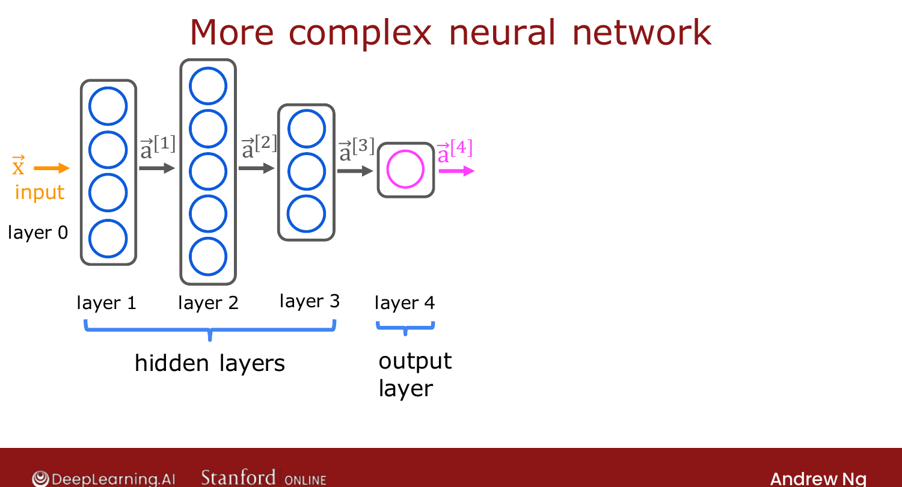

# More Complex Neural Networks

> **Course 2 · Week 1** · _AI-generated study aid — not authoritative; trust the lecture & cited sources._

[← Neural Network Layer](../../course-2/week-1/neural-network-layer.md){ .md-button }

[Inference: Making Predictions (Forward Propagation) →](../../course-2/week-1/inference-making-predictions-forward-propagation.md){ .md-button }

<video controls preload="none" playsinline src="https://dyckms5inbsqq.cloudfront.net/dlai/advanced-learning-algorithms/W1/L6-C2W1L02S02-more-complex-neural-n/lc-advanced-learning-algorithms-W1-L6-C2W1L02S02-more-complex-neural-n-master_360p.mp4?v=1752484659">Your browser can't play this video — <a href="https://dyckms5inbsqq.cloudfront.net/dlai/advanced-learning-algorithms/W1/L6-C2W1L02S02-more-complex-neural-n/lc-advanced-learning-algorithms-W1-L6-C2W1L02S02-more-complex-neural-n-master_360p.mp4?v=1752484659">download the lecture</a>.</video>

> 📄 **[Read the full lecture transcript](more-complex-neural-networks-transcript.md)**

Take the single-layer building block and stack it into a deeper network — and nail down
the general notation along the way. `[00:01]`

## Counting layers

The running example has **4 layers** plus the input. By convention, **counting layers
includes the hidden layers and the output layer, but *not* the input layer** — so layers
1, 2, 3 are hidden, layer 4 is the output, and the input is layer 0. `[01:00]`

## The computation of a hidden layer

Zoom into **layer 3** (the last hidden layer). It takes the previous layer's output
$\vec{a}^{[2]}$ as input and, with 3 neurons, computes

$$a_j^{[3]} = g\big(\vec{w}_j^{[3]} \cdot \vec{a}^{[2]} + b_j^{[3]}\big), \quad j = 1,2,3,$$

outputting the vector $\vec{a}^{[3]} = [a_1^{[3]}, a_2^{[3]}, a_3^{[3]}]$. Notice the two
indices on the weight term: $\vec{w}_j^{[3]}$ is "a parameter **of layer 3**," dotted with
$\vec{a}^{[2]}$, "the output **of layer 2**." `[03:04]`

{ .slide }
_Official C2 slide — a multi-layer network (DeepLearning.AI / Stanford)._
{ .slide-cap }
## The general formula

For an arbitrary layer $\ell$ and unit $j$:

$$\boxed{\,a_j^{[\ell]} = g\big(\vec{w}_j^{[\ell]} \cdot \vec{a}^{[\ell-1]} + b_j^{[\ell]}\big)\,}$$

- superscript $[\ell]$ = "of layer $\ell$"; subscript $j$ = "unit (neuron) $j$";
- the dot product is with $\vec{a}^{[\ell-1]}$ — the **previous** layer's output;
- $g$ is the **activation function** (so far, the sigmoid — its name comes from outputting
  the activation value). `[06:44]`

![The general layer notation: a_j^[l] = g(w_j^[l] · a^[l-1] + b_j^[l]), labelling layer, unit, previous-layer output, and parameters](layer-notation.png){ .slide }
_Official C2 slide — the general activation formula and its notation (DeepLearning.AI / Stanford)._
{ .slide-cap }

![Notation: a^[l]_j = g(w^[l]_j · a^[l-1] + b^[l]_j) — superscript [l] is the layer, subscript j the unit](layer-notation-detail.png){ .slide }
_Official C2 slide — layer/unit notation (DeepLearning.AI / Stanford)._
{ .slide-cap }
## One last notational tidy-up

Give the input vector $\vec{x}$ the alias $\vec{a}^{[0]}$. Then the **same** formula works
for the first layer too: $a_j^{[1]} = g(\vec{w}_j^{[1]} \cdot \vec{a}^{[0]} + b_j^{[1]})$,
with $\vec{a}^{[0]} = \vec{x}$. `[07:39]`

With this, you can compute the activations of **any** layer from the activations of the
previous one. Chaining that computation start-to-finish is **inference** (making
predictions) — next. `[08:02]`

[← Neural Network Layer](../../course-2/week-1/neural-network-layer.md){ .md-button }

[Inference: Making Predictions (Forward Propagation) →](../../course-2/week-1/inference-making-predictions-forward-propagation.md){ .md-button }

