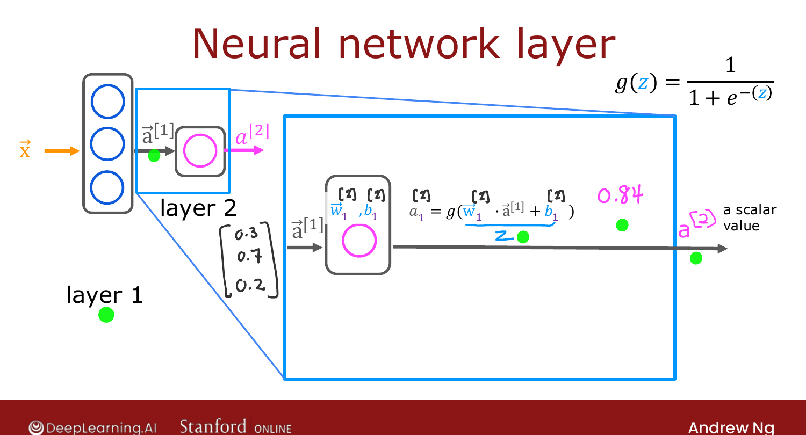
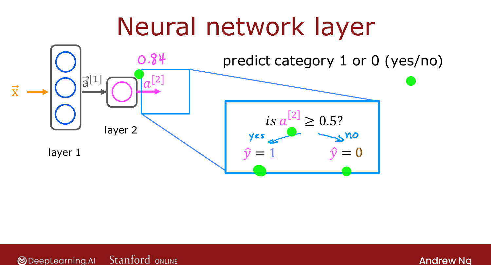

# Neural Network Layer

> **Course 2 · Week 1** · _AI-generated study aid — not authoritative; trust the lecture & cited sources._

[← Example: Recognizing Images](../../course-2/week-1/example-recognizing-images.md){ .md-button }

[More Complex Neural Networks →](../../course-2/week-1/more-complex-neural-networks.md){ .md-button }

<video controls preload="none" playsinline src="https://dyckms5inbsqq.cloudfront.net/dlai/advanced-learning-algorithms/W1/L5-C2W1L02S01-neural-network-layer-/lc-advanced-learning-algorithms-W1-L5-C2W1L02S01-neural-network-layer--master_360p.mp4?v=1752484659">Your browser can't play this video — <a href="https://dyckms5inbsqq.cloudfront.net/dlai/advanced-learning-algorithms/W1/L5-C2W1L02S01-neural-network-layer-/lc-advanced-learning-algorithms-W1-L5-C2W1L02S01-neural-network-layer--master_360p.mp4?v=1752484659">download the lecture</a>.</video>

> 📄 **[Read the full lecture transcript](neural-network-layer-transcript.md)**

The **layer of neurons** is the fundamental building block of modern neural networks.
Get this down and you can stack layers into a full network. `[00:02]`

## Inside the hidden layer

Take the demand-prediction network: 4 input features → a hidden layer of 3 neurons →
an output layer with 1 neuron. Zoom into the hidden layer. It takes the 4 input numbers,
and **each of its 3 neurons is just a little logistic-regression unit**. `[00:47]`

The first neuron has parameters $\vec{w}_1, b_1$ and outputs an activation

$$a_1 = g(\vec{w}_1 \cdot \vec{x} + b_1),$$

where $g(z) = \tfrac{1}{1+e^{-z}}$ is the familiar sigmoid — so $a_1$ might be **0.3**
(a 0.3 "chance" of being highly affordable). The second neuron has its own
$\vec{w}_2, b_2$ and computes $a_2 = g(\vec{w}_2 \cdot \vec{x} + b_2) \approx 0.7$; the
third gives $a_3 \approx 0.2$. Those three numbers form the **activation vector**
$\vec{a} = [0.3, 0.7, 0.2]$ passed to the next layer. `[03:14]`

![The hidden layer: 3 neurons each computing a = g(w·x + b), producing the activation vector [0.3, 0.7, 0.2]](neural-network-layer.png){ .slide }
_Official C2 slide — a layer is just a stack of logistic units (DeepLearning.AI / Stanford)._
{ .slide-cap }

{ .slide }
_Official C2 slide — hidden-layer computation (DeepLearning.AI / Stanford)._
{ .slide-cap }
## Layer numbering and superscript notation

By convention layers are numbered: the input is **layer 0**, the first hidden layer is
**layer 1**, the output is **layer 2** (networks today can have dozens or hundreds of
layers). To keep quantities straight, a **superscript in square brackets $[\ell]$** tags
everything belonging to layer $\ell$: `[03:52]`

- $\vec{a}^{[1]}$ = the activation **output of layer 1**,
- $\vec{w}_1^{[1]}, b_1^{[1]}$ = parameters of the **first unit in layer 1**.

Whenever you see $[\,1\,]$, read "of layer 1"; $[\,2\,]$, "of layer 2," and so on.
`[05:08]`

## The output layer

Layer 2 (the output layer) takes $\vec{a}^{[1]} = [0.3, 0.7, 0.2]$ as its input and, with
its single neuron, computes

$$a_1^{[2]} = g\big(\vec{w}_1^{[2]} \cdot \vec{a}^{[1]} + b_1^{[2]}\big) \approx 0.84.$$

Because the output layer has one neuron, the output $a^{[2]}$ is a **scalar**, not a
vector. `[07:53]`

{ .slide }
_Official C2 slide — the output layer (DeepLearning.AI / Stanford)._
{ .slide-cap }
## Optional: a binary prediction

If you want a yes/no answer rather than a probability, **threshold** the final activation
at 0.5: predict $\hat{y}=1$ if $a_1^{[2]} \ge 0.5$, else $\hat{y}=0$ — exactly the
logistic-regression thresholding from Course 1. `[08:53]`

So every layer **takes a vector of numbers, applies a set of logistic units, and outputs
another vector**, passing it along until the output layer produces the prediction. Next:
stacking layers into a larger network. `[09:27]`

[← Example: Recognizing Images](../../course-2/week-1/example-recognizing-images.md){ .md-button }

[More Complex Neural Networks →](../../course-2/week-1/more-complex-neural-networks.md){ .md-button }

