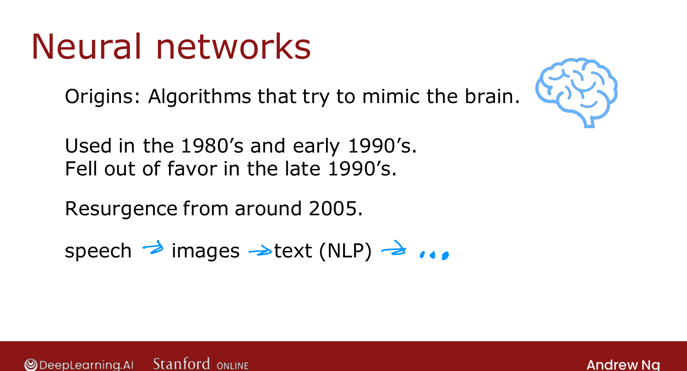
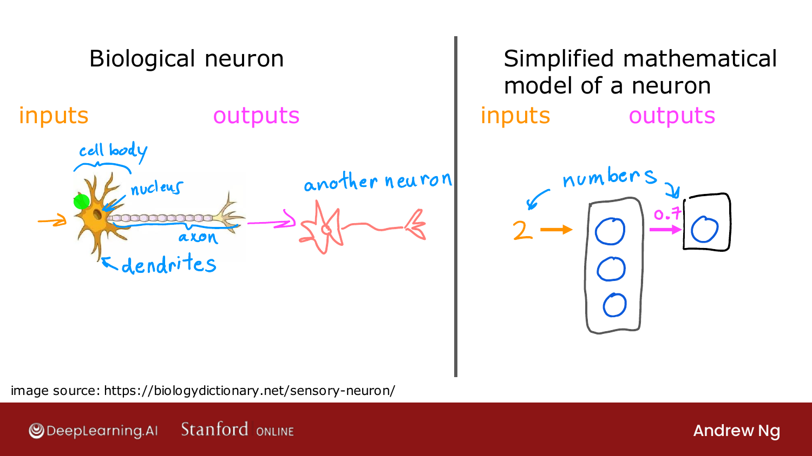
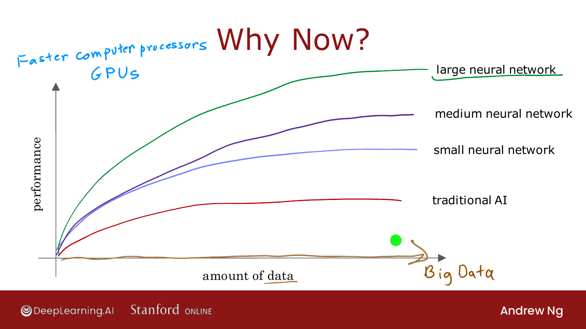

# Neurons and the Brain

> **Course 2 · Week 1** · _AI-generated study aid — not authoritative; trust the lecture & cited sources._

[← Regularized Logistic Regression](../../course-1/week-3/regularized-logistic-regression.md){ .md-button }

[Demand Prediction →](../../course-2/week-1/demand-prediction.md){ .md-button }

<video controls preload="none" playsinline src="https://dyckms5inbsqq.cloudfront.net/dlai/advanced-learning-algorithms/W1/L2-C2W1L01S02-neurons-and-the-brain/lc-advanced-learning-algorithms-W1-L2-C2W1L01S02-neurons-and-the-brain-master_360p.mp4?v=1752484659">Your browser can't play this video — <a href="https://dyckms5inbsqq.cloudfront.net/dlai/advanced-learning-algorithms/W1/L2-C2W1L01S02-neurons-and-the-brain/lc-advanced-learning-algorithms-W1-L2-C2W1L01S02-neurons-and-the-brain-master_360p.mp4?v=1752484659">download the lecture</a>.</video>

> 📄 **[Read the full lecture transcript](neurons-and-the-brain-transcript.md)**

Welcome to Course 2. This week builds **neural networks** — the algorithm behind many of
the recent breakthroughs in AI. We start with where they came from and the (loose)
biological analogy.

## Origins

Neural networks began as **algorithms that try to mimic the brain**. The timeline:

- Invented in the **1980s–early 1990s**.
- **Fell out of favour** in the late 1990s.
- **Resurgence from ~2005**, rebranded "deep learning," powering modern **speech
  recognition, image recognition, and text/NLP**.

{ .slide }
_Official C2 slide — origins of neural networks (DeepLearning.AI / Stanford)._
{ .slide-cap }
## The biological analogy

A **biological neuron** takes electrical **inputs** through its dendrites, does some
processing in the cell body, and sends **outputs** down its axon to other neurons. The
**simplified mathematical model** keeps only the essentials: a neuron takes some
**numbers** as inputs, computes a number, and passes it on.

{ .slide }
_Official C2 slide — biological neuron vs. the simplified mathematical model (DeepLearning.AI / Stanford)._
{ .slide-cap }

A quick caveat Ng stresses: we understand so little of how the brain actually works that
the biological motivation is now only a **loose inspiration**, not a blueprint. What
matters is the math, not the biology.

!!! note "Deeper — Nielsen, *Neural Networks and Deep Learning* (Ch. 1)"
    Nielsen builds this "simplified neuron" precisely. The earliest version, the
    **perceptron**, takes binary inputs $x_1, x_2, \dots$, weights them, and fires
    ($\text{output}=1$) only if $\sum_j w_j x_j$ exceeds a threshold. The problem: a
    perceptron's output flips abruptly, so small weight changes cause large jumps —
    hard to train. The fix is the **sigmoid neuron**, which replaces the step with the
    smooth $\sigma(z) = 1/(1+e^{-z})$ you met in Course 1. That smoothness is exactly
    what lets calculus (gradient descent) tune a whole network — the bridge from "a
    neuron" to "a *learnable* neuron." (Source: neuralnetworksanddeeplearning.com, Ch. 1.)

## Why now?

The ideas are decades old — so why did neural networks take off only recently? **Data and
compute.** As digitization produced **far more data**, traditional algorithms (like
linear/logistic regression) **plateaued** — they couldn't take advantage of it. Larger
neural networks, by contrast, **keep improving** as you feed them more data and run them
on faster hardware (GPUs).

{ .slide }
_Official C2 slide — why neural networks scale with data where traditional methods plateau (DeepLearning.AI / Stanford)._
{ .slide-cap }

Next: a concrete example — **demand prediction** — to see how neurons connect into a
network.

[← Regularized Logistic Regression](../../course-1/week-3/regularized-logistic-regression.md){ .md-button }

[Demand Prediction →](../../course-2/week-1/demand-prediction.md){ .md-button }

