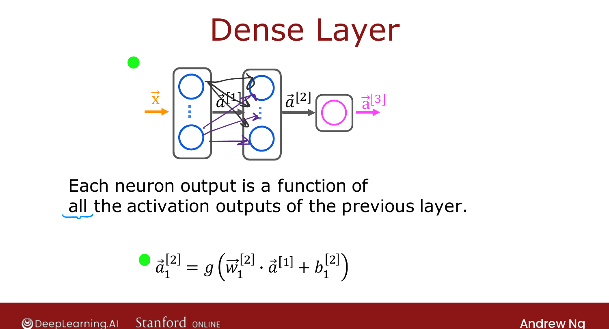
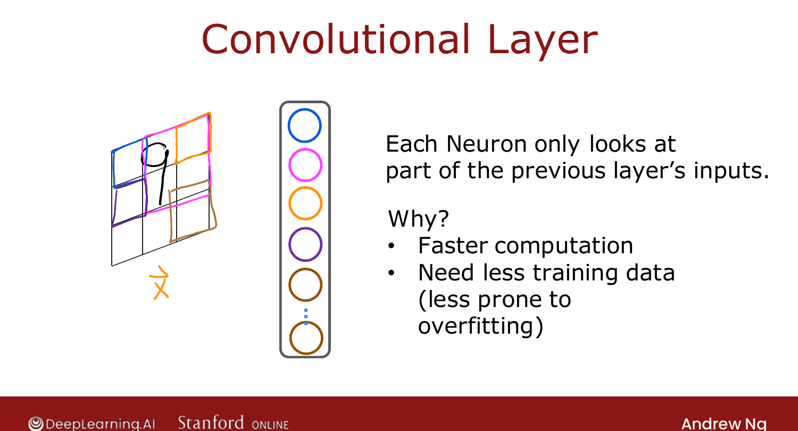

# Additional Layer Types

> **Course 2 · Week 2** · _AI-generated study aid — not authoritative; trust the lecture & cited sources._

[← Advanced Optimization](../../course-2/week-2/advanced-optimization.md){ .md-button }

[What is a Derivative? (Optional) →](../../course-2/week-2/what-is-a-derivative.md){ .md-button }

<video controls preload="none" playsinline src="https://dyckms5inbsqq.cloudfront.net/dlai/advanced-learning-algorithms/W2/L12-C2W2L4S02_v4-L12/lc-advanced-learning-algorithms-W2-L12-C2W2L4S02_v4-L12-master_360p.mp4?v=1752484664">Your browser can't play this video — <a href="https://dyckms5inbsqq.cloudfront.net/dlai/advanced-learning-algorithms/W2/L12-C2W2L4S02_v4-L12/lc-advanced-learning-algorithms-W2-L12-C2W2L4S02_v4-L12-master_360p.mp4?v=1752484664">download the lecture</a>.</video>

> 📄 **[Read the full lecture transcript](additional-layer-types-transcript.md)**

Every layer so far has been a **dense** layer. There are other useful layer types — here's
one: the **convolutional** layer. `[00:03]`

## Recap: the dense layer

In a dense layer, a neuron's activation is a function of **every** activation from the
previous layer: `[00:35]`

$$a^{[2]}_j = g\big(\vec{w}^{[2]}_j \cdot \vec{a}^{[1]} + b^{[2]}_j\big).$$

{ .slide }
_Official C2 slide — the dense (fully-connected) layer (DeepLearning.AI / Stanford)._
{ .slide-cap }

## The convolutional layer

In a **convolutional** layer, each neuron looks at only a **limited region** of the previous
layer's outputs, not all of it. For an image of a handwritten 9, the first hidden neuron
might see only one small rectangle of pixels, the next neuron a different rectangle, and so
on. `[01:07]`

Why restrict each neuron's view? `[02:22]`

1. **Faster computation.**
2. **Needs less training data** (and is **less prone to overfitting**).

A network with such layers is a **convolutional neural network (CNN)**. Convolutional
layers were developed and popularised by **Yann LeCun**. `[03:06]`

{ .slide }
_Official C2 slide — the convolutional layer (DeepLearning.AI / Stanford)._
{ .slide-cap }

Ng's worked example is a **1-D** input: an **EKG/ECG** signal (a list of ~100 voltage
readings over time). Convolutional neurons each scan a window of the signal, and a CNN built
from them classifies whether the patient has a heart condition. `[04:10]`

!!! abstract "Deeper — Prince, *Understanding Deep Learning*, Ch. 10"
    Prince develops the convolutional layer formally: the "limited region" is a small
    **kernel** of shared weights slid across the input (**weight sharing** + **local
    connectivity**). Those two properties are exactly why CNNs need fewer parameters and
    less data than a dense network for image- and signal-shaped inputs — the structural
    reason behind the speed/overfitting benefits Ng lists here.

[← Advanced Optimization](../../course-2/week-2/advanced-optimization.md){ .md-button }

[What is a Derivative? (Optional) →](../../course-2/week-2/what-is-a-derivative.md){ .md-button }

