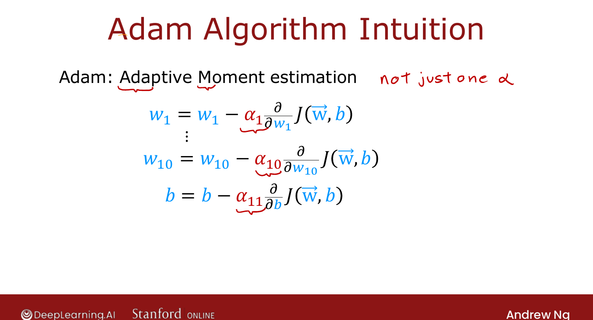

# Advanced Optimization

> **Course 2 · Week 2** · _AI-generated study aid — not authoritative; trust the lecture & cited sources._

<div class="ep-nav" markdown>

[← Classification with Multiple Outputs (Multi-label)](../../course-2/week-2/classification-with-multiple-outputs.md){ .md-button }

[Additional Layer Types →](../../course-2/week-2/additional-layer-types.md){ .md-button }

</div>

<div class="video-wrap"><video controls preload="none" playsinline src="https://dyckms5inbsqq.cloudfront.net/dlai/advanced-learning-algorithms/W2/L11-C2W2L4S01-Advanced-Optimization-/lc-advanced-learning-algorithms-W2-L11-C2W2L4S01-Advanced-Optimization--master_360p.mp4?v=1752484664">Your browser can't play this video — <a href="https://dyckms5inbsqq.cloudfront.net/dlai/advanced-learning-algorithms/W2/L11-C2W2L4S01-Advanced-Optimization-/lc-advanced-learning-algorithms-W2-L11-C2W2L4S01-Advanced-Optimization--master_360p.mp4?v=1752484664">download the lecture</a>.</video></div>

> 📄 **[Read the full lecture transcript](advanced-optimization-transcript.md)**

Gradient descent underpins linear/logistic regression and early neural nets — but there are
now **better** optimizers. Meet **Adam**, which trains networks much faster. `[00:02]`

## The intuition: adapt the step size

Plot the cost $J$ as a contour of ellipses with the minimum at the centre. `[00:51]`

- If every gradient-descent step heads in **roughly the same direction** with tiny steps,
  you *wish* $\alpha$ were **bigger** — so take larger steps and reach the minimum sooner. `[01:25]`
- If steps **oscillate** back and forth across the valley, you *wish* $\alpha$ were
  **smaller** — for a smoother path in. `[02:14]`

**Adam** ("Adaptive Moment estimation") adjusts the learning rate **automatically** to do
exactly this. `[02:48]`

{ .slide }
_Official C2 slide — Adam adapts the step size per parameter (DeepLearning.AI / Stanford)._
{ .slide-cap }

## A learning rate *per parameter*

Adam doesn't use a single global $\alpha$ — it keeps a **separate** learning rate for
**every** parameter. With $w_1,\dots,w_{10}, b$ that's 11 rates $\alpha_1,\dots,\alpha_{11}$.
The rule of thumb behind it: `[03:10]`

- a parameter that keeps moving the **same direction** → **increase** its $\alpha$ (go faster);
- a parameter that keeps **oscillating** → **decrease** its $\alpha$ (settle down). `[04:08]`

(The full mechanism is beyond this course.)

## In code

```python
model.compile(
    optimizer=tf.keras.optimizers.Adam(learning_rate=1e-3),
    loss=SparseCategoricalCrossentropy(from_logits=True),
)
```

The model and fit are unchanged — you just pass an **`optimizer=`** argument. Adam still
needs a starting global learning rate; **try a few values** (larger and smaller) to see
which learns fastest, though Adam is more **robust** to that choice than plain gradient
descent. `[05:00]`

Adam is typically much faster than gradient descent and is the **de facto standard** —
a safe default for training neural networks. `[05:48]`


<div class="ep-nav" markdown>

[← Classification with Multiple Outputs (Multi-label)](../../course-2/week-2/classification-with-multiple-outputs.md){ .md-button }

[Additional Layer Types →](../../course-2/week-2/additional-layer-types.md){ .md-button }

</div>
