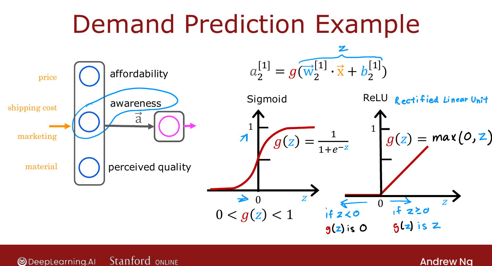
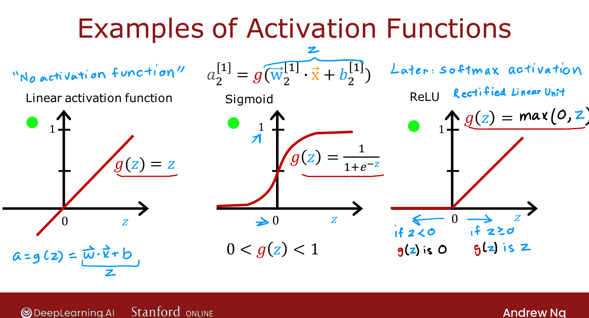

# Alternatives to the Sigmoid Activation

> **Course 2 · Week 2** · _AI-generated study aid — not authoritative; trust the lecture & cited sources._

<div class="ep-nav" markdown>

[← Training Details](../../course-2/week-2/training-details.md){ .md-button }

[Choosing Activation Functions →](../../course-2/week-2/choosing-activation-functions.md){ .md-button }

</div>

<div class="video-wrap"><video controls preload="none" playsinline src="https://dyckms5inbsqq.cloudfront.net/dlai/advanced-learning-algorithms/W2/L3-C2W2L2S01-Alternatives-to-the-si/lc-advanced-learning-algorithms-W2-L3-C2W2L2S01-Alternatives-to-the-si-master_360p.mp4?v=1752484663">Your browser can't play this video — <a href="https://dyckms5inbsqq.cloudfront.net/dlai/advanced-learning-algorithms/W2/L3-C2W2L2S01-Alternatives-to-the-si/lc-advanced-learning-algorithms-W2-L3-C2W2L2S01-Alternatives-to-the-si-master_360p.mp4?v=1752484663">download the lecture</a>.</video></div>

> 📄 **[Read the full lecture transcript](alternatives-to-the-sigmoid-activation-transcript.md)**

So far every neuron has used the **sigmoid** activation — a hangover from building networks
out of logistic-regression units. But swapping in other activation functions makes a
network much more powerful. `[00:22]`

## Why sigmoid is limiting

Recall the **demand-prediction** example: from price, shipping, marketing and material, a
hidden unit estimates "awareness." Sigmoid forces that activation into $[0,1]$ — as if
awareness were a probability. But awareness isn't capped: a product can be a little known,
somewhat known, or have gone **completely viral**. We'd like the activation to be **any
non-negative number**, not just $0$–$1$. `[01:08]`

{ .slide }
_Official C2 slide — why a wider-range activation helps (DeepLearning.AI / Stanford)._
{ .slide-cap }

## ReLU

The fix is the **ReLU** activation (rectified linear unit):

$$g(z) = \max(0, z).$$

It is flat $0$ for $z<0$, then a 45° line for $z\ge 0$ (where $g(z)=z$). So a ReLU neuron's
activation can be $0$ or **any non-negative value** — exactly what "awareness" needed.
"Rectified linear unit" is just the name the original authors gave it; everyone says
"ReLU." `[03:16]`

## The three common activation functions

```text
Linear:   g(z) = z          (a.k.a. "no activation function")
Sigmoid:  g(z) = 1 / (1 + e^(-z))      range (0, 1)
ReLU:     g(z) = max(0, z)             range [0, ∞)
```

The **linear** activation $g(z)=z$ is sometimes described as using *no* activation function,
because then $a = \vec{w}\cdot\vec{x}+b$ with nothing wrapped around it — this course calls
it the linear activation function. These three cover the large majority of networks; the
fourth, **softmax**, comes later this week. `[04:59]`

{ .slide }
_Official C2 slide — the three most-used activations (DeepLearning.AI / Stanford)._
{ .slide-cap }

!!! abstract "Deeper — Prince, *Understanding Deep Learning*, §3.1"
    Prince frames the ReLU as the modern default hidden-unit activation: it is cheap to
    compute, and because its slope is exactly $1$ for all positive inputs it does **not**
    squash gradients the way sigmoid does for large $|z|$ — which is much of why deep
    networks train better with ReLU than with sigmoid hidden units. The next lesson turns
    this into a practical rule for *choosing* activations.

How do you pick between sigmoid, ReLU and linear for a given neuron? That's the next
lesson. `[05:23]`


<div class="ep-nav" markdown>

[← Training Details](../../course-2/week-2/training-details.md){ .md-button }

[Choosing Activation Functions →](../../course-2/week-2/choosing-activation-functions.md){ .md-button }

</div>
