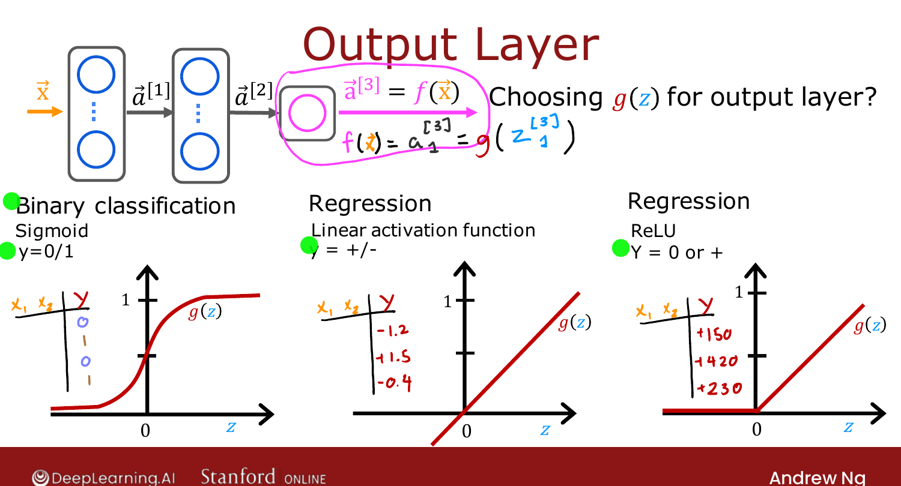
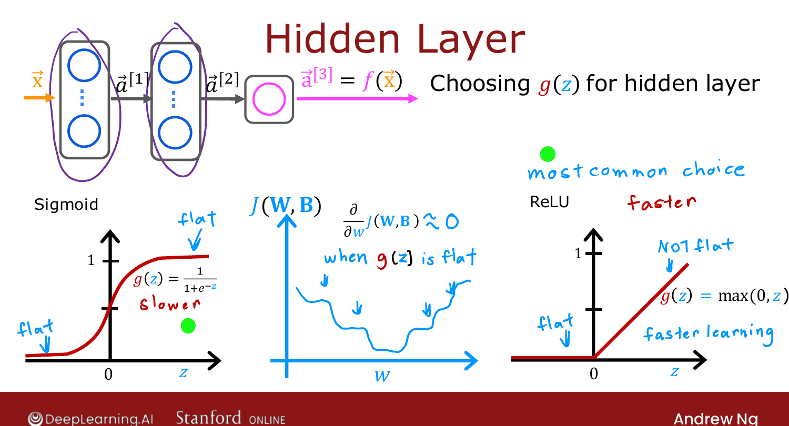

# Choosing Activation Functions

> **Course 2 · Week 2** · _AI-generated study aid — not authoritative; trust the lecture & cited sources._

<div class="ep-nav" markdown>

[← Alternatives to the Sigmoid Activation](../../course-2/week-2/alternatives-to-the-sigmoid-activation.md){ .md-button }

[Why Do We Need Activation Functions? →](../../course-2/week-2/why-do-we-need-activation-functions.md){ .md-button }

</div>

<div class="video-wrap"><video controls preload="none" playsinline src="https://dyckms5inbsqq.cloudfront.net/dlai/advanced-learning-algorithms/W2/L4-C2W2L2S02-Choosing-activation-fu/lc-advanced-learning-algorithms-W2-L4-C2W2L2S02-Choosing-activation-fu-master_360p.mp4?v=1752484663">Your browser can't play this video — <a href="https://dyckms5inbsqq.cloudfront.net/dlai/advanced-learning-algorithms/W2/L4-C2W2L2S02-Choosing-activation-fu/lc-advanced-learning-algorithms-W2-L4-C2W2L2S02-Choosing-activation-fu-master_360p.mp4?v=1752484663">download the lecture</a>.</video></div>

> 📄 **[Read the full lecture transcript](choosing-activation-functions-transcript.md)**

You can pick a **different** activation function for different neurons. There's good
guidance for both the **output** layer and the **hidden** layers. `[00:01]`

## Output layer — match it to the label $y$

The natural choice depends on what $y$ can be: `[00:52]`

| If $y$ is… | Use | Why |
|---|---|---|
| $0$ or $1$ (binary classification) | **sigmoid** | output = $P(y=1)$, just like logistic regression |
| any value, +/− (e.g. stock-price change) | **linear** | $g(z)$ can be positive *or* negative |
| $\ge 0$ only (e.g. house price) | **ReLU** | $g(z)=\max(0,z)$ is never negative |

{ .slide }
_Official C2 slide — choosing $g(z)$ for the output layer (DeepLearning.AI / Stanford)._
{ .slide-cap }

## Hidden layers — use ReLU

For hidden units, **ReLU is by far the most common choice** today. Although early networks
used sigmoid everywhere, the field has moved almost entirely to ReLU in the hidden layers
(sigmoid survives mainly as a binary-classification output). Two reasons: `[03:04]`

1. **Faster to compute** — just $\max(0,z)$, no exponential/inverse. `[03:46]`
2. **Fewer flat regions** — sigmoid is flat on *both* ends; ReLU is flat only for $z<0$.
   Flat activations make the cost $J(\mathbf{W},\mathbf{B})$ flatter too, so gradient
   descent crawls. ReLU's mostly-non-flat shape lets the network **learn faster**. `[04:08]`

{ .slide }
_Official C2 slide — choosing $g(z)$ for the hidden layers (DeepLearning.AI / Stanford)._
{ .slide-cap }

## In TensorFlow

```python
model = Sequential([
    Dense(units=25, activation='relu'),     # hidden layers: ReLU
    Dense(units=15, activation='relu'),
    Dense(units=1,  activation='sigmoid'),  # output: match the label
])
```

Swap `'sigmoid'` → `'linear'` or `'relu'` on the output to match the target type. `[06:08]`

!!! abstract "Deeper — Prince, *Understanding Deep Learning*, §3.3"
    Prince notes that researchers periodically propose new activations — **tanh**,
    **leaky ReLU**, **swish/SiLU**, **GELU** — and a few give small gains in specific
    settings. Ng makes the same point: leaky ReLU has occasionally worked a touch better
    for him, but plain ReLU hidden units + a label-matched output are enough for the vast
    majority of applications.

This raises the obvious question — why do we need a non-linear activation *at all*? Next
lesson. `[08:03]`

{ .slide }
_Official C2 slide — choosing activations, summary (DeepLearning.AI / Stanford)._
{ .slide-cap }


<div class="ep-nav" markdown>

[← Alternatives to the Sigmoid Activation](../../course-2/week-2/alternatives-to-the-sigmoid-activation.md){ .md-button }

[Why Do We Need Activation Functions? →](../../course-2/week-2/why-do-we-need-activation-functions.md){ .md-button }

</div>
