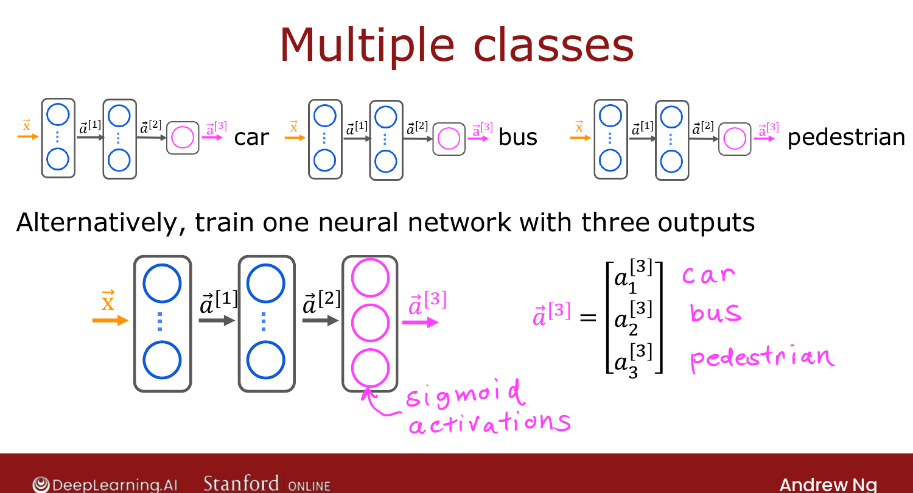

# Classification with Multiple Outputs (Multi-label)

> **Course 2 · Week 2** · _AI-generated study aid — not authoritative; trust the lecture & cited sources._

[← Improved Implementation of Softmax](../../course-2/week-2/improved-implementation-of-softmax.md){ .md-button }

[Advanced Optimization →](../../course-2/week-2/advanced-optimization.md){ .md-button }

<video controls preload="none" playsinline src="https://dyckms5inbsqq.cloudfront.net/dlai/advanced-learning-algorithms/W2/L10-C2W2L3S05-Classification-with-mu/lc-advanced-learning-algorithms-W2-L10-C2W2L3S05-Classification-with-mu-master_360p.mp4?v=1752484664">Your browser can't play this video — <a href="https://dyckms5inbsqq.cloudfront.net/dlai/advanced-learning-algorithms/W2/L10-C2W2L3S05-Classification-with-mu/lc-advanced-learning-algorithms-W2-L10-C2W2L3S05-Classification-with-mu-master_360p.mp4?v=1752484664">download the lecture</a>.</video>

> 📄 **[Read the full lecture transcript](classification-with-multiple-outputs-transcript.md)**

A different problem, easily confused with multiclass: **multi-label classification**, where
a *single* input can carry **several labels at once**. `[00:02]`

## Multi-label vs. multiclass

Self-driving example: given one image in front of the car, ask **three** questions — is
there a car? a bus? a pedestrian? An image might have a car *and* a pedestrian but no bus.
So the target $\vec{y}$ is a **vector** of three numbers, e.g. $[1, 0, 1]$. `[00:54]`

Contrast with **multiclass** (e.g. digit recognition): there $y$ is a **single** number,
even though it can take 10 values. The distinction: `[01:31]`

- **Multiclass** — one label, many possible values (softmax output).
- **Multi-label** — many labels, each independently present/absent.

## Building the network

You *could* train three separate networks (one per label) — not unreasonable. But you can
also train **one** network with **three output neurons**, each a **sigmoid** (since each is
its own binary yes/no question): `[01:49]`

$$\vec{a}^{[3]} = \big(a^{[3]}_1,\ a^{[3]}_2,\ a^{[3]}_3\big),\quad
a^{[3]}_i = \text{sigmoid}(z^{[3]}_i) = P(\text{label } i \text{ present}).$$

{ .slide }
_Official C2 slide — a single network with three sigmoid outputs (DeepLearning.AI / Stanford)._
{ .slide-cap }

Note the output layer uses **sigmoid** (three independent binary problems), **not** softmax
(softmax forces the outputs to compete and sum to 1, which is wrong here). `[02:59]`

{ .slide }
_Official C2 slide — a multi-label network (DeepLearning.AI / Stanford)._
{ .slide-cap }

Next: more advanced concepts — starting with an optimizer faster than gradient descent. `[04:00]`

[← Improved Implementation of Softmax](../../course-2/week-2/improved-implementation-of-softmax.md){ .md-button }

[Advanced Optimization →](../../course-2/week-2/advanced-optimization.md){ .md-button }

