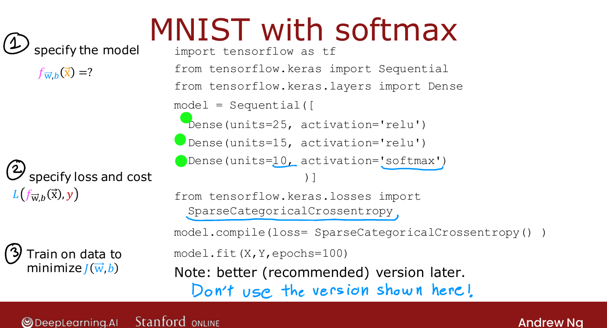
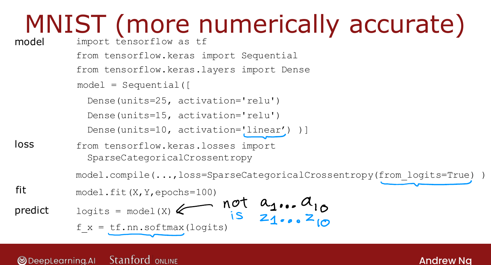

# Improved Implementation of Softmax

> **Course 2 · Week 2** · _AI-generated study aid — not authoritative; trust the lecture & cited sources._

<div class="ep-nav" markdown>

[← Neural Network with Softmax Output](../../course-2/week-2/neural-network-with-softmax-output.md){ .md-button }

[Classification with Multiple Outputs (Multi-label) →](../../course-2/week-2/classification-with-multiple-outputs.md){ .md-button }

</div>

<div class="video-wrap"><video controls preload="none" playsinline src="https://dyckms5inbsqq.cloudfront.net/dlai/advanced-learning-algorithms/W2/L9-C2W2L3S04-Improved-implementatio/lc-advanced-learning-algorithms-W2-L9-C2W2L3S04-Improved-implementatio-master_360p.mp4?v=1752484664">Your browser can't play this video — <a href="https://dyckms5inbsqq.cloudfront.net/dlai/advanced-learning-algorithms/W2/L9-C2W2L3S04-Improved-implementatio/lc-advanced-learning-algorithms-W2-L9-C2W2L3S04-Improved-implementatio-master_360p.mp4?v=1752484664">download the lecture</a>.</video></div>

> 📄 **[Read the full lecture transcript](improved-implementation-of-softmax-transcript.md)**

The previous softmax code works, but there's a **numerically more accurate** way to write
it — and it's the version you should use. `[00:03]`

## Numerical round-off, illustrated

Two ways to compute the same value $\tfrac{2}{10000}$ in a computer: `[00:24]`

```python
x = 2 / 10000                                   # option 1: direct
x = (1 + 1/10000) - (1 - 1/10000)               # option 2: via two big intermediates
```

Both are $\tfrac{2}{10000}$ mathematically, but option 2 prints with **round-off error** —
floating-point numbers have finite precision, so forcing the computer through large
intermediate quantities loses accuracy. `[01:38]`


{ .slide }
_Official C2 slide — numerical round-off (DeepLearning.AI / Stanford)._
{ .slide-cap }
## Let TensorFlow skip the intermediate $a$

For logistic regression, the usual code computes $a = g(z)$ first, then the loss from $a$.
If instead you **fold the activation into the loss** — give TensorFlow the loss written
directly in terms of $z$ — it can rearrange terms and compute it more accurately, without
pinning down $a$ as an intermediate. The recipe: `[02:50]`

- output layer uses a **`'linear'`** activation (so it outputs $z$, not $a$);
- the loss carries the activation **inside** it, switched on by **`from_logits=True`**
  (the "logits" are just the $z$ values). `[04:34]`

## Why softmax needs this more than logistic

For softmax, the $e^{z_j}$ terms can be **extremely small or extremely large** when a $z$ is
very negative or very positive. Folding everything into the loss lets TensorFlow rearrange
to avoid those extremes — so the round-off, mild for logistic regression, is meaningfully
reduced for softmax. `[06:20]`

```python
model = Sequential([
    Dense(units=25, activation='relu'),
    Dense(units=15, activation='relu'),
    Dense(units=10, activation='linear'),       # <- linear, outputs z (logits)
])
model.compile(loss=SparseCategoricalCrossentropy(from_logits=True))
model.fit(X, y, epochs=100)
```

{ .slide }
_Official C2 slide — the recommended, numerically-stable softmax implementation (DeepLearning.AI / Stanford)._
{ .slide-cap }

## One catch — the output is now logits, not probabilities

With a linear output layer the final layer emits $z_1,\dots,z_{10}$, **not** probabilities.
So at prediction time you must map them through softmax yourself (for logistic regression,
likewise through the sigmoid) to recover the probabilities. The trade-off: a touch less
readable, but more numerically accurate — and it's what Ng recommends you use. `[08:05]`


<div class="ep-nav" markdown>

[← Neural Network with Softmax Output](../../course-2/week-2/neural-network-with-softmax-output.md){ .md-button }

[Classification with Multiple Outputs (Multi-label) →](../../course-2/week-2/classification-with-multiple-outputs.md){ .md-button }

</div>
