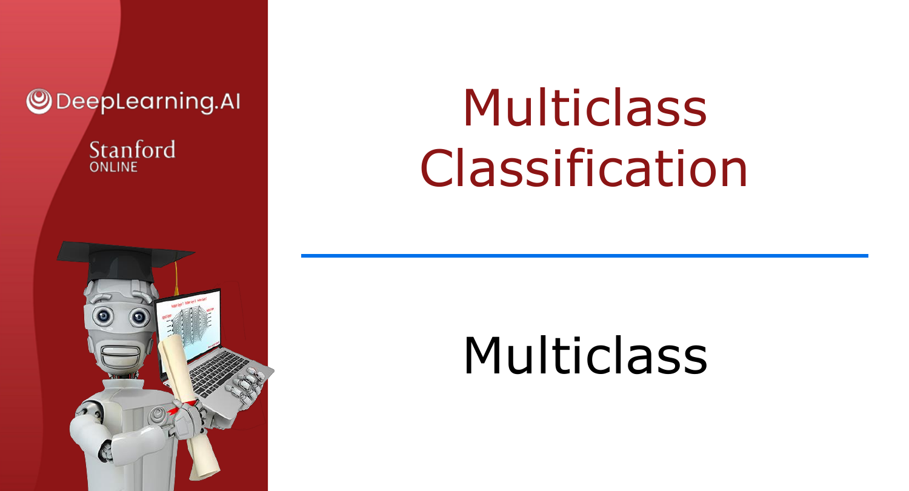
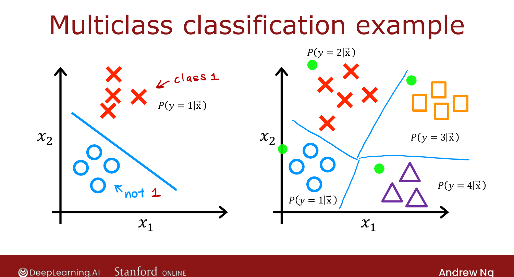

# Multiclass Classification

> **Course 2 · Week 2** · _AI-generated study aid — not authoritative; trust the lecture & cited sources._

[← Why Do We Need Activation Functions?](../../course-2/week-2/why-do-we-need-activation-functions.md){ .md-button }

[Softmax Regression →](../../course-2/week-2/softmax.md){ .md-button }

<video controls preload="none" playsinline src="https://dyckms5inbsqq.cloudfront.net/dlai/advanced-learning-algorithms/W2/L6-C2W2L3S01-Multiclass-L6/lc-advanced-learning-algorithms-W2-L6-C2W2L3S01-Multiclass-L6-master_360p.mp4?v=1752484663">Your browser can't play this video — <a href="https://dyckms5inbsqq.cloudfront.net/dlai/advanced-learning-algorithms/W2/L6-C2W2L3S01-Multiclass-L6/lc-advanced-learning-algorithms-W2-L6-C2W2L3S01-Multiclass-L6-master_360p.mp4?v=1752484663">download the lecture</a>.</video>

> 📄 **[Read the full lecture transcript](multiclass-transcript.md)**

**Multiclass classification** is a classification problem with **more than two** possible
output labels — not just $0$ or $1$. `[00:02]`

## Examples

- **Handwritten digits / zip codes** — recognise all **10** digits $0$–$9$, not just 0 vs 1. `[00:25]`
- **Medical diagnosis** — distinguish among 3 or 5 possible diseases. `[00:35]`
- **Visual defect inspection** — classify a manufactured pill as scratch / discoloration /
  chip defect (one of several defect types). `[00:52]`

The key property: $y$ still takes on a **small number of discrete categories** (not any
number), but now **more than two** of them. `[01:23]`

{ .slide }
_Official C2 slide — a multiclass example (MNIST) (DeepLearning.AI / Stanford)._
{ .slide-cap }
## What changes vs. binary

For binary classification with features $x_1, x_2$, logistic regression estimates the
single probability $P(y=1\mid\vec{x})$. With, say, **four** classes (O, X, △, □), we instead
want **all** the class probabilities:

$$P(y=1\mid\vec{x}),\; P(y=2\mid\vec{x}),\; P(y=3\mid\vec{x}),\; P(y=4\mid\vec{x}).$$

The algorithm in the next lesson learns a decision boundary that carves the $x_1$–$x_2$
plane into **four** regions instead of two. `[02:46]`

{ .slide }
_Official C2 slide — a four-class classification problem (DeepLearning.AI / Stanford)._
{ .slide-cap }

Next we meet **softmax regression**, the generalisation of logistic regression that
produces those probabilities — and then fit it into a neural network. `[02:59]`

[← Why Do We Need Activation Functions?](../../course-2/week-2/why-do-we-need-activation-functions.md){ .md-button }

[Softmax Regression →](../../course-2/week-2/softmax.md){ .md-button }

