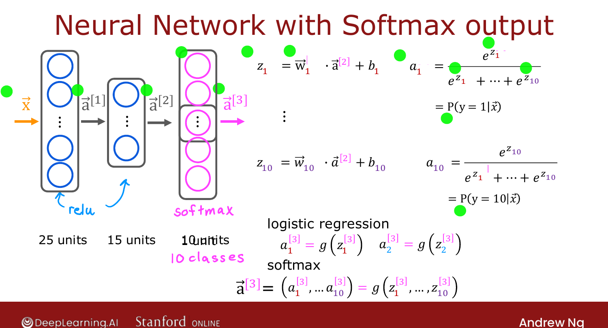

# Neural Network with Softmax Output

> **Course 2 · Week 2** · _AI-generated study aid — not authoritative; trust the lecture & cited sources._

<div class="ep-nav" markdown>

[← Softmax Regression](../../course-2/week-2/softmax.md){ .md-button }

[Improved Implementation of Softmax →](../../course-2/week-2/improved-implementation-of-softmax.md){ .md-button }

</div>

<div class="video-wrap"><video controls preload="none" playsinline src="https://dyckms5inbsqq.cloudfront.net/dlai/advanced-learning-algorithms/W2/L8-C2W2L3S03-Neural-Network-with-So/lc-advanced-learning-algorithms-W2-L8-C2W2L3S03-Neural-Network-with-So-master_360p.mp4?v=1752484664">Your browser can't play this video — <a href="https://dyckms5inbsqq.cloudfront.net/dlai/advanced-learning-algorithms/W2/L8-C2W2L3S03-Neural-Network-with-So/lc-advanced-learning-algorithms-W2-L8-C2W2L3S03-Neural-Network-with-So-master_360p.mp4?v=1752484664">download the lecture</a>.</video></div>

> 📄 **[Read the full lecture transcript](neural-network-with-softmax-output-transcript.md)**

To do multiclass classification with a neural network, put the **softmax model in the
output layer**. `[00:02]`

## A softmax output layer

For 10-class digit recognition (0–9), give the network **10 output units** and make the
last layer a **softmax layer**. Forward propagation is unchanged through the hidden layers
($\vec{a}^{[1]}$, $\vec{a}^{[2]}$ as before); the output layer computes all ten $z$'s and
then the softmax: `[01:21]`

$$z^{[3]}_j = \vec{w}^{[3]}_j\cdot\vec{a}^{[2]} + b^{[3]}_j,\qquad
a^{[3]}_j = \frac{e^{z^{[3]}_j}}{e^{z^{[3]}_1}+\cdots+e^{z^{[3]}_{10}}}.$$

{ .slide }
_Official C2 slide — a neural network with a softmax output (DeepLearning.AI / Stanford)._
{ .slide-cap }

## Softmax is unusual: each output depends on *all* the z's

For sigmoid/ReLU/linear, $a_1$ depends only on $z_1$, $a_2$ only on $z_2$ — the activation
is applied **element-wise**. Softmax is different: $a_1$ is a function of $z_1, z_2, \dots,
z_{10}$ — **every** output depends on **all** the $z$'s (because of the shared denominator). `[03:00]`

## In TensorFlow (the "works but don't use it" version)

```python
model = Sequential([
    Dense(units=25, activation='relu'),
    Dense(units=15, activation='relu'),
    Dense(units=10, activation='softmax'),     # 10-class softmax output
])
model.compile(loss=SparseCategoricalCrossentropy())
model.fit(X, y, epochs=100)
```

**`SparseCategoricalCrossentropy`** is the cost from the last lesson. *Categorical* = $y$ is
one of several categories; *sparse* = each example is **exactly one** category (a digit is a
2 or a 7, never both). `[05:33]`

!!! warning "Don't ship this exact code"
    Ng flags it on the slide: this version works, but there's a **numerically more accurate**
    way to write a softmax network in TensorFlow — that's the next lesson, and it's the
    version you should actually use. `[06:58]`

{ .slide }
_Official C2 slide — MNIST with a softmax output (DeepLearning.AI / Stanford)._
{ .slide-cap }


<div class="ep-nav" markdown>

[← Softmax Regression](../../course-2/week-2/softmax.md){ .md-button }

[Improved Implementation of Softmax →](../../course-2/week-2/improved-implementation-of-softmax.md){ .md-button }

</div>
