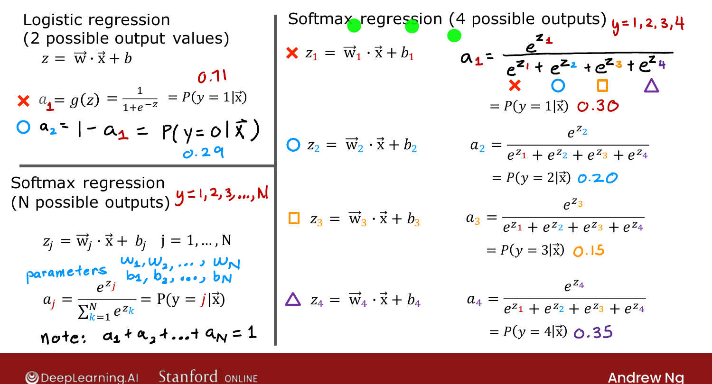
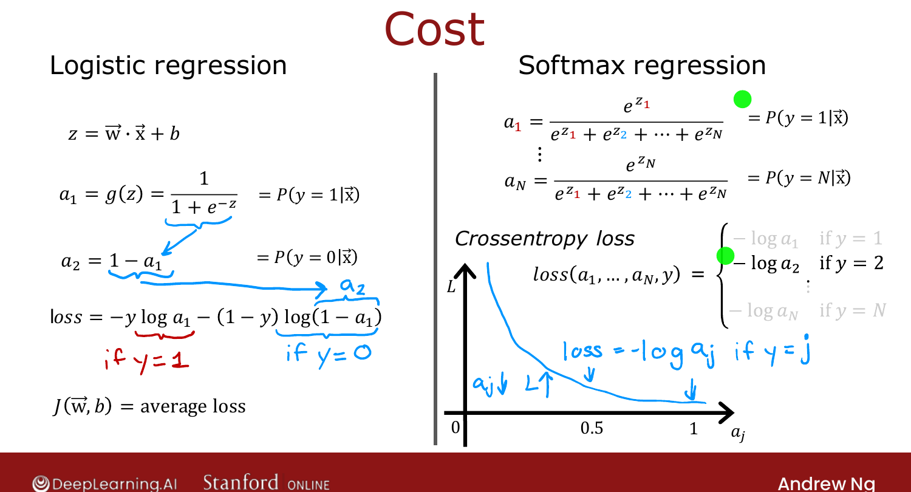

# Softmax Regression

> **Course 2 · Week 2** · _AI-generated study aid — not authoritative; trust the lecture & cited sources._

[← Multiclass Classification](../../course-2/week-2/multiclass.md){ .md-button }

[Neural Network with Softmax Output →](../../course-2/week-2/neural-network-with-softmax-output.md){ .md-button }

<video controls preload="none" playsinline src="https://dyckms5inbsqq.cloudfront.net/dlai/advanced-learning-algorithms/W2/L7-C2W2L3S02-softmax-L7/lc-advanced-learning-algorithms-W2-L7-C2W2L3S02-softmax-L7-master_360p.mp4?v=1752484663">Your browser can't play this video — <a href="https://dyckms5inbsqq.cloudfront.net/dlai/advanced-learning-algorithms/W2/L7-C2W2L3S02-softmax-L7/lc-advanced-learning-algorithms-W2-L7-C2W2L3S02-softmax-L7-master_360p.mp4?v=1752484663">download the lecture</a>.</video>

> 📄 **[Read the full lecture transcript](softmax-transcript.md)**

**Softmax regression** generalises logistic regression from binary to **multiclass**
classification. `[00:02]`

## From logistic to softmax

Logistic regression ($y\in\{0,1\}$) computes $z=\vec{w}\cdot\vec{x}+b$ then
$a=g(z)=P(y=1\mid\vec{x})$. It helps to think of it as computing **two** numbers:
$a_1 = P(y=1\mid\vec{x})$ and $a_2 = 1-a_1 = P(y=0\mid\vec{x})$ — which sum to $1$. `[01:36]`

Softmax generalises this. With, say, **4** classes, compute one $z$ per class:

$$z_j = \vec{w}_j\cdot\vec{x} + b_j,\quad j=1,\dots,4,$$

then convert to probabilities by exponentiating and normalising:

$$a_j = \frac{e^{z_j}}{e^{z_1}+e^{z_2}+e^{z_3}+e^{z_4}} = P(y=j\mid\vec{x}).$$

By construction $a_1+a_2+a_3+a_4 = 1$. (So if $a_1,a_2,a_3 = 0.30, 0.20, 0.15$, then
$a_4 = 0.35$.) `[04:58]`

{ .slide }
_Official C2 slide — the softmax model (DeepLearning.AI / Stanford)._
{ .slide-cap }

## General case

For $N$ classes ($y\in\{1,\dots,N\}$):

$$z_j = \vec{w}_j\cdot\vec{x}+b_j,\qquad a_j = \frac{e^{z_j}}{\sum_{k=1}^{N} e^{z_k}}.$$

The $a_j$ always sum to $1$. With $N=2$, softmax reduces to logistic regression (with
slightly different parameters) — which is why softmax is its **generalisation**. `[06:43]`

## Cost function — cross-entropy

Rewrite logistic loss using $a_2 = 1-a_1$: it's $-\log a_1$ if $y=1$, and $-\log a_2$ if
$y=0$. Softmax extends this directly: `[08:03]`

$$L(\vec{a}, y) = -\log a_j \quad\text{when } y = j.$$

Only the term for the **true** class is computed (each example has one $y$). The curve
$-\log a_j$ is large when $a_j$ is small and near $0$ when $a_j\to 1$ — so the loss pushes
the model to make the probability of the *correct* class as large as possible. `[11:03]`

{ .slide }
_Official C2 slide — softmax (cross-entropy) cost (DeepLearning.AI / Stanford)._
{ .slide-cap }

Next: drop softmax into the **output layer** of a neural network. `[11:16]`

## Try it in the browser

**Try it — implement the softmax function** — edit the code, then hit **Validate** for instant ✓/✗ (runs real Python via Pyodide, no setup):

{{ IDE('softmax_exo') }}

[← Multiclass Classification](../../course-2/week-2/multiclass.md){ .md-button }

[Neural Network with Softmax Output →](../../course-2/week-2/neural-network-with-softmax-output.md){ .md-button }

