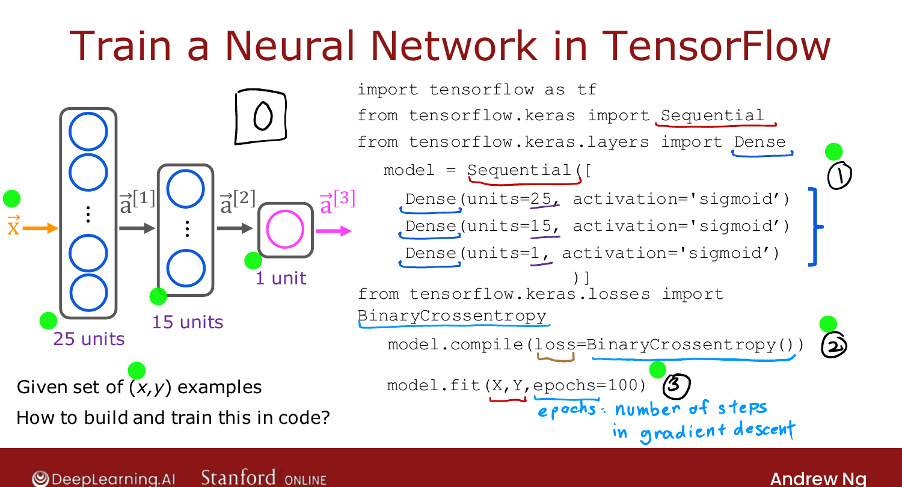

# TensorFlow Implementation

> **Course 2 · Week 2** · _AI-generated study aid — not authoritative; trust the lecture & cited sources._

<div class="ep-nav" markdown>

[← Matrix Multiplication Code](../../course-2/week-1/matrix-multiplication-code.md){ .md-button }

[Training Details →](../../course-2/week-2/training-details.md){ .md-button }

</div>

<div class="video-wrap"><video controls preload="none" playsinline src="https://dyckms5inbsqq.cloudfront.net/dlai/advanced-learning-algorithms/W2/L1-C2W2L1S01-TensorFlow-implementat/lc-advanced-learning-algorithms-W2-L1-C2W2L1S01-TensorFlow-implementat-master_360p.mp4?v=1752484662">Your browser can't play this video — <a href="https://dyckms5inbsqq.cloudfront.net/dlai/advanced-learning-algorithms/W2/L1-C2W2L1S01-TensorFlow-implementat/lc-advanced-learning-algorithms-W2-L1-C2W2L1S01-TensorFlow-implementat-master_360p.mp4?v=1752484662">download the lecture</a>.</video></div>

> 📄 **[Read the full lecture transcript](tensorflow-implementation-transcript.md)**

This week is about **training** a neural network — taking your own data and fitting the
parameters. We continue the running example of **handwritten-digit recognition** (is this
image a 0 or a 1?), using last week's architecture: input $\vec{x}$ (the image) → hidden
layer of 25 units → hidden layer of 15 units → 1 output unit. `[00:34]`

## The three lines that train a network

Given a training set of images $\vec{x}$ with ground-truth labels $y$, here is the entire
TensorFlow recipe: `[01:01]`

```python
import tensorflow as tf
from tensorflow.keras import Sequential
from tensorflow.keras.layers import Dense

# 1. specify the model (same as last week's forward-prop architecture)
model = Sequential([
    Dense(units=25, activation='sigmoid'),
    Dense(units=15, activation='sigmoid'),
    Dense(units=1,  activation='sigmoid'),
])

# 2. compile the model — tell it which loss to minimize
model.compile(loss=tf.keras.losses.BinaryCrossentropy())

# 3. fit (train) the model on the data
model.fit(X, y, epochs=100)
```

- **Step 1 — specify the model.** The `Sequential` stack of `Dense` layers is exactly last
  week's forward-propagation architecture; it tells TensorFlow how to compute the output. `[00:50]`
- **Step 2 — compile with a loss.** The key argument is the **loss function**; here the
  **binary cross-entropy** loss (next lesson explains what it is). `[01:42]`
- **Step 3 — fit.** `model.fit` runs the training. **`epochs`** is the technical term for
  *how many steps* of a gradient-descent-like algorithm to run — the same "how long do we
  run gradient descent?" question from Course 1. `[02:17]`

{ .slide }
_Official C2 slide — train a neural network in TensorFlow (DeepLearning.AI / Stanford)._
{ .slide-cap }

## Understand what's under the hood

Ng's recurring point: don't just call these lines without understanding them. When a
learning algorithm doesn't work the first time, having the **conceptual mental model** of
what `fit` is really doing is what lets you debug it. The next few lessons open up each of
the three steps. `[03:08]`


<div class="ep-nav" markdown>

[← Matrix Multiplication Code](../../course-2/week-1/matrix-multiplication-code.md){ .md-button }

[Training Details →](../../course-2/week-2/training-details.md){ .md-button }

</div>
