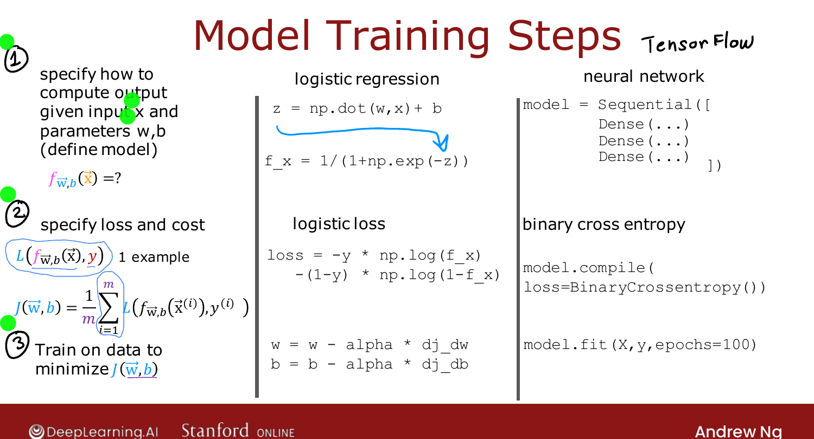
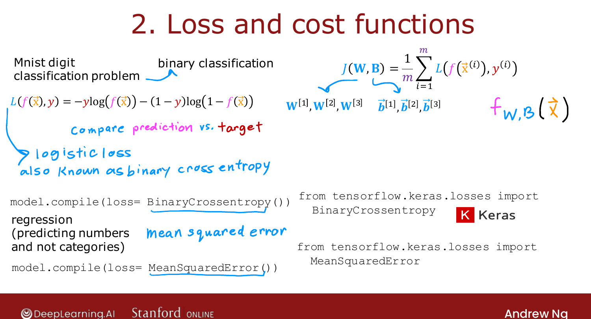

# Training Details

> **Course 2 · Week 2** · _AI-generated study aid — not authoritative; trust the lecture & cited sources._

<div class="ep-nav" markdown>

[← TensorFlow Implementation](../../course-2/week-2/tensorflow-implementation.md){ .md-button }

[Alternatives to the Sigmoid Activation →](../../course-2/week-2/alternatives-to-the-sigmoid-activation.md){ .md-button }

</div>

<div class="video-wrap"><video controls preload="none" playsinline src="https://dyckms5inbsqq.cloudfront.net/dlai/advanced-learning-algorithms/W2/L2-C2W2L1S02-Training-Details-L2/lc-advanced-learning-algorithms-W2-L2-C2W2L1S02-Training-Details-L2-master_360p.mp4?v=1752484662">Your browser can't play this video — <a href="https://dyckms5inbsqq.cloudfront.net/dlai/advanced-learning-algorithms/W2/L2-C2W2L1S02-Training-Details-L2/lc-advanced-learning-algorithms-W2-L2-C2W2L1S02-Training-Details-L2-master_360p.mp4?v=1752484662">download the lecture</a>.</video></div>

> 📄 **[Read the full lecture transcript](training-details-transcript.md)**

What is that TensorFlow code *actually* doing? The same **three steps** that trained
logistic regression in Course 1 are exactly the three steps that train a neural network —
just with more parameters. `[00:09]`

## Recall: training logistic regression in 3 steps

1. **Specify how to compute the output** $f_{\vec{w},b}(\vec{x})$ given input $\vec{x}$ and
   parameters $\vec{w}, b$. For logistic regression that was
   $f_{\vec{w},b}(\vec{x}) = g(\vec{w}\cdot\vec{x}+b) = \frac{1}{1+e^{-(\vec{w}\cdot\vec{x}+b)}}$. `[00:30]`
2. **Specify the loss and cost.** The loss on a *single* example was
   $L(f,y) = -y\log f - (1-y)\log(1-f)$, and the **cost** $J(\vec{w},b)$ is the **average**
   of the loss over all $m$ training examples. `[01:21]`
3. **Minimize the cost** with an algorithm — gradient descent:
   $w_j := w_j - \alpha\,\frac{\partial}{\partial w_j}J$, and likewise for $b$. `[02:46]`

{ .slide }
_Official C2 slide — the three training steps, logistic regression vs. neural network (DeepLearning.AI / Stanford)._
{ .slide-cap }

## The same three steps for a neural network

- **Step 1 — model.** The `Sequential([...])` code specifies the *entire architecture*
  (25 → 15 → 1, sigmoid) and therefore every parameter $\vec{w}^{[1]},b^{[1]},\dots$ —
  enough for TensorFlow to compute the output $\vec{a}^{[3]} = f(\vec{x})$. `[04:55]`
- **Step 2 — loss & cost.** For 0/1 digit classification the loss is the **same** one as
  logistic regression, $-y\log f(\vec{x}) - (1-y)\log(1-f(\vec{x}))$ — which statisticians
  call the **cross-entropy** loss; "binary" just flags the two-class case. The cost
  $J(\mathbf{W},\mathbf{B})$ averages it over the training set. For **regression** instead,
  compile with `MeanSquaredError()`. `[06:09]`

```python
model.compile(loss=tf.keras.losses.BinaryCrossentropy())   # classification
model.compile(loss=tf.keras.losses.MeanSquaredError())     # regression
```

(Historical note: **Keras** began as a project independent of TensorFlow and was later
merged in — which is why the names live under `tf.keras.losses`.) `[07:01]`

{ .slide }
_Official C2 slide — choosing the loss defines the cost (DeepLearning.AI / Stanford)._
{ .slide-cap }

- **Step 3 — minimize.** Gradient descent updates every $w^{[\ell]}_j$ using the **partial
  derivatives** $\frac{\partial}{\partial w^{[\ell]}_j}J$. The standard way to compute all
  those derivatives is an algorithm called **back-propagation**, which TensorFlow runs for
  you *inside* `model.fit`. (Later this week you'll see TensorFlow can use an optimizer a
  bit faster than plain gradient descent.) `[09:41]`

!!! note "Deeper — Nielsen, *Neural Networks and Deep Learning*, Ch. 3"
    Michael Nielsen motivates the **cross-entropy** cost directly: with the quadratic
    (squared-error) cost, a badly-wrong sigmoid neuron *learns slowly* because the gradient
    contains the small factor $g'(z)$. Cross-entropy is constructed so that term cancels —
    the further off the prediction, the **faster** the neuron learns. That is the practical
    reason classification networks use cross-entropy rather than squared error.

## Use the library, but know how it works

As a field matures, engineers call libraries instead of coding from scratch (we no longer
write our own sort or square-root routines). Deep learning has reached that point —
most production networks use TensorFlow or PyTorch — but understanding what happens under
the hood is still what lets you fix the unexpected. `[12:47]`


<div class="ep-nav" markdown>

[← TensorFlow Implementation](../../course-2/week-2/tensorflow-implementation.md){ .md-button }

[Alternatives to the Sigmoid Activation →](../../course-2/week-2/alternatives-to-the-sigmoid-activation.md){ .md-button }

</div>
