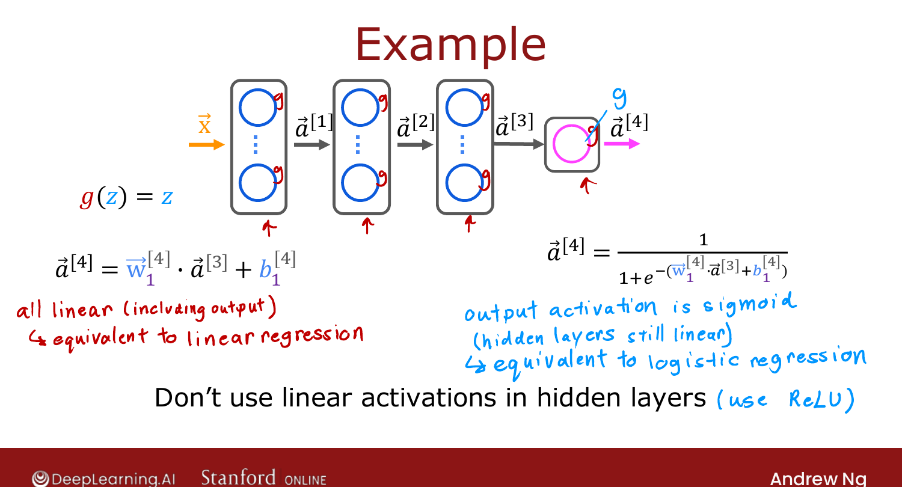
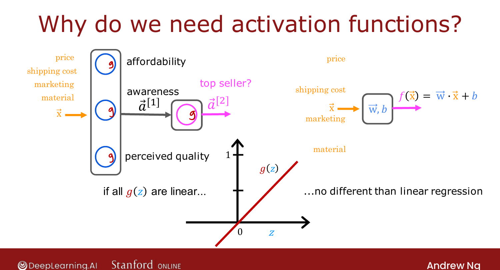

# Why Do We Need Activation Functions?

> **Course 2 · Week 2** · _AI-generated study aid — not authoritative; trust the lecture & cited sources._

[← Choosing Activation Functions](../../course-2/week-2/choosing-activation-functions.md){ .md-button }

[Multiclass Classification →](../../course-2/week-2/multiclass.md){ .md-button }

<video controls preload="none" playsinline src="https://dyckms5inbsqq.cloudfront.net/dlai/advanced-learning-algorithms/W2/L5-C2W2L2S03-Why-do-we-need-activat/lc-advanced-learning-algorithms-W2-L5-C2W2L2S03-Why-do-we-need-activat-master_360p.mp4?v=1752484663">Your browser can't play this video — <a href="https://dyckms5inbsqq.cloudfront.net/dlai/advanced-learning-algorithms/W2/L5-C2W2L2S03-Why-do-we-need-activat/lc-advanced-learning-algorithms-W2-L5-C2W2L2S03-Why-do-we-need-activat-master_360p.mp4?v=1752484663">download the lecture</a>.</video>

> 📄 **[Read the full lecture transcript](why-do-we-need-activation-functions-transcript.md)**

Why not just use the **linear** activation $g(z)=z$ everywhere — i.e. no activation at all?
It turns out that breaks the network completely: it collapses into plain linear regression. `[00:02]`

## The collapse, on a tiny network

Take $x$ (one number) → one hidden unit ($w_1,b_1$) → one output unit ($w_2,b_2$), with
$g(z)=z$ everywhere: `[00:51]`

$$a^{[1]} = w_1 x + b_1,\qquad a^{[2]} = w_2 a^{[1]} + b_2.$$

Substitute $a^{[1]}$ into $a^{[2]}$:

$$a^{[2]} = w_2(w_1 x + b_1) + b_2 = (w_2 w_1)\,x + (w_2 b_1 + b_2).$$

Set $w = w_2 w_1$ and $b = w_2 b_1 + b_2$ and you get $a^{[2]} = wx + b$ — just **linear
regression**. The extra layer bought nothing. `[02:48]`

The reason is general: **a linear function of a linear function is still linear.** Stacking
linear layers can never represent anything more complex than a single linear map. `[03:06]`

{ .slide }
_Official C2 slide — don't use linear activations in hidden layers (DeepLearning.AI / Stanford)._
{ .slide-cap }

## The general rule

- All layers **linear** → the whole network $\equiv$ **linear regression**. `[03:40]`
- Hidden layers **linear** + output **sigmoid** → the network $\equiv$ **logistic
  regression**. `[04:04]`

Either way the network does nothing you couldn't do with one of the Course-1 models. Hence
the rule of thumb: **never use linear activations in the hidden layers** — use ReLU. `[04:32]`

!!! note "Deeper — Nielsen, *Neural Networks and Deep Learning*, Ch. 4"
    The flip side of this is Nielsen's **universal-approximation** result: as soon as the
    hidden units are **non-linear** (e.g. sigmoid or ReLU), a network with a single hidden
    layer can approximate *any* continuous function to arbitrary accuracy given enough
    units. Non-linearity is the one ingredient that turns a stack of layers from "still
    linear regression" into a universal function approximator.

{ .slide }
_Official C2 slide — linear activations collapse (DeepLearning.AI / Stanford)._
{ .slide-cap }

Next: generalising classification to **more than two** classes. `[05:06]`

[← Choosing Activation Functions](../../course-2/week-2/choosing-activation-functions.md){ .md-button }

[Multiclass Classification →](../../course-2/week-2/multiclass.md){ .md-button }

