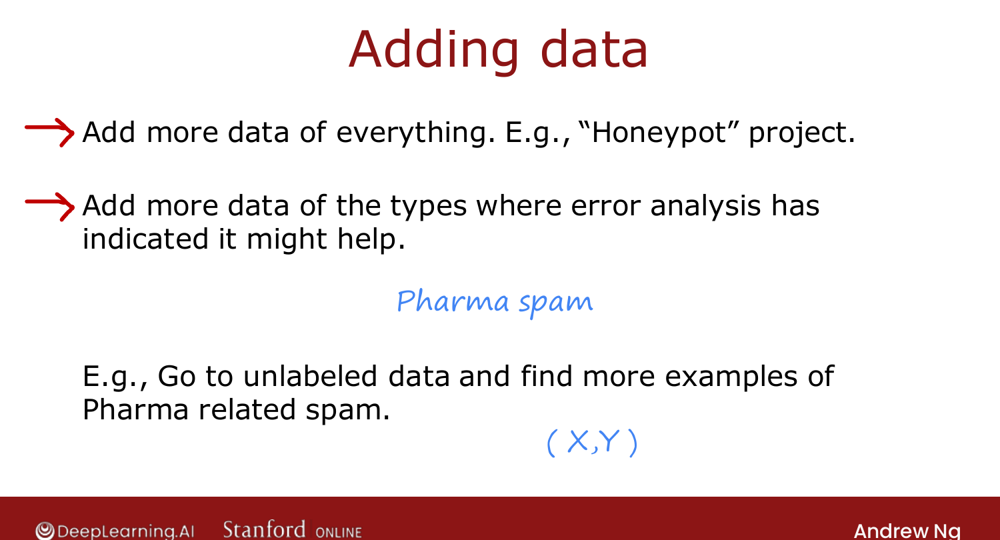
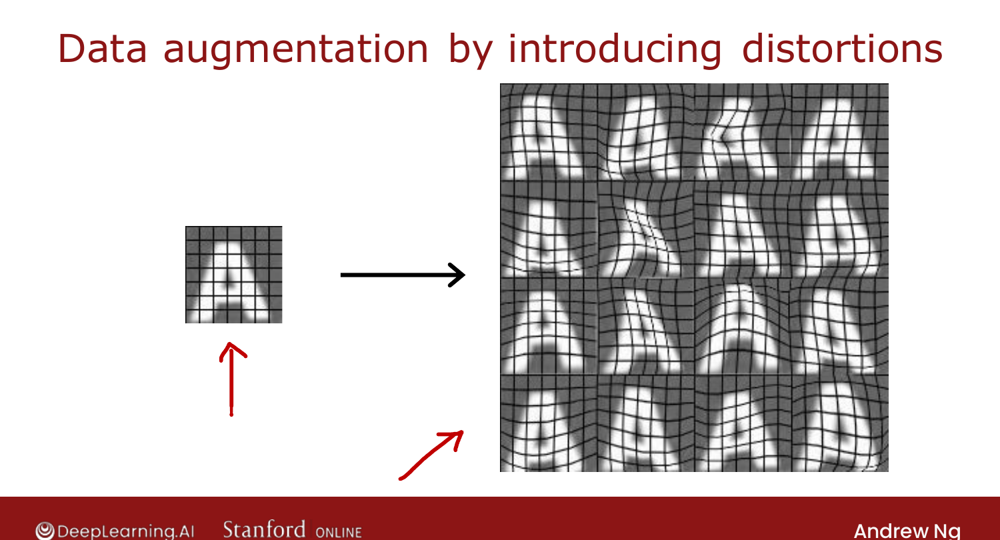
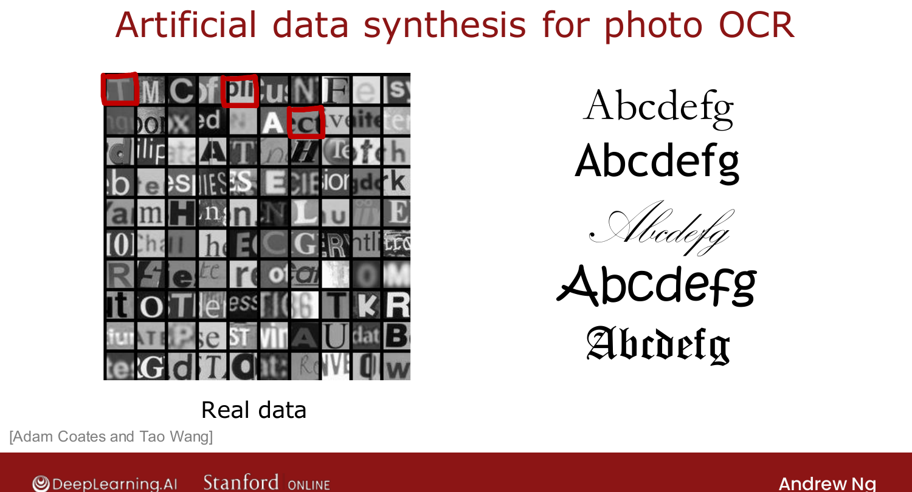

# Adding Data

> **Course 2 · Week 3** · _AI-generated study aid — not authoritative; trust the lecture & cited sources._

[← Error Analysis](../../course-2/week-3/error-analysis.md){ .md-button }

[Transfer Learning →](../../course-2/week-3/transfer-learning-using-data-from-a-different-task.md){ .md-button }

<video controls preload="none" playsinline src="https://dyckms5inbsqq.cloudfront.net/dlai/advanced-learning-algorithms/W3/L12-C2W3L3S03-Adding-data-L12/lc-advanced-learning-algorithms-W3-L12-C2W3L3S03-Adding-data-L12-master_360p.mp4?v=1752484668">Your browser can't play this video — <a href="https://dyckms5inbsqq.cloudfront.net/dlai/advanced-learning-algorithms/W3/L12-C2W3L3S03-Adding-data-L12/lc-advanced-learning-algorithms-W3-L12-C2W3L3S03-Adding-data-L12-master_360p.mp4?v=1752484668">download the lecture</a>.</video>

> 📄 **[Read the full lecture transcript](adding-data-transcript.md)**

A grab-bag of techniques for **getting more data** when that's what your diagnostics call
for. Not every one applies to every problem, but many are broadly useful. `[00:47]`

## Add data where it helps, not everywhere

Getting more data of *everything* is slow and expensive. Better: add more data of the
**types error analysis flagged**. If pharma spam is the big error category, have labelers
skim **unlabeled** email for more *pharma* examples — a modest, targeted effort that can
boost performance far more than collecting random emails. `[03:11]`

{ .slide }
_Official C2 slide — add data where it helps (DeepLearning.AI / Stanford)._
{ .slide-cap }

## Data augmentation

Take an existing example and **distort the input** while keeping the label, to manufacture
new examples. For OCR of the letter A: rotate, enlarge, shrink, change contrast, or apply
random **grid warping** — one image becomes many, all still labeled "A." `[05:23]`

{ .slide }
_Official C2 slide — augmentation by distortion (DeepLearning.AI / Stanford)._
{ .slide-cap }

It works for **speech** too: add crowd noise, car noise, or a bad-phone-line effect to a
clean clip to make several training examples. **Key rule:** the distortions should be
**representative of the test set** — adding crowd noise helps if your users speak in noisy
places; adding **pure random per-pixel noise** usually **doesn't** help, because the test
set never looks like that. `[08:14]`

## Data synthesis

**Synthesis** makes brand-new examples *from scratch* (not by modifying existing ones). For
**photo OCR**, type random text in many computer **fonts**, colors and contrasts and
screenshot it — the synthetic letters look realistic enough to generate a huge training set.
Synthesis is used most in **computer vision**. `[11:03]`

{ .slide }
_Official C2 slide — synthetic data for photo OCR (DeepLearning.AI / Stanford)._
{ .slide-cap }

## Model-centric vs. data-centric

An AI system is **code + data**. For decades research held the *data* fixed and improved the
*code* (model-centric). But today's algorithms (linear/logistic regression, neural nets,
decision trees) are already very good — so it's often more fruitful to take a **data-centric**
view and engineer the **data**: collect targeted data, augment, or synthesize. `[12:49]`

Next: when you really can't get much data — **transfer learning**. `[13:38]`

[← Error Analysis](../../course-2/week-3/error-analysis.md){ .md-button }

[Transfer Learning →](../../course-2/week-3/transfer-learning-using-data-from-a-different-task.md){ .md-button }

