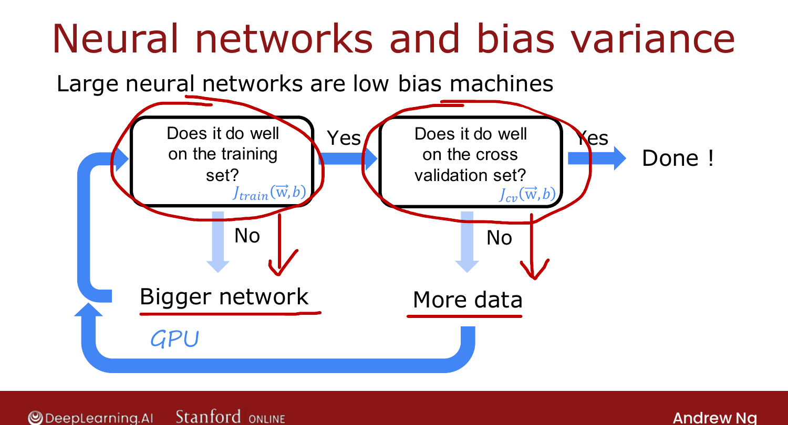
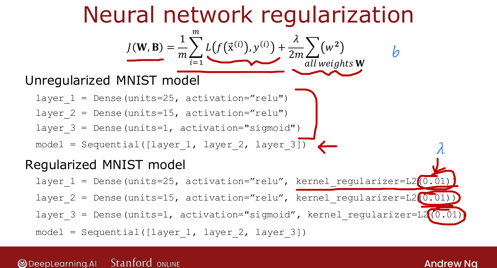

# Bias, Variance, and Neural Networks

> **Course 2 · Week 3** · _AI-generated study aid — not authoritative; trust the lecture & cited sources._

<div class="ep-nav" markdown>

[← Deciding What to Try Next (Revisited)](../../course-2/week-3/deciding-what-to-try-next-revisited.md){ .md-button }

[The Iterative Loop of ML Development →](../../course-2/week-3/iterative-loop-of-ml-development.md){ .md-button }

</div>

<div class="video-wrap"><video controls preload="none" playsinline src="https://dyckms5inbsqq.cloudfront.net/dlai/advanced-learning-algorithms/W3/L9-C2W3L2S06-Bias-variance-and-neur/lc-advanced-learning-algorithms-W3-L9-C2W3L2S06-Bias-variance-and-neur-master_360p.mp4?v=1752484667">Your browser can't play this video — <a href="https://dyckms5inbsqq.cloudfront.net/dlai/advanced-learning-algorithms/W3/L9-C2W3L2S06-Bias-variance-and-neur/lc-advanced-learning-algorithms-W3-L9-C2W3L2S06-Bias-variance-and-neur-master_360p.mp4?v=1752484667">download the lecture</a>.</video></div>

> 📄 **[Read the full lecture transcript](bias-variance-and-neural-networks-transcript.md)**

Neural networks + big data give a way to **sidestep** the classic bias-variance trade-off. `[00:08]`

## The old trade-off

Before neural networks, you balanced model complexity (degree $d$, or $\lambda$): too simple
→ high bias, too complex → high variance, and you picked a middle point with lowest
$J_\text{cv}$. That tug-of-war is the **bias-variance trade-off**. `[01:23]`

## The neural-network recipe

Large neural networks are **low-bias machines**: made big enough, they can almost always fit
a not-too-huge training set. That gives a simple loop that treats bias and variance
**separately**: `[01:51]`

1. **Does it do well on the training set?** (Is $J_\text{train}$ low vs. baseline?)
   - **No** (high bias) → use a **bigger network** (more layers/units), retrain, repeat.
2. **Does it do well on the cross-validation set?** (Is $J_\text{cv}$ close to $J_\text{train}$?)
   - **No** (high variance) → **get more data**, go back to step 1.
3. **Yes to both** → done. `[04:38]`

{ .slide }
_Official C2 slide — the bias/variance recipe for neural networks (DeepLearning.AI / Stanford)._
{ .slide-cap }

Caveats: bigger networks get **computationally expensive** (hence GPUs), and you can only
get so much data. But this loop explains much of the **rise of deep learning**. `[05:08]`

## Won't a big network overfit?

Mostly **no** — a **large** network with **well-chosen regularization** does as well or
better than a smaller one. It almost never *hurts* to go bigger (so long as you regularize);
the only real cost is slower training/inference. `[06:52]`

The L2 regularization term is what you'd expect, summed over all weights $w$ (we don't
regularize $b$):

$$J = \frac{1}{m}\sum L + \frac{\lambda}{2m}\sum_{\text{all } w} w^2.$$

```python
from tensorflow.keras.regularizers import L2
model = Sequential([
    Dense(25, activation='relu', kernel_regularizer=L2(0.01)),
    Dense(15, activation='relu', kernel_regularizer=L2(0.01)),
    Dense(10, activation='linear', kernel_regularizer=L2(0.01)),
])
```

{ .slide }
_Official C2 slide — L2 regularization in TensorFlow (DeepLearning.AI / Stanford)._
{ .slide-cap }

!!! note "Deeper — Nielsen, *Neural Networks and Deep Learning*, Ch. 3"
    Nielsen's chapter on overfitting and regularization gives the matching intuition: L2
    weight decay penalizes large weights, biasing the network toward **smaller, smoother**
    weight configurations that generalize better — which is why (as Ng says) a large
    regularized network usually beats a small one rather than overfitting.

Takeaways: a large network is often a low-bias machine, so with neural networks you usually
fight **variance**, not bias. Next: the ML **development process**. `[10:05]`


<div class="ep-nav" markdown>

[← Deciding What to Try Next (Revisited)](../../course-2/week-3/deciding-what-to-try-next-revisited.md){ .md-button }

[The Iterative Loop of ML Development →](../../course-2/week-3/iterative-loop-of-ml-development.md){ .md-button }

</div>
