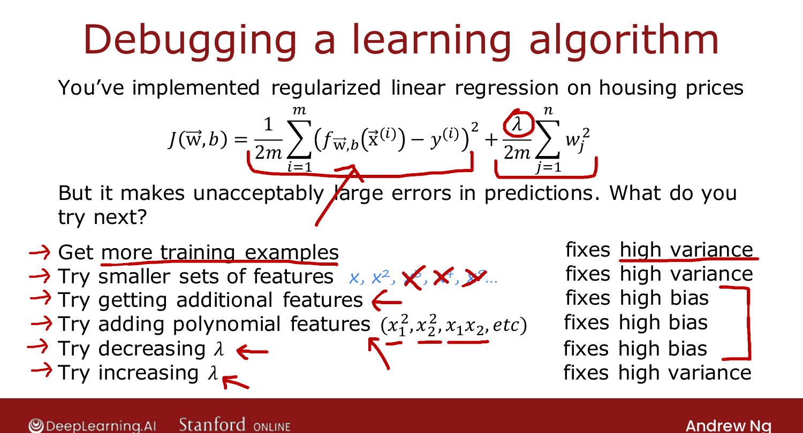

# Deciding What to Try Next (Revisited)

> **Course 2 · Week 3** · _AI-generated study aid — not authoritative; trust the lecture & cited sources._

[← Learning Curves](../../course-2/week-3/learning-curves.md){ .md-button }

[Bias, Variance, and Neural Networks →](../../course-2/week-3/bias-variance-and-neural-networks.md){ .md-button }

<video controls preload="none" playsinline src="https://dyckms5inbsqq.cloudfront.net/dlai/advanced-learning-algorithms/W3/L8-C2W3L2S05-Deciding-what-to-try-n/lc-advanced-learning-algorithms-W3-L8-C2W3L2S05-Deciding-what-to-try-n-master_360p.mp4?v=1752484667">Your browser can't play this video — <a href="https://dyckms5inbsqq.cloudfront.net/dlai/advanced-learning-algorithms/W3/L8-C2W3L2S05-Deciding-what-to-try-n/lc-advanced-learning-algorithms-W3-L8-C2W3L2S05-Deciding-what-to-try-n-master_360p.mp4?v=1752484667">download the lecture</a>.</video>

> 📄 **[Read the full lecture transcript](deciding-what-to-try-next-revisited-transcript.md)**

Back to the six options from the start of the week. Each one fixes **either** high bias
**or** high variance — and now you can tell which. `[00:35]`

## The six fixes, sorted

| Idea | Fixes |
|---|---|
| Get **more training examples** | high **variance** |
| Try a **smaller** set of features | high **variance** |
| Get **additional** features | high **bias** |
| Add **polynomial** features | high **bias** |
| **Decrease** $\lambda$ | high **bias** |
| **Increase** $\lambda$ | high **variance** |

{ .slide }
_Official C2 slide — which fix addresses which problem (DeepLearning.AI / Stanford)._
{ .slide-cap }

## The intuition

- **High variance** (overfitting) → **get more data** or **simplify the model**: fewer
  features, or a larger $\lambda$ — less flexibility to fit wiggly curves. `[01:55]`
- **High bias** (underfitting) → **make the model more powerful**: more/polynomial features,
  or a smaller $\lambda$ — more flexibility to fit complex functions. `[05:35]`

Why "more data fixes variance, not bias": with high bias the learning curves have already
plateaued, so extra data doesn't help. And **don't** shrink the training set to fix bias —
that just worsens generalization. `[06:36]`

!!! note "Bias/variance: a lifetime to master"
    Ng relays a former PhD student's line — bias/variance "takes a short time to learn but a
    lifetime to master." Knowing the definitions is easy; applying them systematically to
    real projects is a skill you build through repeated practice. He almost always checks
    bias vs. variance first when training any algorithm. `[07:24]`

Next: bias/variance applied to **neural networks**. `[08:44]`

[← Learning Curves](../../course-2/week-3/learning-curves.md){ .md-button }

[Bias, Variance, and Neural Networks →](../../course-2/week-3/bias-variance-and-neural-networks.md){ .md-button }

