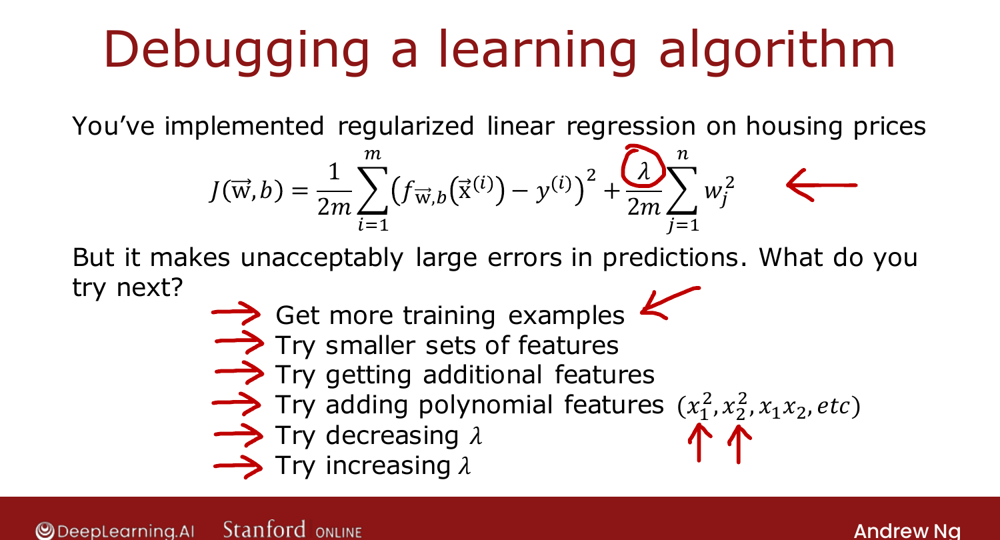
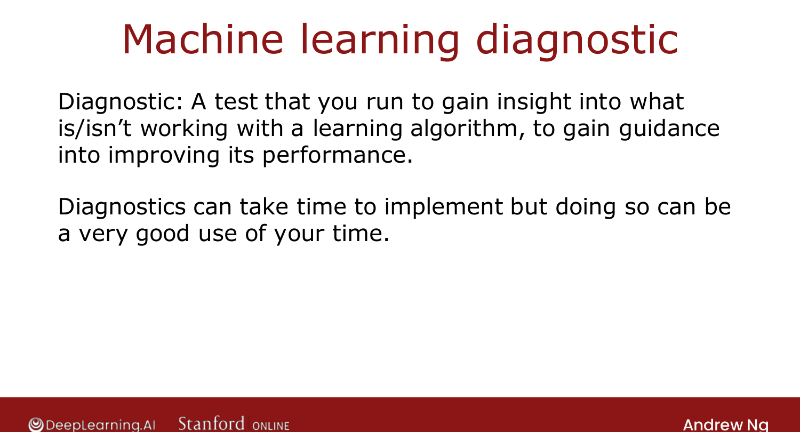

# Deciding What to Try Next

> **Course 2 · Week 3** · _AI-generated study aid — not authoritative; trust the lecture & cited sources._

[← Larger Neural Network Example (Optional)](../../course-2/week-2/larger-neural-network-example.md){ .md-button }

[Evaluating a Model →](../../course-2/week-3/evaluating-a-model.md){ .md-button }

<video controls preload="none" playsinline src="https://dyckms5inbsqq.cloudfront.net/dlai/advanced-learning-algorithms/W3/L1-C2W3L1S01-Deciding-what-to-try-n/lc-advanced-learning-algorithms-W3-L1-C2W3L1S01-Deciding-what-to-try-n-master_360p.mp4?v=1752484665">Your browser can't play this video — <a href="https://dyckms5inbsqq.cloudfront.net/dlai/advanced-learning-algorithms/W3/L1-C2W3L1S01-Deciding-what-to-try-n/lc-advanced-learning-algorithms-W3-L1-C2W3L1S01-Deciding-what-to-try-n-master_360p.mp4?v=1752484665">download the lecture</a>.</video>

> 📄 **[Read the full lecture transcript](deciding-what-to-try-next-transcript.md)**

You now have powerful tools — linear regression, logistic regression, neural networks. This
week is about using them **effectively**: making good decisions about what to do next, which
is what separates a 2-week project from a 6-month one. `[00:18]`

## The problem: too many options

Say you've trained regularized linear regression to predict housing prices, and it makes
**unacceptably large errors**. What do you try next? The usual menu: `[01:04]`

- get **more training examples**
- try a **smaller** set of features
- try **additional** features
- add **polynomial** features ($x_1^2, x_2^2, x_1 x_2, \dots$)
- **decrease** $\lambda$
- **increase** $\lambda$

Some of these will help a lot; some will waste months. Teams have spent *many months*
collecting more data when it turned out not to help. The skill is choosing **where to invest
your time**. `[02:29]`

{ .slide }
_Official C2 slide — what to try next when a model underperforms (DeepLearning.AI / Stanford)._
{ .slide-cap }

## The answer: diagnostics

A **diagnostic** is a test you run to gain **insight** into what is or isn't working with a
learning algorithm — guidance on how to improve it. A good diagnostic can tell you, for
example, whether it's even *worth* weeks of collecting more data — potentially saving you
months. Diagnostics take time to implement, but running them is usually a very good use of
that time. `[02:47]`

{ .slide }
_Official C2 slide — what a diagnostic is (DeepLearning.AI / Stanford)._
{ .slide-cap }

First, the foundation everything else builds on: **how to evaluate a model**. `[03:35]`

[← Larger Neural Network Example (Optional)](../../course-2/week-2/larger-neural-network-example.md){ .md-button }

[Evaluating a Model →](../../course-2/week-3/evaluating-a-model.md){ .md-button }

