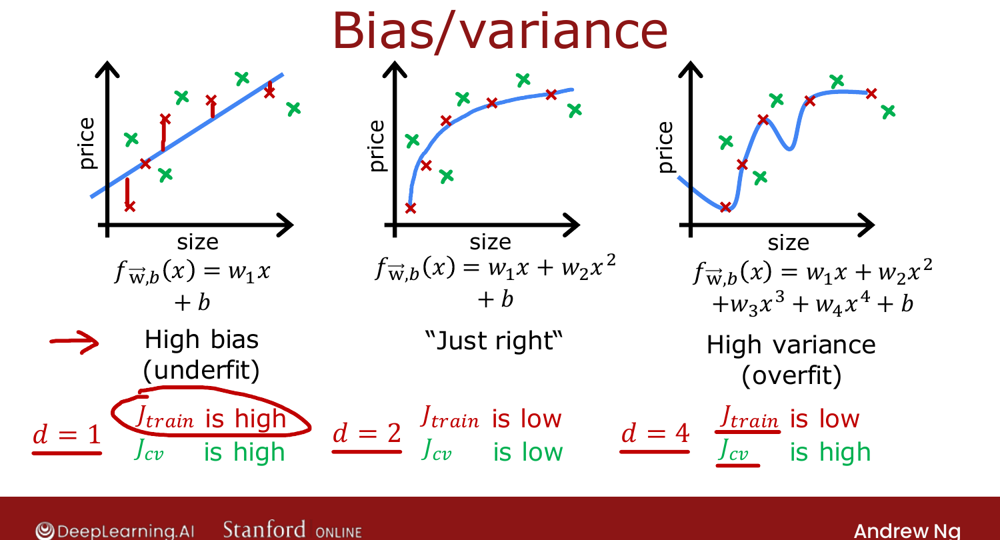
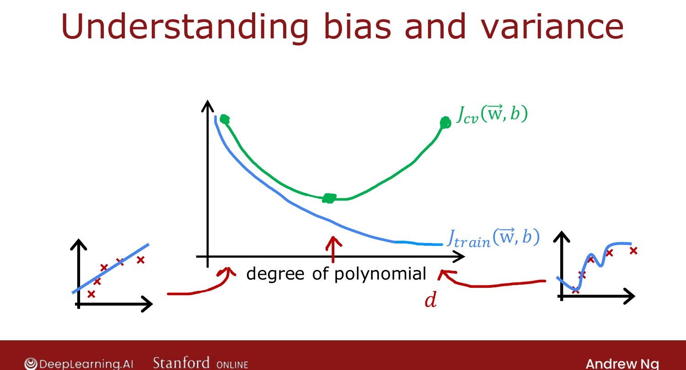
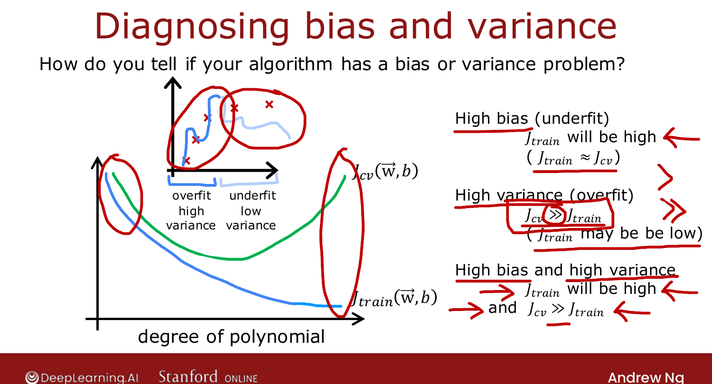

# Diagnosing Bias and Variance

> **Course 2 · Week 3** · _AI-generated study aid — not authoritative; trust the lecture & cited sources._

[← Model Selection: Train / Cross-Validation / Test Sets](../../course-2/week-3/model-selection-and-training-cross-validation-test-sets.md){ .md-button }

[Regularization and Bias/Variance →](../../course-2/week-3/regularization-and-bias-variance.md){ .md-button }

<video controls preload="none" playsinline src="https://dyckms5inbsqq.cloudfront.net/dlai/advanced-learning-algorithms/W3/L4-C2W3L2S01-Diagnosing-bias-and-va/lc-advanced-learning-algorithms-W3-L4-C2W3L2S01-Diagnosing-bias-and-va-master_360p.mp4?v=1752484666">Your browser can't play this video — <a href="https://dyckms5inbsqq.cloudfront.net/dlai/advanced-learning-algorithms/W3/L4-C2W3L2S01-Diagnosing-bias-and-va/lc-advanced-learning-algorithms-W3-L4-C2W3L2S01-Diagnosing-bias-and-va-master_360p.mp4?v=1752484666">download the lecture</a>.</video>

> 📄 **[Read the full lecture transcript](diagnosing-bias-and-variance-transcript.md)**

A model almost never works well the first time. Looking at its **bias** and **variance** is
the single best guide to what to try next. `[00:26]`

## The two failure modes

From Course 1, fitting housing data: a straight line **underfits** (**high bias**); a
4th-order polynomial **overfits** (**high variance**); a quadratic is **just right**. With
one feature you can see it — but with many features you can't plot $f$, so diagnose it
**numerically** instead. `[01:24]`

{ .slide }
_Official C2 slide — the bias/variance triptych (DeepLearning.AI / Stanford)._
{ .slide-cap }

_Sweep the model complexity and watch $J_\text{train}$ fall while $J_\text{cv}$ traces a U — high-bias on the left, high-variance on the right._
{ .mlw-caption }

## Read it off $J_\text{train}$ and $J_\text{cv}$

- **High bias (underfit):** $J_\text{train}$ is **high** — it doesn't even fit the training
  set. ($J_\text{cv}$ is high too, and close to $J_\text{train}$.) `[02:33]`
- **High variance (overfit):** $J_\text{cv} \gg J_\text{train}$ — does much better on data
  it has seen than on data it hasn't. ($J_\text{train}$ is usually low.) `[03:18]`
- **Just right:** both $J_\text{train}$ and $J_\text{cv}$ are low. `[04:27]`

{ .slide }
_Official C2 slide — J_train and J_cv vs. degree of polynomial (DeepLearning.AI / Stanford)._
{ .slide-cap }

As the degree $d$ rises, $J_\text{train}$ keeps falling, but $J_\text{cv}$ forms a **U** —
high at low $d$ (underfit) and high at high $d$ (overfit), lowest in the middle. `[07:14]`

{ .slide }
_Official C2 slide — the bias/variance decision rule (DeepLearning.AI / Stanford)._
{ .slide-cap }

## Both at once

It's possible (rare for 1-D linear models, occasional for neural networks) to have **high
bias *and* high variance**: $J_\text{train}$ high **and** $J_\text{cv} \gg J_\text{train}$ —
as if the model overfits part of the input while underfitting another part. `[08:31]`

**Takeaway:** high bias = doesn't do well on the training set; high variance = does much
worse on CV than training. Next: how **regularization** ($\lambda$) shifts this. `[10:53]`

[← Model Selection: Train / Cross-Validation / Test Sets](../../course-2/week-3/model-selection-and-training-cross-validation-test-sets.md){ .md-button }

[Regularization and Bias/Variance →](../../course-2/week-3/regularization-and-bias-variance.md){ .md-button }

