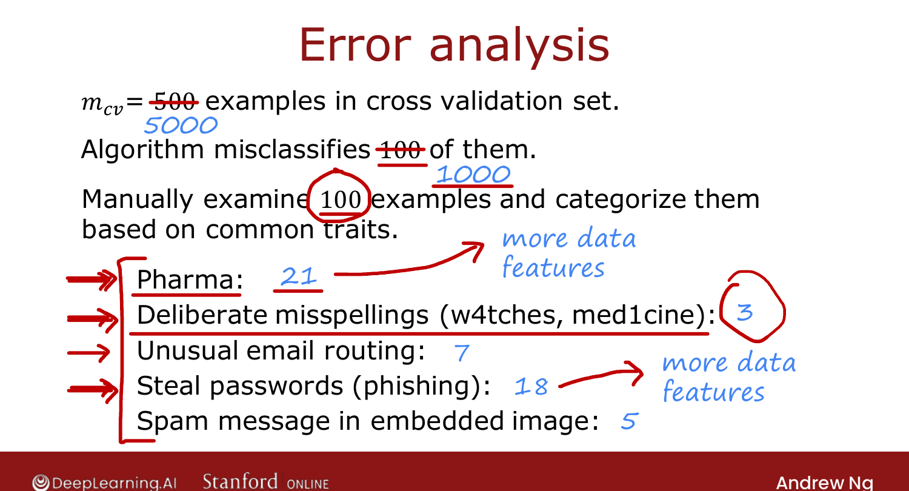

# Error Analysis

> **Course 2 · Week 3** · _AI-generated study aid — not authoritative; trust the lecture & cited sources._

[← The Iterative Loop of ML Development](../../course-2/week-3/iterative-loop-of-ml-development.md){ .md-button }

[Adding Data →](../../course-2/week-3/adding-data.md){ .md-button }

<video controls preload="none" playsinline src="https://dyckms5inbsqq.cloudfront.net/dlai/advanced-learning-algorithms/W3/L11-C2W3L3S02-Error-analysis-L11/lc-advanced-learning-algorithms-W3-L11-C2W3L3S02-Error-analysis-L11-master_360p.mp4?v=1752484668">Your browser can't play this video — <a href="https://dyckms5inbsqq.cloudfront.net/dlai/advanced-learning-algorithms/W3/L11-C2W3L3S02-Error-analysis-L11/lc-advanced-learning-algorithms-W3-L11-C2W3L3S02-Error-analysis-L11-master_360p.mp4?v=1752484668">download the lecture</a>.</video>

> 📄 **[Read the full lecture transcript](error-analysis-transcript.md)**

After bias/variance, **error analysis** is the second-most-important diagnostic for deciding
what to try next. `[00:02]`

## What it is

Suppose $m_\text{cv} = 500$ and the algorithm misclassifies 100 of them. Error analysis is
just **manually looking through** those 100 misclassified examples and **grouping them into
common themes**, then counting each group. For the spam classifier: `[00:45]`

| Category | Count (of 100) |
|---|---|
| Pharmaceutical spam | 21 |
| Phishing / password-stealing | 18 |
| Unusual email routing | 7 |
| Deliberate misspellings | 3 |
| Embedded-image spam | … |

{ .slide }
_Official C2 slide — categorizing misclassified examples (DeepLearning.AI / Stanford)._
{ .slide-cap }

## Why it pays off

The counts show **pharma** and **phishing** are the big problems, while **misspellings** are
small. Even a perfect misspelling-detector would fix only **3 of 100** — so it's low
priority. (Ng once spent a lot of time on a misspelling detector before realizing its impact
was tiny — exactly the mistake error analysis prevents.) `[03:06]`

Notes on the process:

- Categories can **overlap** (one email can be pharma *and* phishing). `[03:38]`
- If too many to read (e.g. 1,000 misclassified), **randomly sample ~100** — enough to see
  the common error types. `[04:30]`

## From analysis to action

Finding that pharma spam dominates inspires **targeted** fixes: collect more *pharma* data
specifically, or add features for drug names — rather than collecting more of everything. `[04:54]`

**Limitation:** error analysis is easy for tasks **humans are good at** (you can see why an
email is spam) but harder where humans can't judge (e.g. predicting which ad a user clicks).
Where it applies, it can save **months** of fruitless work. `[07:14]`

Next: how to **add data** efficiently when variance is the problem. `[08:01]`

[← The Iterative Loop of ML Development](../../course-2/week-3/iterative-loop-of-ml-development.md){ .md-button }

[Adding Data →](../../course-2/week-3/adding-data.md){ .md-button }

