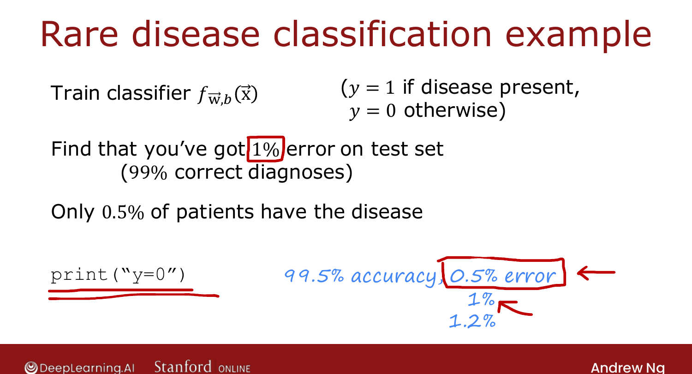
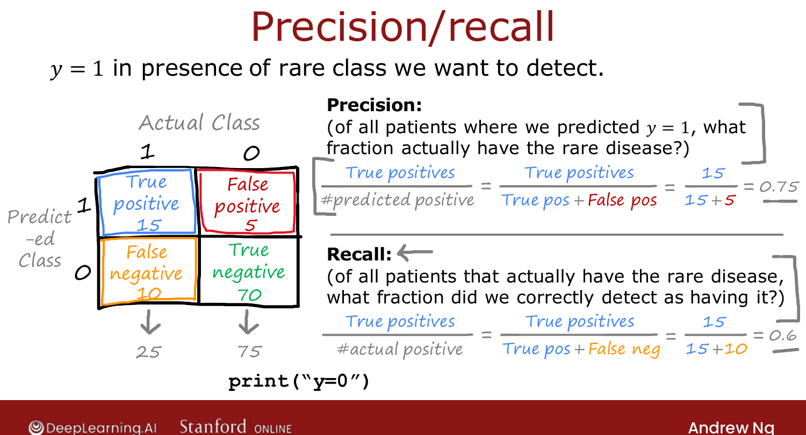

# Error Metrics for Skewed Datasets (Optional)

> **Course 2 · Week 3** · _AI-generated study aid — not authoritative; trust the lecture & cited sources._

[← Fairness, Bias, and Ethics](../../course-2/week-3/fairness-bias-and-ethics.md){ .md-button }

[Trading Off Precision and Recall (Optional) →](../../course-2/week-3/trading-off-precision-and-recall.md){ .md-button }

<video controls preload="none" playsinline src="https://dyckms5inbsqq.cloudfront.net/dlai/advanced-learning-algorithms/W3/L16-C2W3L4S01-Error-metrics-for-skew/lc-advanced-learning-algorithms-W3-L16-C2W3L4S01-Error-metrics-for-skew-master_360p.mp4?v=1752484669">Your browser can't play this video — <a href="https://dyckms5inbsqq.cloudfront.net/dlai/advanced-learning-algorithms/W3/L16-C2W3L4S01-Error-metrics-for-skew/lc-advanced-learning-algorithms-W3-L16-C2W3L4S01-Error-metrics-for-skew-master_360p.mp4?v=1752484669">download the lecture</a>.</video>

> 📄 **[Read the full lecture transcript](error-metrics-for-skewed-datasets-transcript.md)**

When the ratio of positive to negative examples is **very far from 50/50**, plain accuracy
stops being a useful metric. `[00:01]`

## Why accuracy misleads

Train a classifier for a **rare disease** ($y=1$ if present). Suppose it gets **1% error**
(99% accuracy) — sounds great. But if only **0.5%** of patients actually have the disease,
then the trivial program `print("y=0")` — never diagnosing anyone — has **99.5% accuracy**,
*beating* your model. So 1% error tells you nothing about whether the model is actually
useful, and you can't compare 99.5% vs. 99.2% vs. 99.6% models meaningfully. `[02:12]`

{ .slide }
_Official C2 slide — why accuracy fails on skewed data (DeepLearning.AI / Stanford)._
{ .slide-cap }

## The confusion matrix

For the rare class $y=1$, tabulate predictions vs. actuals into four cells: `[03:13]`

|  | Actual 1 | Actual 0 |
|---|---|---|
| **Predicted 1** | True Positive (15) | False Positive (5) |
| **Predicted 0** | False Negative (10) | True Negative (70) |

## Precision and recall

$$\text{Precision} = \frac{\text{TP}}{\text{TP}+\text{FP}} = \frac{15}{15+5} = 0.75,
\qquad
\text{Recall} = \frac{\text{TP}}{\text{TP}+\text{FN}} = \frac{15}{15+10} = 0.60.$$

- **Precision:** of all examples we *predicted* positive, what fraction really are? (When it
  says "disease," how often is it right? → 75%.) `[06:42]`
- **Recall:** of all examples that *actually* are positive, what fraction did we catch? (Of
  the patients who have the disease, how many did we find? → 60%.) `[07:45]`

{ .slide }
_Official C2 slide — precision and recall (DeepLearning.AI / Stanford)._
{ .slide-cap }

The trick: the `print("y=0")` cheat has **zero** true positives, so its **recall is 0** —
exposing it immediately. An algorithm with high-ish precision *and* recall is genuinely
useful. Next: trading the two off. `[10:48]`

[← Fairness, Bias, and Ethics](../../course-2/week-3/fairness-bias-and-ethics.md){ .md-button }

[Trading Off Precision and Recall (Optional) →](../../course-2/week-3/trading-off-precision-and-recall.md){ .md-button }

