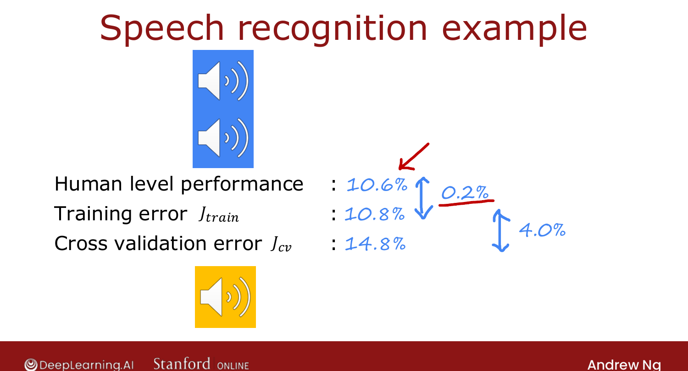
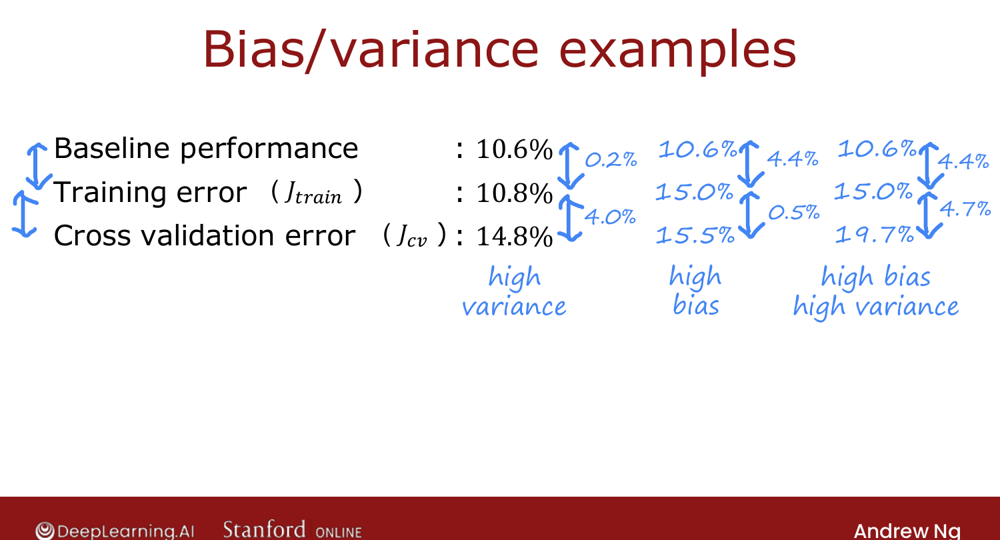

# Establishing a Baseline Level of Performance

> **Course 2 · Week 3** · _AI-generated study aid — not authoritative; trust the lecture & cited sources._

[← Regularization and Bias/Variance](../../course-2/week-3/regularization-and-bias-variance.md){ .md-button }

[Learning Curves →](../../course-2/week-3/learning-curves.md){ .md-button }

<video controls preload="none" playsinline src="https://dyckms5inbsqq.cloudfront.net/dlai/advanced-learning-algorithms/W3/L6-C2W3L2S03-Establishing-a-baselin/lc-advanced-learning-algorithms-W3-L6-C2W3L2S03-Establishing-a-baselin-master_360p.mp4?v=1752484666">Your browser can't play this video — <a href="https://dyckms5inbsqq.cloudfront.net/dlai/advanced-learning-algorithms/W3/L6-C2W3L2S03-Establishing-a-baselin/lc-advanced-learning-algorithms-W3-L6-C2W3L2S03-Establishing-a-baselin-master_360p.mp4?v=1752484666">download the lecture</a>.</video>

> 📄 **[Read the full lecture transcript](establishing-a-baseline-level-of-performance-transcript.md)**

Is $J_\text{train} = 10.8\%$ "high"? It depends on what's **achievable**. The fix: compare
to a **baseline**. `[00:12]`

## Speech-recognition example

A speech recognizer gets $J_\text{train} = 10.8\%$, $J_\text{cv} = 14.8\%$. Getting 10.8%
of the *training* set wrong looks like high bias. But **human-level performance** on the
same noisy audio is **10.6%** — even fluent humans can't transcribe noisy clips perfectly. `[02:30]`

Now compare the **gaps**:

- $J_\text{train} -$ baseline $= 10.8 - 10.6 = \mathbf{0.2\%}$ → tiny → **not** high bias.
- $J_\text{cv} - J_\text{train} = 14.8 - 10.8 = \mathbf{4.0\%}$ → large → **high variance**.

So benchmarking against the baseline flips the diagnosis from "high bias" to "high variance." `[03:36]`

{ .slide }
_Official C2 slide — judging error relative to a baseline (DeepLearning.AI / Stanford)._
{ .slide-cap }

## Picking a baseline

The **baseline** = the error you could *reasonably hope* to reach. Three common ways: `[04:51]`

1. **Human-level performance** — great for unstructured data (audio, images, text).
2. **A competing algorithm** — a prior or competitor's implementation.
3. **Experience / a guess.**

Then the **two gaps** are the diagnosis:

- baseline → $J_\text{train}$ gap large ⇒ **high bias**;
- $J_\text{train}$ → $J_\text{cv}$ gap large ⇒ **high variance**;
- both large ⇒ **both**.

{ .slide }
_Official C2 slide — the two gaps decide bias vs. variance (DeepLearning.AI / Stanford)._
{ .slide-cap }

The baseline can be $0\%$ if perfect performance is achievable — but for noisy tasks it's
much higher, and ignoring that misreads bias. Next: **learning curves**. `[09:13]`

[← Regularization and Bias/Variance](../../course-2/week-3/regularization-and-bias-variance.md){ .md-button }

[Learning Curves →](../../course-2/week-3/learning-curves.md){ .md-button }

