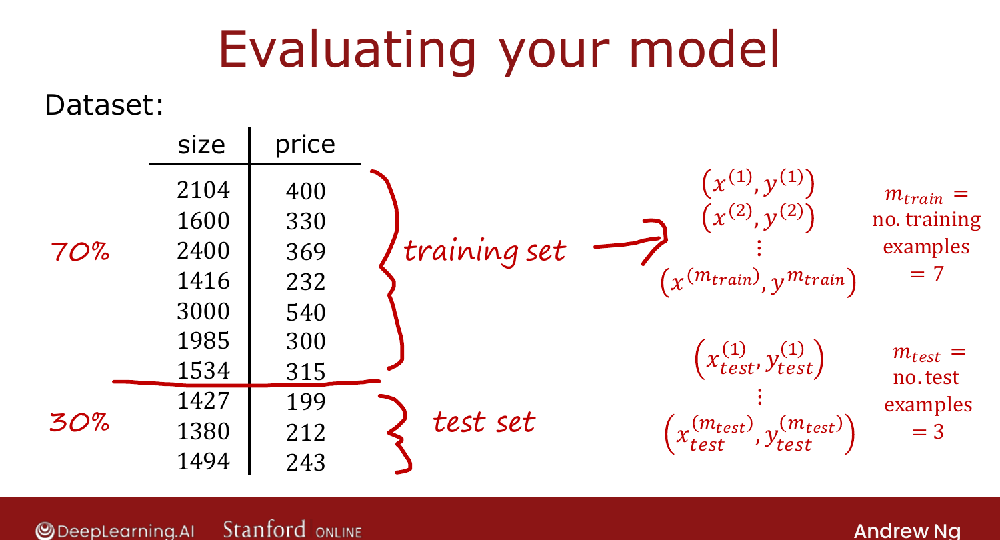
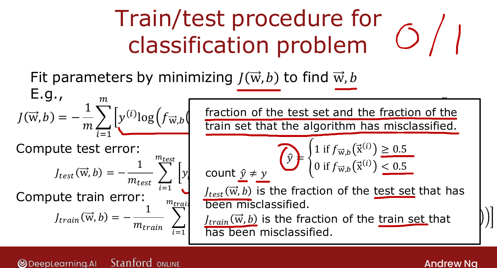

# Evaluating a Model

> **Course 2 · Week 3** · _AI-generated study aid — not authoritative; trust the lecture & cited sources._

[← Deciding What to Try Next](../../course-2/week-3/deciding-what-to-try-next.md){ .md-button }

[Model Selection: Train / Cross-Validation / Test Sets →](../../course-2/week-3/model-selection-and-training-cross-validation-test-sets.md){ .md-button }

<video controls preload="none" playsinline src="https://dyckms5inbsqq.cloudfront.net/dlai/advanced-learning-algorithms/W3/L2-C2W3L1S02-Evaluating-a-model-L2/lc-advanced-learning-algorithms-W3-L2-C2W3L1S02-Evaluating-a-model-L2-master_360p.mp4?v=1752484666">Your browser can't play this video — <a href="https://dyckms5inbsqq.cloudfront.net/dlai/advanced-learning-algorithms/W3/L2-C2W3L1S02-Evaluating-a-model-L2/lc-advanced-learning-algorithms-W3-L2-C2W3L1S02-Evaluating-a-model-L2-master_360p.mp4?v=1752484666">download the lecture</a>.</video>

> 📄 **[Read the full lecture transcript](evaluating-a-model-transcript.md)**

A **systematic** way to evaluate a model's performance also points the way to improving it. `[00:06]`

## Why eyeballing the curve fails

A 4th-order polynomial fit to 5 housing-price points fits the training data perfectly but is
**wiggly** — it won't generalize. With one feature you can *see* that. But with four features
($x_1$ size, $x_2$ bedrooms, $x_3$ floors, $x_4$ age) you can't plot a 4-D function, so you
need a **numerical** way to tell. `[01:43]`

## Train/test split

Split the data: ~**70%** training set, ~**30%** test set. Train the parameters on the
training set, then measure performance on the held-out test set. Notation:
$m_\text{train}$, $(\vec{x}^{(i)}_\text{test}, y^{(i)}_\text{test})$, $m_\text{test}$. `[03:56]`

{ .slide }
_Official C2 slide — splitting data into training and test sets (DeepLearning.AI / Stanford)._
{ .slide-cap }

## Train and test error (regression)

Fit by minimizing the regularized cost $J(\vec{w},b)$. Then compute, **without** the
regularization term: `[04:41]`

$$J_\text{test} = \frac{1}{2m_\text{test}}\sum_{i=1}^{m_\text{test}}\big(f(\vec{x}^{(i)}_\text{test}) - y^{(i)}_\text{test}\big)^2,
\qquad
J_\text{train} = \frac{1}{2m_\text{train}}\sum_{i=1}^{m_\text{train}}\big(f(\vec{x}^{(i)}) - y^{(i)}\big)^2.$$

The wiggly polynomial gives $J_\text{train}\approx 0$ but $J_\text{test}$ **high** — the
signal that it fits the training set yet fails to generalize. `[06:47]`

## Classification version

For classification you can use the logistic-loss form, but more common is the
**misclassification fraction**: have the model predict $\hat{y}\in\{0,1\}$ (1 if
$f(\vec{x})\ge 0.5$), then $J_\text{test}$ = fraction of the test set where
$\hat{y}\ne y$, and $J_\text{train}$ likewise on the training set. `[08:36]`

{ .slide }
_Official C2 slide — train/test error for classification (DeepLearning.AI / Stanford)._
{ .slide-cap }

Next: a refinement that lets the procedure **automatically choose** a model. `[09:53]`

[← Deciding What to Try Next](../../course-2/week-3/deciding-what-to-try-next.md){ .md-button }

[Model Selection: Train / Cross-Validation / Test Sets →](../../course-2/week-3/model-selection-and-training-cross-validation-test-sets.md){ .md-button }

