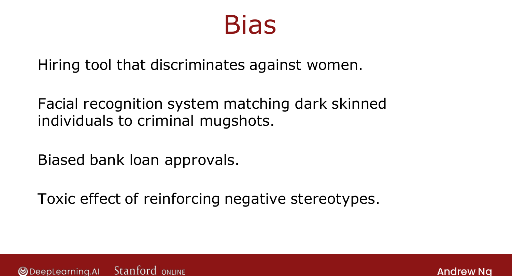

# Fairness, Bias, and Ethics

> **Course 2 · Week 3** · _AI-generated study aid — not authoritative; trust the lecture & cited sources._

[← Full Cycle of a Machine Learning Project](../../course-2/week-3/full-cycle-of-a-machine-learning-project.md){ .md-button }

[Error Metrics for Skewed Datasets (Optional) →](../../course-2/week-3/error-metrics-for-skewed-datasets.md){ .md-button }

<video controls preload="none" playsinline src="https://dyckms5inbsqq.cloudfront.net/dlai/advanced-learning-algorithms/W3/L15-C2W3L3S06-Fairness-bias-and-ethi/lc-advanced-learning-algorithms-W3-L15-C2W3L3S06-Fairness-bias-and-ethi-master_360p.mp4?v=1752484669">Your browser can't play this video — <a href="https://dyckms5inbsqq.cloudfront.net/dlai/advanced-learning-algorithms/W3/L15-C2W3L3S06-Fairness-bias-and-ethi/lc-advanced-learning-algorithms-W3-L15-C2W3L3S06-Fairness-bias-and-ethi-master_360p.mp4?v=1752484669">download the lecture</a>.</video>

> 📄 **[Read the full lecture transcript](fairness-bias-and-ethics-transcript.md)**

ML systems affect billions of people. If you build a system that affects people, give real
thought to making it **fair, free from bias, and ethical**. `[00:06]`

## When it has gone wrong

- A hiring tool that **discriminated against women**. `[00:43]`
- Face recognition matching **dark-skinned** individuals to criminal mugshots far more often. `[00:58]`
- **Biased bank-loan** approvals against subgroups. `[01:19]`
- Reinforcing **negative stereotypes** (e.g. a child searching a profession and seeing no one
  who looks like her). `[01:26]`

{ .slide }
_Official C2 slide — documented bias failures (DeepLearning.AI / Stanford)._
{ .slide-cap }

## Adverse use cases

**Deepfakes** (fake videos without consent), social media **amplifying toxic speech** when
optimizing for engagement, **bots** generating fake comments for commercial/political ends,
and ML used for **fraud**. As with spam, there's an ongoing battle between bad actors using
ML and those fighting them. Ng's blunt advice: **don't build harmful systems, and if asked
to work on something unethical, walk away** — he has killed financially sound projects on
ethical grounds. `[03:42]`

## No checklist — but guidance

Ng read books on ethics and philosophy hoping for a 5-item checklist, and **failed** — no
one has a simple one. Instead, general practices to make work **less biased and more fair**: `[05:08]`

1. **Assemble a diverse team** to brainstorm what might go wrong, emphasizing harm to
   **vulnerable groups** — diverse teams catch more problems. `[05:16]`
2. **Search the literature** for standards/guidelines in your industry (e.g. emerging
   fairness standards for loan approval). `[06:06]`
3. **Audit** the system against the identified harms **before** deployment — a key line of
   defense between training and production. `[06:41]`
4. Have a **mitigation plan** (e.g. roll back to a known-fair model) and keep **monitoring**
   for harm after deployment — like self-driving teams preparing accident plans in advance. `[07:33]`

Some projects carry far heavier ethical weight than others (roasting coffee beans vs.
approving loans). Take these issues **seriously** — the systems we build affect a lot of
people. `[08:22]`

That's the end of Week 3's required material. The last two lessons are optional: handling
**skewed datasets**. `[09:30]`

[← Full Cycle of a Machine Learning Project](../../course-2/week-3/full-cycle-of-a-machine-learning-project.md){ .md-button }

[Error Metrics for Skewed Datasets (Optional) →](../../course-2/week-3/error-metrics-for-skewed-datasets.md){ .md-button }

