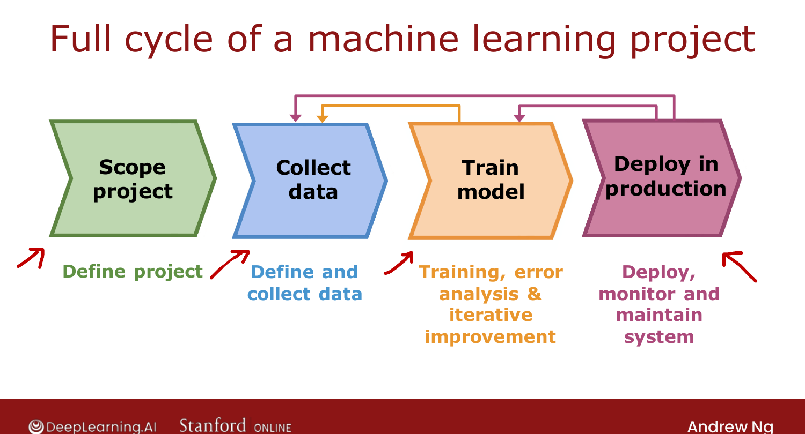
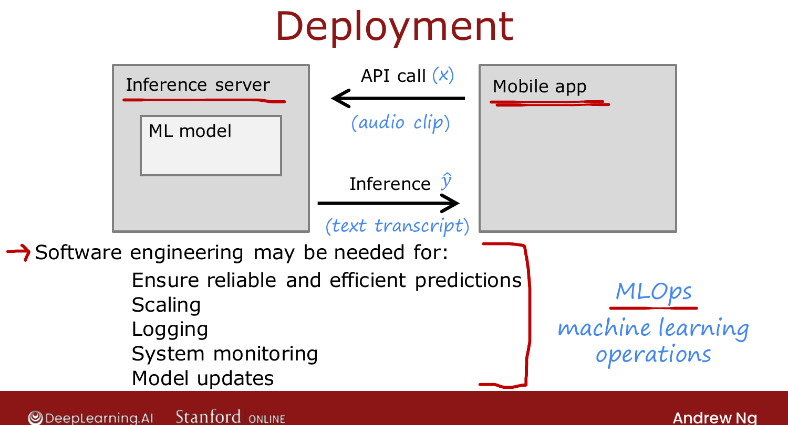

# Full Cycle of a Machine Learning Project

> **Course 2 · Week 3** · _AI-generated study aid — not authoritative; trust the lecture & cited sources._

[← Transfer Learning](../../course-2/week-3/transfer-learning-using-data-from-a-different-task.md){ .md-button }

[Fairness, Bias, and Ethics →](../../course-2/week-3/fairness-bias-and-ethics.md){ .md-button }

<video controls preload="none" playsinline src="https://dyckms5inbsqq.cloudfront.net/dlai/advanced-learning-algorithms/W3/L14-C2W3L3S05-Full-cycle-of-a-machin/lc-advanced-learning-algorithms-W3-L14-C2W3L3S05-Full-cycle-of-a-machin-master_360p.mp4?v=1752484668">Your browser can't play this video — <a href="https://dyckms5inbsqq.cloudfront.net/dlai/advanced-learning-algorithms/W3/L14-C2W3L3S05-Full-cycle-of-a-machin/lc-advanced-learning-algorithms-W3-L14-C2W3L3S05-Full-cycle-of-a-machin-master_360p.mp4?v=1752484668">download the lecture</a>.</video>

> 📄 **[Read the full lecture transcript](full-cycle-of-a-machine-learning-project-transcript.md)**

Training a model is just one piece. Here's the **full cycle** of building a valuable ML
system, using speech recognition as the example. `[00:17]`

## The four stages (with loops)

1. **Scope the project** — decide what to work on (e.g. voice search). `[00:37]`
2. **Collect data** — decide what data you need; gather the audio and labels. `[00:59]`
3. **Train the model** — train, run error analysis, iterate. Bias/variance or error analysis
   often sends you **back** to collect more data — maybe a specific kind (e.g. Ng's speech
   system did poorly with **car noise**, so he used augmentation to add car-noise data). `[01:14]`
4. **Deploy in production** — make it available to users, then **monitor and maintain** it. `[02:17]`

And deployment can loop back too: production data (with consent) can feed further
improvement. `[03:07]`

{ .slide }
_Official C2 slide — the full cycle of an ML project (DeepLearning.AI / Stanford)._
{ .slide-cap }

## Deployment, briefly

A common pattern: put the trained model on an **inference server**. The mobile app makes an
**API call** passing the input $\vec{x}$ (e.g. the audio); the server runs the model and
returns the prediction $\hat{y}$ (the transcript). `[03:39]`

Software engineering may be needed for: reliable/efficient predictions, **scaling** to many
users, **logging** inputs and predictions, **system monitoring**, and **model updates**.
(Ng's speech system degraded when new celebrities/politicians people searched for weren't in
the training set — monitoring caught the **data shift** and triggered a retrain.) `[06:33]`

{ .slide }
_Official C2 slide — deploying and maintaining a model (DeepLearning.AI / Stanford)._
{ .slide-cap }

This growing discipline is **MLOps** (Machine Learning Operations): systematically building,
deploying and maintaining ML systems so they stay reliable, scalable, monitored and
updatable. `[07:22]`

Next: the ethics of building ML systems. `[08:38]`

[← Transfer Learning](../../course-2/week-3/transfer-learning-using-data-from-a-different-task.md){ .md-button }

[Fairness, Bias, and Ethics →](../../course-2/week-3/fairness-bias-and-ethics.md){ .md-button }

