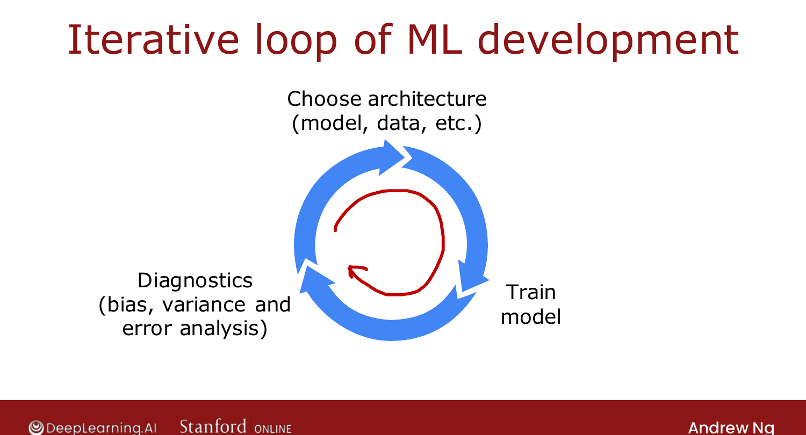
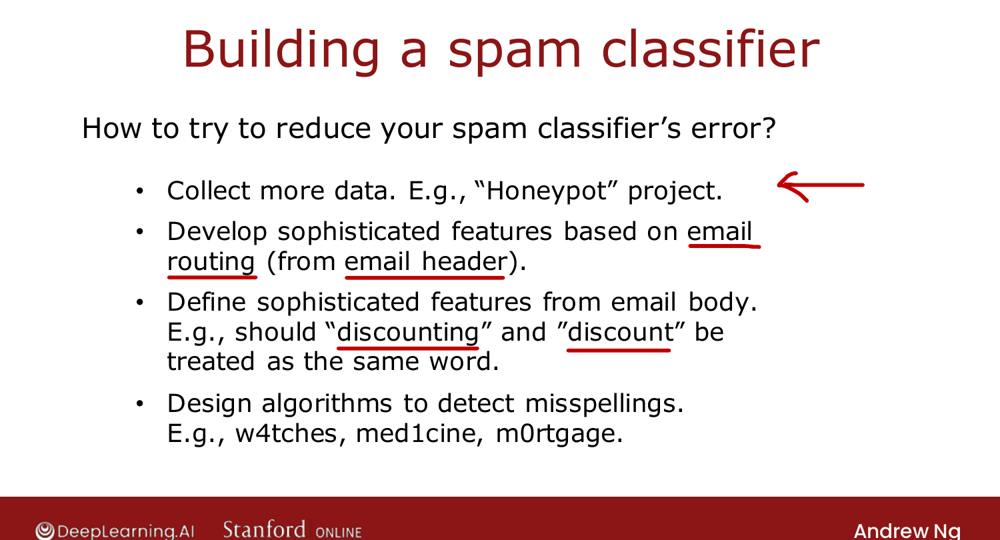

# The Iterative Loop of ML Development

> **Course 2 · Week 3** · _AI-generated study aid — not authoritative; trust the lecture & cited sources._

[← Bias, Variance, and Neural Networks](../../course-2/week-3/bias-variance-and-neural-networks.md){ .md-button }

[Error Analysis →](../../course-2/week-3/error-analysis.md){ .md-button }

<video controls preload="none" playsinline src="https://dyckms5inbsqq.cloudfront.net/dlai/advanced-learning-algorithms/W3/L10-C2W3L3S01-Iterative-loop-of-ML-d/lc-advanced-learning-algorithms-W3-L10-C2W3L3S01-Iterative-loop-of-ML-d-master_360p.mp4?v=1752484667">Your browser can't play this video — <a href="https://dyckms5inbsqq.cloudfront.net/dlai/advanced-learning-algorithms/W3/L10-C2W3L3S01-Iterative-loop-of-ML-d/lc-advanced-learning-algorithms-W3-L10-C2W3L3S01-Iterative-loop-of-ML-d-master_360p.mp4?v=1752484667">download the lecture</a>.</video>

> 📄 **[Read the full lecture transcript](iterative-loop-of-ml-development-transcript.md)**

What developing a machine learning system actually feels like — a loop you go around several
times. `[00:19]`

## The loop

1. **Choose an architecture** — pick the model, the data, the hyperparameters.
2. **Train** the model — it almost never works well the first time.
3. **Run diagnostics** — bias/variance, and **error analysis** (next lesson).
4. Based on the insights, **change** something — bigger network, adjust $\lambda$, add/remove
   features, add data — and go around again. `[01:31]`

It usually takes **multiple iterations** to reach the performance you want.

{ .slide }
_Official C2 slide — the iterative loop of ML development (DeepLearning.AI / Stanford)._
{ .slide-cap }

## Running example: an email spam classifier

Build it as **supervised learning / text classification**: input $\vec{x}$ = features of an
email (e.g. a 0/1 indicator for each of the top ~10,000 words), label $y = 1$ for spam, $0$
for not. Spammers fight back with deliberate misspellings (*w4tches*, *med1cine*). `[02:47]`

Ways you *might* try to reduce the error:

- collect more data (e.g. a **honeypot** project);
- more sophisticated **email-routing** features (from the header);
- sophisticated features from the **email body** (is "discounting" = "discount"?);
- an algorithm to detect deliberate **misspellings**.

{ .slide }
_Official C2 slide — options for improving the spam classifier (DeepLearning.AI / Stanford)._
{ .slide-cap }

Which of these is worth your time? That's exactly what **diagnostics** answer — next, the
second-most-important one after bias/variance: **error analysis**. `[02:54]`

[← Bias, Variance, and Neural Networks](../../course-2/week-3/bias-variance-and-neural-networks.md){ .md-button }

[Error Analysis →](../../course-2/week-3/error-analysis.md){ .md-button }

