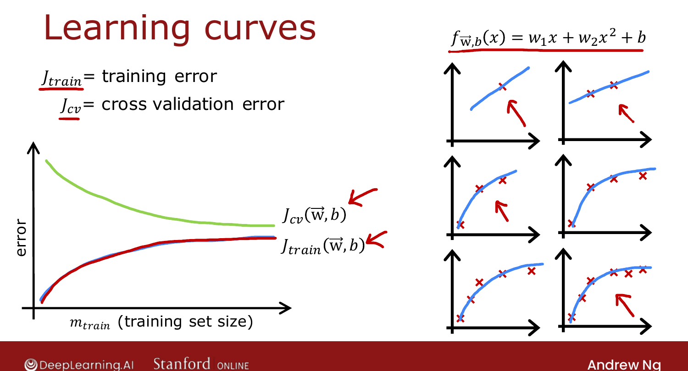
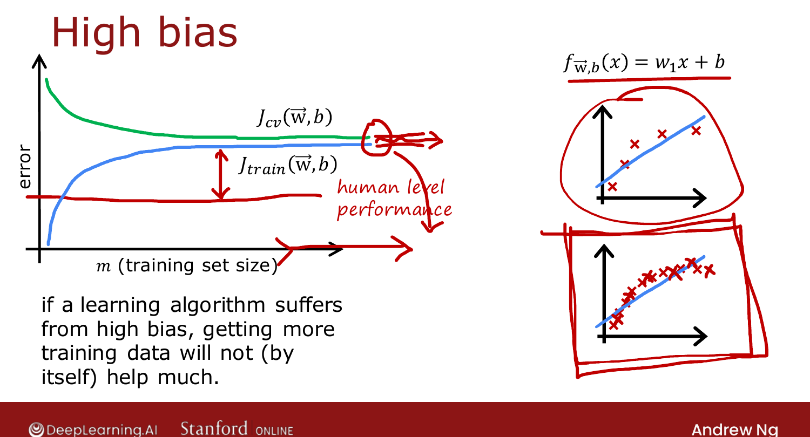
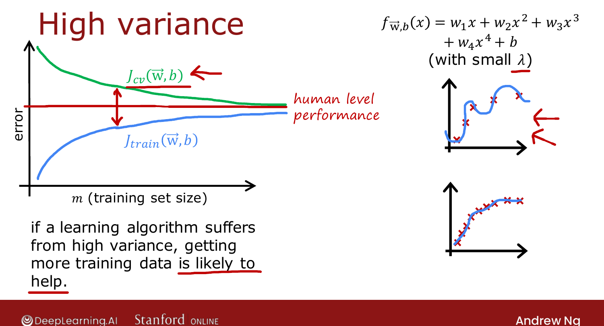

# Learning Curves

> **Course 2 · Week 3** · _AI-generated study aid — not authoritative; trust the lecture & cited sources._

[← Establishing a Baseline Level of Performance](../../course-2/week-3/establishing-a-baseline-level-of-performance.md){ .md-button }

[Deciding What to Try Next (Revisited) →](../../course-2/week-3/deciding-what-to-try-next-revisited.md){ .md-button }

<video controls preload="none" playsinline src="https://dyckms5inbsqq.cloudfront.net/dlai/advanced-learning-algorithms/W3/L7-C2W3L2S04-Learning-curves-L7/lc-advanced-learning-algorithms-W3-L7-C2W3L2S04-Learning-curves-L7-master_360p.mp4?v=1752484667">Your browser can't play this video — <a href="https://dyckms5inbsqq.cloudfront.net/dlai/advanced-learning-algorithms/W3/L7-C2W3L2S04-Learning-curves-L7/lc-advanced-learning-algorithms-W3-L7-C2W3L2S04-Learning-curves-L7-master_360p.mp4?v=1752484667">download the lecture</a>.</video>

> 📄 **[Read the full lecture transcript](learning-curves-transcript.md)**

Learning curves show how the algorithm does as a function of **experience** — i.e. the
**training-set size** $m_\text{train}$. `[00:01]`

## The basic shape

Plot error against $m_\text{train}$ for a quadratic model: `[00:47]`

- **$J_\text{cv}$ decreases** as the training set grows (more data → better model).
- **$J_\text{train}$ increases** as the training set grows — with 1–3 points a quadratic
  fits perfectly ($\approx 0$ error); with more points it's harder to fit them all, so
  average training error rises.
- $J_\text{cv}$ stays **above** $J_\text{train}$ (parameters were fit to the training set). `[03:09]`

{ .slide }
_Official C2 slide — the basic learning-curve shape (DeepLearning.AI / Stanford)._
{ .slide-cap }

## High bias: curves plateau, with a big gap to baseline

Fit a too-simple straight line: both $J_\text{train}$ and $J_\text{cv}$ rise/fall and then
**flatten out** (a straight line barely changes once you have enough points). They flatten
**far above** the baseline — a big gap. **Key consequence: more data won't help** — the
curves have already plateaued, so adding examples doesn't close the gap. `[05:01]`

{ .slide }
_Official C2 slide — high-bias learning curves (DeepLearning.AI / Stanford)._
{ .slide-cap }

## High variance: a big train–CV gap that more data *can* close

Fit a too-complex function: $J_\text{train}$ is low (even below baseline) but $J_\text{cv}$
is much higher — a large gap. Here **more training data is likely to help**: as
$m_\text{train}$ grows, $J_\text{cv}$ keeps coming down toward $J_\text{train}$. `[06:00]`

{ .slide }
_Official C2 slide — high-variance learning curves (DeepLearning.AI / Stanford)._
{ .slide-cap }

So the learning curve tells you whether collecting more data is worth it — the diagnostic
Ng promised could save you months. Next: turning all this into an action list. `[06:00]`

[← Establishing a Baseline Level of Performance](../../course-2/week-3/establishing-a-baseline-level-of-performance.md){ .md-button }

[Deciding What to Try Next (Revisited) →](../../course-2/week-3/deciding-what-to-try-next-revisited.md){ .md-button }

