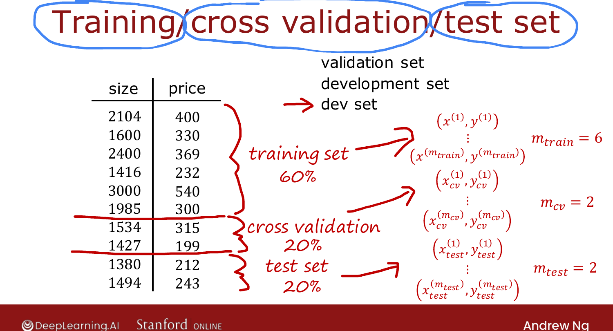
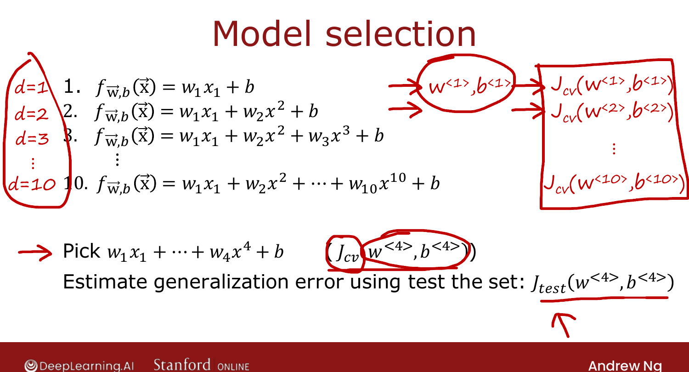

# Model Selection: Train / Cross-Validation / Test Sets

> **Course 2 · Week 3** · _AI-generated study aid — not authoritative; trust the lecture & cited sources._

[← Evaluating a Model](../../course-2/week-3/evaluating-a-model.md){ .md-button }

[Diagnosing Bias and Variance →](../../course-2/week-3/diagnosing-bias-and-variance.md){ .md-button }

<video controls preload="none" playsinline src="https://dyckms5inbsqq.cloudfront.net/dlai/advanced-learning-algorithms/W3/L3-C2W3L1S03-Model-selection-and-tr/lc-advanced-learning-algorithms-W3-L3-C2W3L1S03-Model-selection-and-tr-master_360p.mp4?v=1752484666">Your browser can't play this video — <a href="https://dyckms5inbsqq.cloudfront.net/dlai/advanced-learning-algorithms/W3/L3-C2W3L1S03-Model-selection-and-tr/lc-advanced-learning-algorithms-W3-L3-C2W3L1S03-Model-selection-and-tr-master_360p.mp4?v=1752484666">download the lecture</a>.</video>

> 📄 **[Read the full lecture transcript](model-selection-and-training-cross-validation-test-sets-transcript.md)**

A refinement of the train/test idea that lets you **automatically choose** a model — e.g.
which degree of polynomial to use. `[00:01]`

## The flawed two-way approach

Fit polynomials of degree $d=1,2,\dots,10$, compute $J_\text{test}$ for each, and pick the
$d$ with the lowest $J_\text{test}$ (say $d=5$). The problem: you just **chose a parameter**
($d$) using the test set, so $J_\text{test}$ for the winner is an **optimistic** (too low)
estimate of the true generalization error — exactly as $J_\text{train}$ was optimistic when
you fit $\vec{w},b$ on the training set. `[03:54]`

## The fix: three-way split

Split the data into **three** subsets: `[05:11]`

- **Training set** (~60%) — fit $\vec{w}, b$.
- **Cross-validation set** (~20%) — also called the **validation** or **dev** set; used to
  **choose** between models. ($\vec{x}^{(i)}_\text{cv}, y^{(i)}_\text{cv}$, count $m_\text{cv}$.)
- **Test set** (~20%) — touched only at the very end, to report generalization.

"Cross-validation" just means an extra set to **cross-check** the accuracy of different
models. `[07:08]`

{ .slide }
_Official C2 slide — training / cross-validation / test sets (DeepLearning.AI / Stanford)._
{ .slide-cap }

## The model-selection procedure

1. For each candidate $d$, fit $\vec{w}^{\langle d\rangle}, b^{\langle d\rangle}$ on the
   **training** set.
2. Compute $J_\text{cv}(\vec{w}^{\langle d\rangle}, b^{\langle d\rangle})$ on the
   **cross-validation** set; pick the $d$ with the **lowest $J_\text{cv}$**.
3. Report $J_\text{test}$ for the chosen model as the **unbiased** generalization estimate —
   the test set was never used to choose anything. `[05:04]`

{ .slide }
_Official C2 slide — choose on CV, report on test (DeepLearning.AI / Stanford)._
{ .slide-cap }

The same recipe chooses a **neural-network architecture**: fit several architectures, pick
the one with lowest $J_\text{cv}$, report $J_\text{test}$. `[05:09]`

Next: a deeper diagnostic — **bias and variance**. `[09:53]`

[← Evaluating a Model](../../course-2/week-3/evaluating-a-model.md){ .md-button }

[Diagnosing Bias and Variance →](../../course-2/week-3/diagnosing-bias-and-variance.md){ .md-button }

