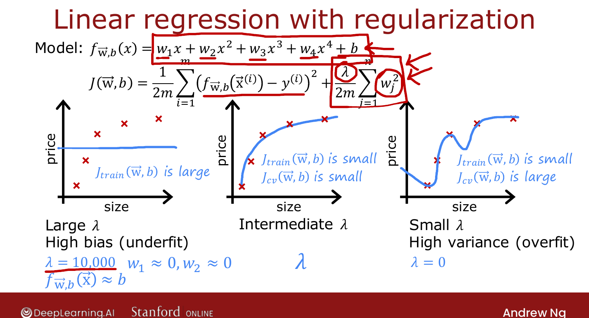
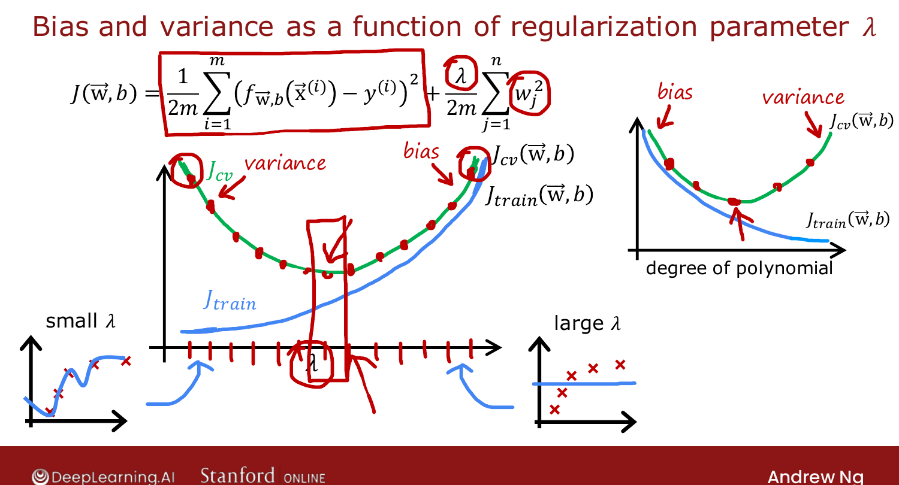

# Regularization and Bias/Variance

> **Course 2 · Week 3** · _AI-generated study aid — not authoritative; trust the lecture & cited sources._

[← Diagnosing Bias and Variance](../../course-2/week-3/diagnosing-bias-and-variance.md){ .md-button }

[Establishing a Baseline Level of Performance →](../../course-2/week-3/establishing-a-baseline-level-of-performance.md){ .md-button }

<video controls preload="none" playsinline src="https://dyckms5inbsqq.cloudfront.net/dlai/advanced-learning-algorithms/W3/L5-C2W3L2S02-Regularization-and-bia/lc-advanced-learning-algorithms-W3-L5-C2W3L2S02-Regularization-and-bia-master_360p.mp4?v=1752484666">Your browser can't play this video — <a href="https://dyckms5inbsqq.cloudfront.net/dlai/advanced-learning-algorithms/W3/L5-C2W3L2S02-Regularization-and-bia/lc-advanced-learning-algorithms-W3-L5-C2W3L2S02-Regularization-and-bia-master_360p.mp4?v=1752484666">download the lecture</a>.</video>

> 📄 **[Read the full lecture transcript](regularization-and-bias-variance-transcript.md)**

How the regularization parameter $\lambda$ shifts bias and variance — and how to choose it. `[00:13]`

## The two extremes (4th-order polynomial)

- **$\lambda$ very large** (e.g. 10,000): the algorithm forces all $w_j \approx 0$, so
  $f(\vec{x}) \approx b$, a flat line → **high bias / underfit**, $J_\text{train}$ high. `[01:03]`
- **$\lambda = 0$** (no regularization): the 4th-order polynomial overfits → **high variance**,
  $J_\text{train}$ small but $J_\text{cv} \gg J_\text{train}$. `[02:25]`
- **Intermediate $\lambda$**: just right — small $J_\text{train}$ and small $J_\text{cv}$. `[02:42]`

{ .slide }
_Official C2 slide — λ vs. bias/variance (DeepLearning.AI / Stanford)._
{ .slide-cap }

## Choosing $\lambda$ by cross-validation

Same recipe as choosing the polynomial degree: try a range of $\lambda$
(0, 0.01, 0.02, 0.04, …, doubling up to ~10), fit parameters for each, compute
$J_\text{cv}$, and pick the $\lambda$ with the **lowest $J_\text{cv}$**. Report
$J_\text{test}$ for the chosen model. `[05:00]`

## The mirror-image curve

Plot $J_\text{train}$ and $J_\text{cv}$ against $\lambda$ — it's the **left-right flip** of
the degree plot: `[05:45]`

- small $\lambda$ (left) → high variance: $J_\text{train}$ low, $J_\text{cv}$ high;
- large $\lambda$ (right) → high bias: $J_\text{train}$ rises (less attention to fitting),
  $J_\text{cv}$ high too;
- the best $\lambda$ sits in the middle where $J_\text{cv}$ bottoms out.

{ .slide }
_Official C2 slide — J_train and J_cv vs. λ (DeepLearning.AI / Stanford)._
{ .slide-cap }

Next: what counts as a "high" $J_\text{train}$ — establishing a **baseline**. `[08:09]`

[← Diagnosing Bias and Variance](../../course-2/week-3/diagnosing-bias-and-variance.md){ .md-button }

[Establishing a Baseline Level of Performance →](../../course-2/week-3/establishing-a-baseline-level-of-performance.md){ .md-button }

