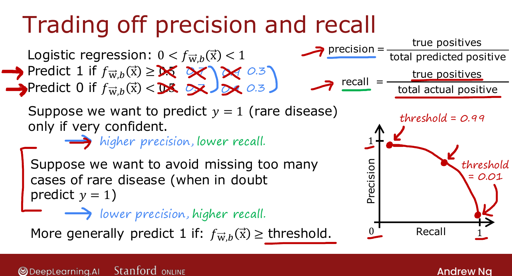
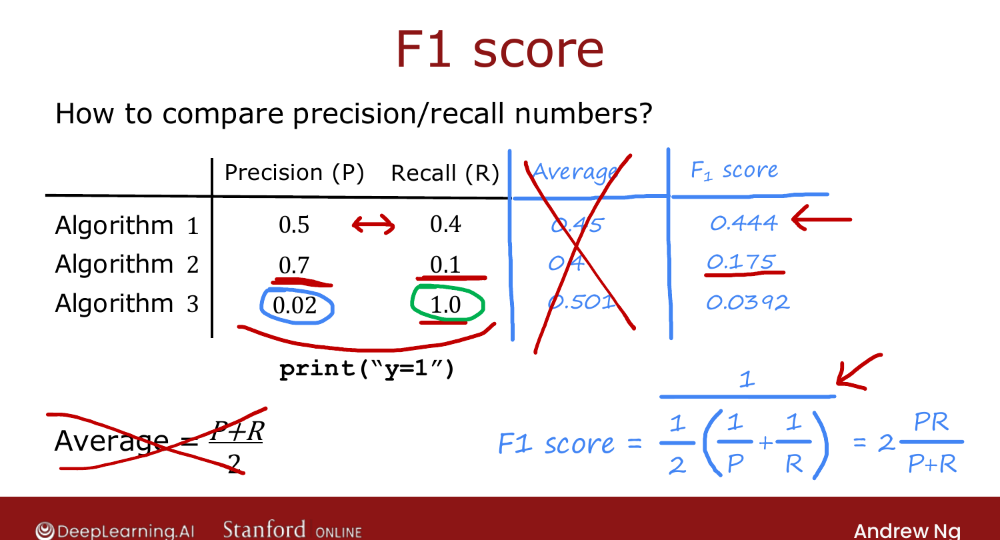

# Trading Off Precision and Recall (Optional)

> **Course 2 · Week 3** · _AI-generated study aid — not authoritative; trust the lecture & cited sources._

[← Error Metrics for Skewed Datasets (Optional)](../../course-2/week-3/error-metrics-for-skewed-datasets.md){ .md-button }

[Decision Tree Model →](../../course-2/week-4/decision-tree-model.md){ .md-button }

<video controls preload="none" playsinline src="https://dyckms5inbsqq.cloudfront.net/dlai/advanced-learning-algorithms/W3/L17-C2W3L4S02-Trading-off-precision-/lc-advanced-learning-algorithms-W3-L17-C2W3L4S02-Trading-off-precision--master_360p.mp4?v=1752484669">Your browser can't play this video — <a href="https://dyckms5inbsqq.cloudfront.net/dlai/advanced-learning-algorithms/W3/L17-C2W3L4S02-Trading-off-precision-/lc-advanced-learning-algorithms-W3-L17-C2W3L4S02-Trading-off-precision--master_360p.mp4?v=1752484669">download the lecture</a>.</video>

> 📄 **[Read the full lecture transcript](trading-off-precision-and-recall-transcript.md)**

Ideally you want **high precision and high recall** — but in practice there's a **trade-off**,
and you pick a point on it. `[00:01]`

## The threshold knob

Logistic regression outputs a probability in $[0,1]$. The usual rule predicts $1$ if
$f(\vec{x})\ge 0.5$. Raise or lower that **threshold** to slide along the trade-off: `[01:05]`

- **Raise to 0.7 (or 0.9)** — predict $1$ only when very confident. → **higher precision,
  lower recall.** Use when acting on a positive is costly/invasive and an untreated case
  isn't catastrophic. `[02:09]`
- **Lower to 0.3** — "when in doubt, predict 1." → **lower precision, higher recall.** Use
  when *missing* a positive is far worse than a false alarm (cheap, safe treatment but a
  dangerous untreated disease). `[04:05]`

{ .slide }
_Official C2 slide — the threshold trades precision against recall (DeepLearning.AI / Stanford)._
{ .slide-cap }

Plotting precision vs. recall across thresholds gives a curve; you **manually** pick the
point that balances the costs of false positives vs. false negatives. Note the threshold is
**not** chosen by cross-validation — it's an application judgment call. `[06:33]`

## The F1 score

If you want to compare algorithms (or pick a threshold) **automatically**, combine precision
$P$ and recall $R$ into one number. A plain **average** is misleading — an algorithm with
$P=0.5, R=0.001$ (the `print("y=0")`-ish cheat) shouldn't score well. The **F1 score** is the
**harmonic mean**, which is dominated by the *smaller* of the two: `[07:00]`

$$F_1 = \frac{1}{\frac{1}{2}\left(\frac{1}{P}+\frac{1}{R}\right)} = 2\,\frac{P\,R}{P+R}.$$

So F1 is only high when **both** $P$ and $R$ are high — pick the algorithm (or threshold)
with the best F1.

{ .slide }
_Official C2 slide — the F1 score (DeepLearning.AI / Stanford)._
{ .slide-cap }

That completes Course 2 Week 3 — diagnostics, the development process, and skewed-data
metrics. Next week: **decision trees**.

[← Error Metrics for Skewed Datasets (Optional)](../../course-2/week-3/error-metrics-for-skewed-datasets.md){ .md-button }

[Decision Tree Model →](../../course-2/week-4/decision-tree-model.md){ .md-button }

