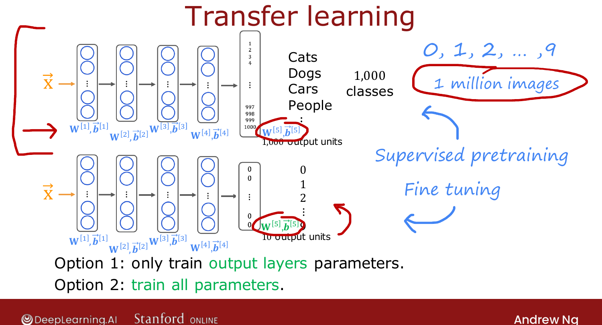
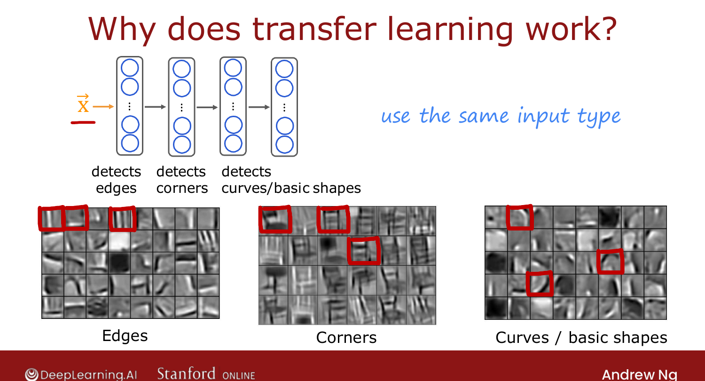

# Transfer Learning

> **Course 2 · Week 3** · _AI-generated study aid — not authoritative; trust the lecture & cited sources._

[← Adding Data](../../course-2/week-3/adding-data.md){ .md-button }

[Full Cycle of a Machine Learning Project →](../../course-2/week-3/full-cycle-of-a-machine-learning-project.md){ .md-button }

<video controls preload="none" playsinline src="https://dyckms5inbsqq.cloudfront.net/dlai/advanced-learning-algorithms/W3/L13-C2W3L3S04-Transfer-learning-usin/lc-advanced-learning-algorithms-W3-L13-C2W3L3S04-Transfer-learning-usin-master_360p.mp4?v=1752484668">Your browser can't play this video — <a href="https://dyckms5inbsqq.cloudfront.net/dlai/advanced-learning-algorithms/W3/L13-C2W3L3S04-Transfer-learning-usin/lc-advanced-learning-algorithms-W3-L13-C2W3L3S04-Transfer-learning-usin-master_360p.mp4?v=1752484668">download the lecture</a>.</video>

> 📄 **[Read the full lecture transcript](transfer-learning-using-data-from-a-different-task-transcript.md)**

When you **don't have much data**, transfer learning lets you borrow from a **different**
task — one of the most useful techniques in practice. `[00:02]`

## The idea

Say you want to recognize digits 0–9 but have little labeled data. Take a network already
trained on a **huge** dataset (e.g. 1M images, 1,000 classes: cats, dogs, cars, people…).
**Keep** the parameters of all layers **except the last**, replace the 1,000-unit output
layer with a fresh **10-unit** output layer, and train from there. `[01:52]`

{ .slide }
_Official C2 slide — copy the early layers, replace the output (DeepLearning.AI / Stanford)._
{ .slide-cap }

Two fine-tuning options: `[03:13]`

- **Option 1** — freeze layers 1–4, train **only** the new output layer (best for a *very*
  small dataset).
- **Option 2** — train **all** layers, but **initialize** 1–4 from the pre-trained values
  (best for a somewhat larger dataset).

The two phases have names: **supervised pre-training** (train on the big dataset) then
**fine-tuning** (gradient-descent further on your small dataset). `[04:27]`

## Why it works

Early layers learn **generic** image features — layer 1 detects **edges**, layer 2
**corners**, layer 3 **basic shapes/curves**. These are useful for *many* vision tasks,
including digits, so transferring them gives the new network a big head start. `[07:43]`

**Restriction:** the **input type must match** — an image-pretrained network transfers to
image tasks, audio→audio, text→text, not across types. `[08:06]`

{ .slide }
_Official C2 slide — generic early-layer features transfer (DeepLearning.AI / Stanford)._
{ .slide-cap }

## The practical win

You usually **don't** do the pre-training yourself — researchers post pre-trained networks
online, free to download. Grab one (trained on your input type), swap the output layer,
fine-tune on your small dataset. Building on each other's work is much of how the ML
community gets strong results from little data. `[06:02]`

!!! abstract "Deeper — Prince, *Understanding Deep Learning*, Ch. 9 (Transfer learning & fine-tuning)"
    Prince frames pre-training + fine-tuning as initializing in a **better region of
    parameter space**: the pre-trained features are a strong prior, so fine-tuning needs far
    fewer labeled examples to reach good performance — the formal version of Ng's "the
    network starts off in a much better place."

Next: the **full cycle** of a machine-learning project. `[09:03]`

[← Adding Data](../../course-2/week-3/adding-data.md){ .md-button }

[Full Cycle of a Machine Learning Project →](../../course-2/week-3/full-cycle-of-a-machine-learning-project.md){ .md-button }

