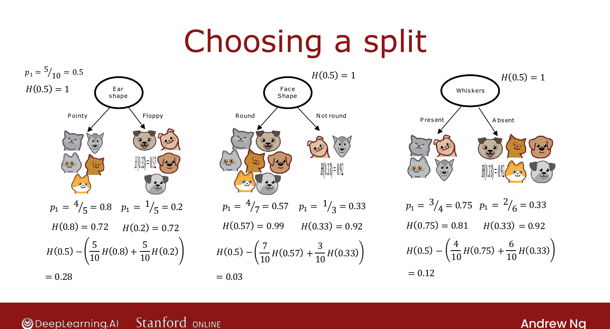
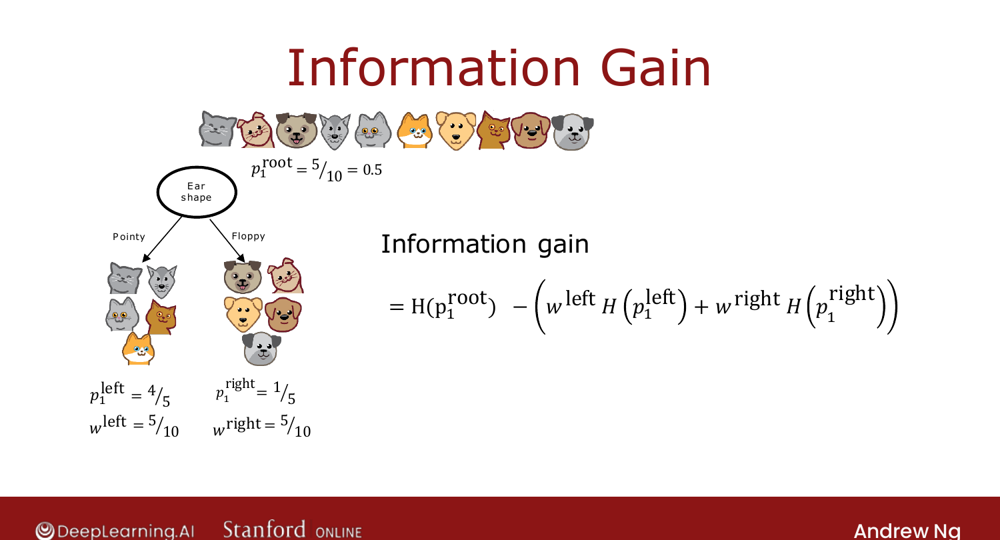

# Choosing a Split: Information Gain

> **Course 2 · Week 4** · _AI-generated study aid — not authoritative; trust the lecture & cited sources._

[← Measuring Purity](../../course-2/week-4/measuring-purity.md){ .md-button }

[Putting It Together →](../../course-2/week-4/putting-it-together.md){ .md-button }

<video controls preload="none" playsinline src="https://dyckms5inbsqq.cloudfront.net/dlai/advanced-learning-algorithms/W4/L4-C2W4L2S02-Choosing-a-split-Infor/lc-advanced-learning-algorithms-W4-L4-C2W4L2S02-Choosing-a-split-Infor-master_360p.mp4?v=1752484670">Your browser can't play this video — <a href="https://dyckms5inbsqq.cloudfront.net/dlai/advanced-learning-algorithms/W4/L4-C2W4L2S02-Choosing-a-split-Infor/lc-advanced-learning-algorithms-W4-L4-C2W4L2S02-Choosing-a-split-Infor-master_360p.mp4?v=1752484670">download the lecture</a>.</video>

> 📄 **[Read the full lecture transcript](choosing-a-split-information-gain-transcript.md)**

The reduction in entropy from a split is called **information gain**. You split on the
feature with the **highest** information gain. `[00:02]`

## Weighted average entropy

Splitting on a feature gives a left and a right subset, each with its own entropy. You don't
just average them — you take a **weighted** average, weighting by the **fraction of examples**
that land in each branch (a branch with more examples matters more). For the cat data,
splitting on ear shape gives left $p_1 = 4/5$ and right $p_1 = 1/5$, each weighted by
$5/10$. `[02:00]`

{ .slide }
_Official C2 slide — weighted-average entropy of a split (DeepLearning.AI / Stanford)._
{ .slide-cap }

## Information gain

**Information gain** = root entropy − weighted-average entropy of the branches:

$$\text{Information gain} = H(p_1^{\text{root}}) - \Big(w^{\text{left}}H(p_1^{\text{left}}) + w^{\text{right}}H(p_1^{\text{right}})\Big),$$

where $w^{\text{left}}, w^{\text{right}}$ are the fractions of examples going left/right. The
bigger the drop in entropy, the better the split. `[--]`

{ .slide }
_Official C2 slide — the information-gain formula (DeepLearning.AI / Stanford)._
{ .slide-cap }

Why measure the *reduction* rather than just the branch entropy? It lets you also use
information gain as a **stopping criterion** — if the best available split barely reduces
entropy, it's not worth splitting (keeps the tree small, reduces overfitting). Compute
information gain for every feature, **split on the largest**, and you have the core of the
decision-tree algorithm. Next: putting it all together. `[--]`

[← Measuring Purity](../../course-2/week-4/measuring-purity.md){ .md-button }

[Putting It Together →](../../course-2/week-4/putting-it-together.md){ .md-button }

