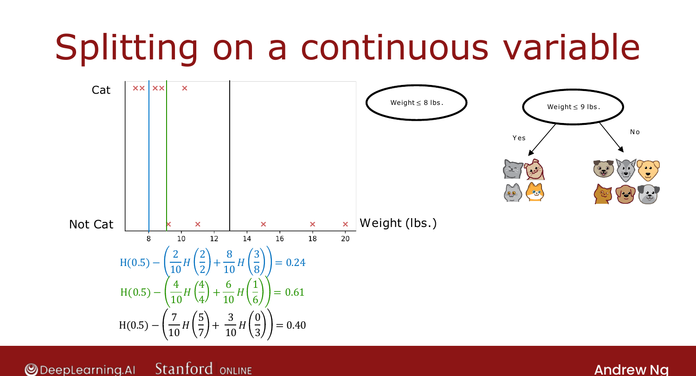

# Continuous-Valued Features

> **Course 2 · Week 4** · _AI-generated study aid — not authoritative; trust the lecture & cited sources._

[← One-Hot Encoding of Categorical Features](../../course-2/week-4/using-one-hot-encoding-of-categorical-features.md){ .md-button }

[Regression Trees (Optional) →](../../course-2/week-4/regression-trees.md){ .md-button }

<video controls preload="none" playsinline src="https://dyckms5inbsqq.cloudfront.net/dlai/advanced-learning-algorithms/W4/L7-C2W4L2S05-Continuous-valued-feat/lc-advanced-learning-algorithms-W4-L7-C2W4L2S05-Continuous-valued-feat-master_360p.mp4?v=1752484671">Your browser can't play this video — <a href="https://dyckms5inbsqq.cloudfront.net/dlai/advanced-learning-algorithms/W4/L7-C2W4L2S05-Continuous-valued-feat/lc-advanced-learning-algorithms-W4-L7-C2W4L2S05-Continuous-valued-feat-master_360p.mp4?v=1752484671">download the lecture</a>.</video>

> 📄 **[Read the full lecture transcript](continuous-valued-features-transcript.md)**

How to let a decision tree split on a feature that can be **any number** — like the animal's
**weight**. `[00:01]`

## Split on a threshold

The algorithm proceeds as before, but now it can also consider splitting on **weight**. A
split on a continuous feature has the form "**weight $\le$ some threshold**." The learning
algorithm's job is to pick the **best threshold** — the one with the highest information
gain. `[01:46]`

For each candidate threshold, do the usual information-gain calculation. E.g. for the cat
data: `[02:30]`

- **weight $\le 8$**: information gain $= 0.24$;
- **weight $\le 9$**: information gain $= 0.61$ (best);
- **weight $\le 13$**: information gain $= 0.40$.

{ .slide }
_Official C2 slide — splitting on a continuous feature (DeepLearning.AI / Stanford)._
{ .slide-cap }

## Which thresholds to try

Sort the examples by the feature value and test the **midpoints** between consecutive
sorted values — with 10 examples that's 9 candidate thresholds. Pick the threshold with the
highest information gain; if that beats every other feature's information gain, split on this
continuous feature at that threshold (here, weight $\le 9$). `[04:42]`

So continuous features need no new machinery — just **try several thresholds**, run the
usual information-gain calculation, and split if it wins. Next (optional): trees that predict
**numbers** — regression trees. `[06:06]`

[← One-Hot Encoding of Categorical Features](../../course-2/week-4/using-one-hot-encoding-of-categorical-features.md){ .md-button }

[Regression Trees (Optional) →](../../course-2/week-4/regression-trees.md){ .md-button }

