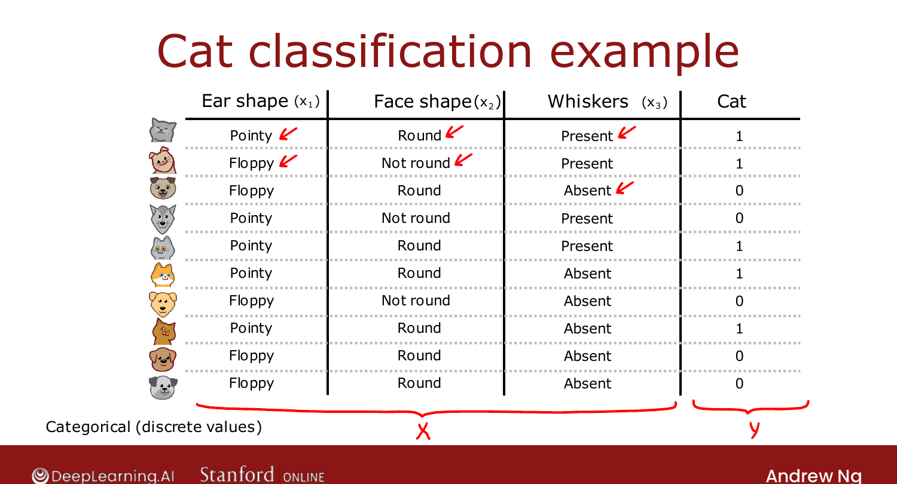
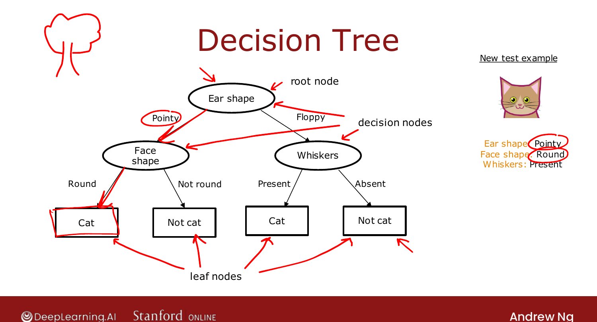

# Decision Tree Model

> **Course 2 · Week 4** · _AI-generated study aid — not authoritative; trust the lecture & cited sources._

[← Trading Off Precision and Recall (Optional)](../../course-2/week-3/trading-off-precision-and-recall.md){ .md-button }

[The Learning Process →](../../course-2/week-4/learning-process.md){ .md-button }

<video controls preload="none" playsinline src="https://dyckms5inbsqq.cloudfront.net/dlai/advanced-learning-algorithms/W4/L1-C2W4L1S01-Decision-tree-model-L1/lc-advanced-learning-algorithms-W4-L1-C2W4L1S01-Decision-tree-model-L1-master_360p.mp4?v=1752484669">Your browser can't play this video — <a href="https://dyckms5inbsqq.cloudfront.net/dlai/advanced-learning-algorithms/W4/L1-C2W4L1S01-Decision-tree-model-L1/lc-advanced-learning-algorithms-W4-L1-C2W4L1S01-Decision-tree-model-L1-master_360p.mp4?v=1752484669">download the lecture</a>.</video>

> 📄 **[Read the full lecture transcript](decision-tree-model-transcript.md)**

The final week: **decision trees** and **tree ensembles** — powerful, widely used, and a
frequent winner of ML competitions, even if they get less academic attention than neural
networks. `[00:11]`

## Running example: cat classification

You run a cat adoption center. Given 10 training examples with three **categorical** features
— **ear shape** (pointy/floppy), **face shape** (round/not round), **whiskers**
(present/absent) — predict $y$ = "is it a cat?" (5 cats, 5 dogs). Each feature takes one of
two values; it's binary classification. `[01:47]`

{ .slide }
_Official C2 slide — the cat-classification dataset (DeepLearning.AI / Stanford)._
{ .slide-cap }

## What a decision tree is

The model output by the learning algorithm is a **tree** of **nodes**. To classify a new
example (pointy ears, round face, whiskers present): `[03:20]`

- Start at the **root node** (top) — it tests **ear shape**. Pointy → go **left**.
- The next **decision node** tests **face shape**. Round → go down.
- Reach a **leaf node** (a rectangle at the bottom) — it makes the **prediction**: *cat*.

Terminology: the **root node** is the topmost; the oval **decision nodes** test a feature and
send you left/right; the rectangular **leaf nodes** make predictions. (By computer-science
convention the root is at the *top* and leaves at the *bottom* — like a hanging plant.) `[05:16]`

{ .slide }
_Official C2 slide — anatomy of a decision tree (DeepLearning.AI / Stanford)._
{ .slide-cap }

## Many possible trees

For one dataset there are **many** possible trees — some do better, some worse on the
training/CV/test sets. The job of the **learning algorithm** is to pick a tree that fits the
training set well **and** generalizes. How? That's the next lesson. `[06:48]`

[← Trading Off Precision and Recall (Optional)](../../course-2/week-3/trading-off-precision-and-recall.md){ .md-button }

[The Learning Process →](../../course-2/week-4/learning-process.md){ .md-button }

