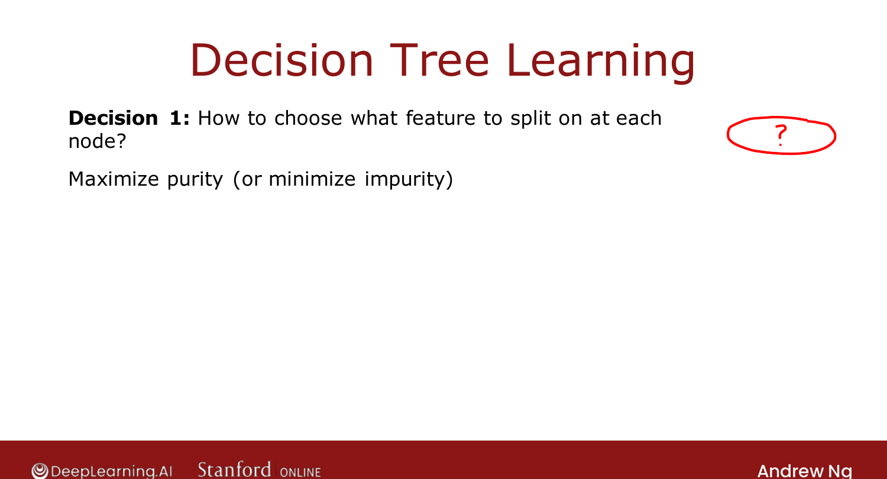
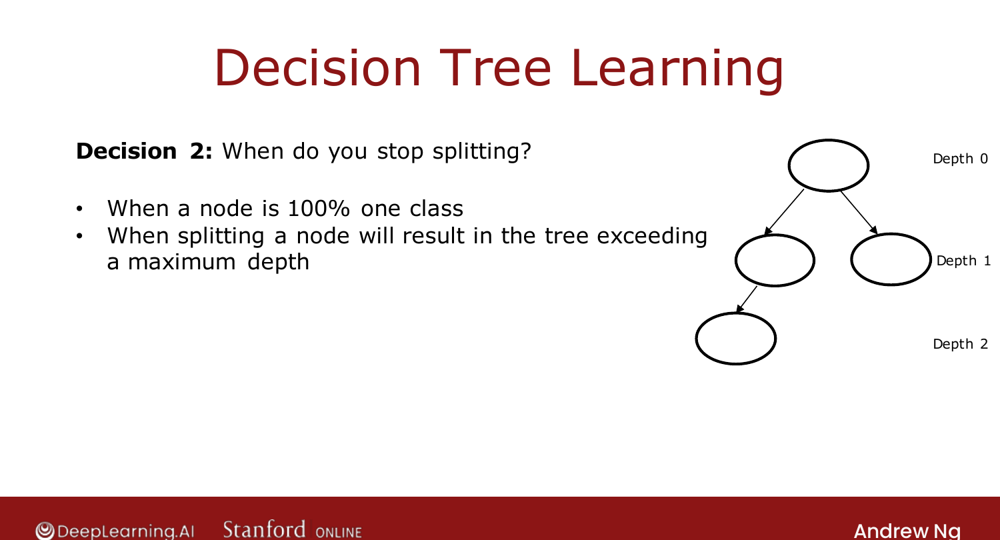

# The Learning Process

> **Course 2 · Week 4** · _AI-generated study aid — not authoritative; trust the lecture & cited sources._

[← Decision Tree Model](../../course-2/week-4/decision-tree-model.md){ .md-button }

[Measuring Purity →](../../course-2/week-4/measuring-purity.md){ .md-button }

<video controls preload="none" playsinline src="https://dyckms5inbsqq.cloudfront.net/dlai/advanced-learning-algorithms/W4/L2-C2W4L1S02-Learning-Process-L2/lc-advanced-learning-algorithms-W4-L2-C2W4L1S02-Learning-Process-L2-master_360p.mp4?v=1752484669">Your browser can't play this video — <a href="https://dyckms5inbsqq.cloudfront.net/dlai/advanced-learning-algorithms/W4/L2-C2W4L1S02-Learning-Process-L2/lc-advanced-learning-algorithms-W4-L2-C2W4L1S02-Learning-Process-L2-master_360p.mp4?v=1752484669">download the lecture</a>.</video>

> 📄 **[Read the full lecture transcript](learning-process-transcript.md)**

Building a decision tree from a training set comes down to two key decisions, made over and
over. `[00:01]`

## How the tree gets built

Start with all 10 examples at the root. Pick a feature (say **ear shape**) and **split**:
pointy ears go left (5 examples), floppy ears go right (5). On the left, split again (say on
**face shape**): 4 round-faced (all cats → **leaf: cat**) and 1 not-round (a dog → **leaf:
not cat**). Repeat on the right branch. `[03:31]`

## Decision 1: which feature to split on?

At each node, choose the feature that **maximizes purity** — splits that get each side as
close as possible to **all cats** or **all dogs**. (A magic "has cat DNA?" feature would
give 5/5 cats left and 0/5 right — perfectly pure. The real features are less clean, so you
compare ear shape vs. face shape vs. whiskers by purity.) `[03:51]`

{ .slide }
_Official C2 slide — choosing what to split on (DeepLearning.AI / Stanford)._
{ .slide-cap }

## Decision 2: when to stop splitting?

Stop a branch when any of: `[06:28]`

- the node is **100% one class** (entropy 0);
- splitting would exceed a chosen **maximum depth** (depth = hops from the root; root is
  depth 0). Smaller trees are less prone to **overfitting**;
- the **purity improvement** from splitting is below a threshold;
- the **number of examples** at the node is below a threshold.

{ .slide }
_Official C2 slide — when to stop splitting (DeepLearning.AI / Stanford)._
{ .slide-cap }

The algorithm can feel like "a lot of pieces" because it accreted refinements from many
researchers over the years — but the pieces fit into an effective method, and open-source
libraries handle most of these choices for you. Next: **entropy**, the way to measure
(im)purity. `[10:52]`

[← Decision Tree Model](../../course-2/week-4/decision-tree-model.md){ .md-button }

[Measuring Purity →](../../course-2/week-4/measuring-purity.md){ .md-button }

