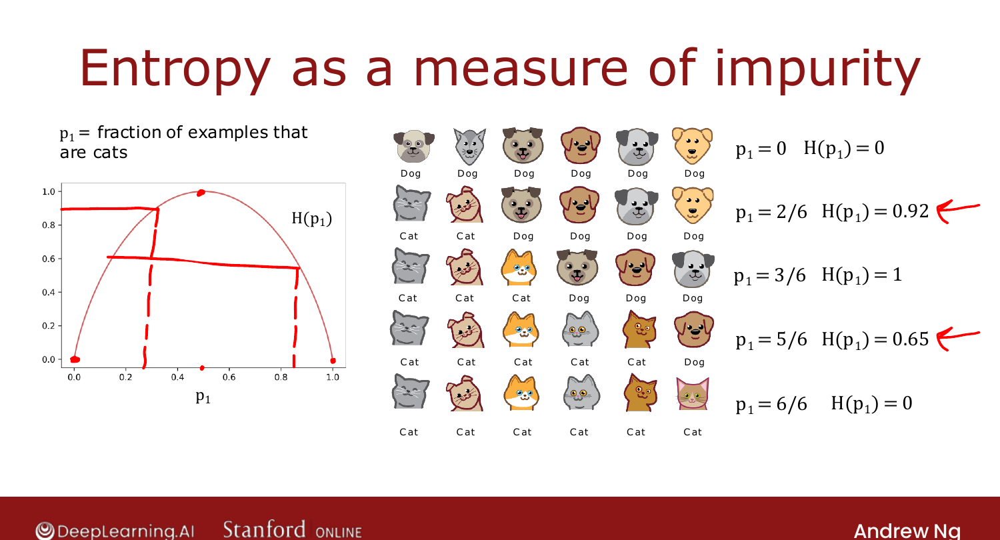
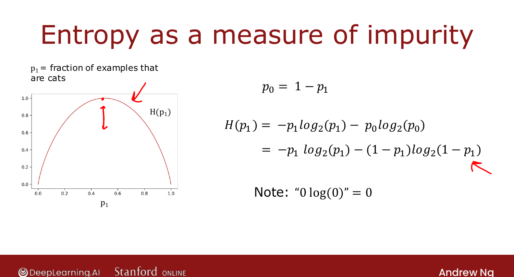

# Measuring Purity

> **Course 2 · Week 4** · _AI-generated study aid — not authoritative; trust the lecture & cited sources._

[← The Learning Process](../../course-2/week-4/learning-process.md){ .md-button }

[Choosing a Split: Information Gain →](../../course-2/week-4/choosing-a-split-information-gain.md){ .md-button }

<video controls preload="none" playsinline src="https://dyckms5inbsqq.cloudfront.net/dlai/advanced-learning-algorithms/W4/L3-C2W4L2S01-Measuring-purity-L3/lc-advanced-learning-algorithms-W4-L3-C2W4L2S01-Measuring-purity-L3-master_360p.mp4?v=1752484670">Your browser can't play this video — <a href="https://dyckms5inbsqq.cloudfront.net/dlai/advanced-learning-algorithms/W4/L3-C2W4L2S01-Measuring-purity-L3/lc-advanced-learning-algorithms-W4-L3-C2W4L2S01-Measuring-purity-L3-master_360p.mp4?v=1752484670">download the lecture</a>.</video>

> 📄 **[Read the full lecture transcript](measuring-purity-transcript.md)**

To choose splits by purity, you need to **quantify** it. The tool is **entropy** — a measure
of **impurity**. `[00:02]`

## Entropy

Let $p_1$ = the fraction of examples that are cats (label 1). Entropy $H(p_1)$ is a curve
that is **0** when the set is all one class (pure) and **1** at a **50/50** mix (most
impure): `[01:01]`

- 3 cats / 3 dogs → $p_1 = 0.5$ → $H = 1$ (maximally impure).
- 5 cats / 1 dog → $p_1 \approx 0.83$ → $H \approx 0.65$.
- 6 cats / 0 dogs → $p_1 = 1$ → $H = 0$ (pure).
- 2 cats / 4 dogs → $p_1 \approx 0.33$ → $H \approx 0.92$.

{ .slide }
_Official C2 slide — entropy as a measure of impurity (DeepLearning.AI / Stanford)._
{ .slide-cap }

## The formula

With $p_0 = 1 - p_1$ (fraction of non-cats):

$$H(p_1) = -p_1 \log_2(p_1) - p_0 \log_2(p_0) = -p_1\log_2 p_1 - (1-p_1)\log_2(1-p_1).$$

We use $\log_2$ so the peak is a clean **1** (natural log just rescales it). Convention:
$0\log 0 = 0$, so $H = 0$ at $p_1 = 0$ or $1$. `[05:00]`

{ .slide }
_Official C2 slide — the entropy equation (DeepLearning.AI / Stanford)._
{ .slide-cap }

(This looks like the logistic loss from Course 1 — there's a real mathematical reason, but
you don't need it here.) Open-source libraries sometimes use the similar **Gini** criterion
instead; entropy works fine for most applications. Next: using entropy to **choose a
split**. `[07:27]`

## Try it in the browser

**Try it — implement the entropy H(p₁)** — edit the code, then hit **Validate** for instant ✓/✗ (runs real Python via Pyodide, no setup):

{{ IDE('entropy_exo') }}

[← The Learning Process](../../course-2/week-4/learning-process.md){ .md-button }

[Choosing a Split: Information Gain →](../../course-2/week-4/choosing-a-split-information-gain.md){ .md-button }

