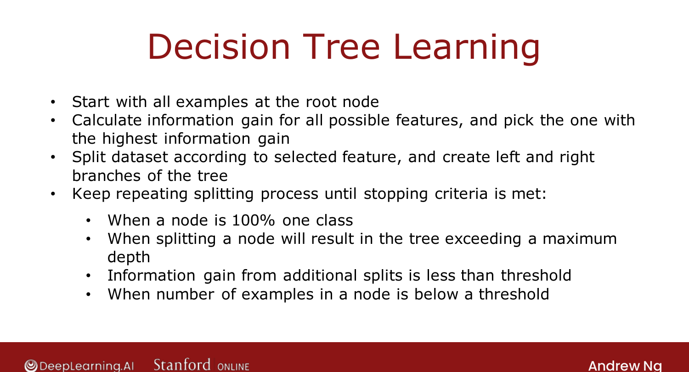

# Putting It Together

> **Course 2 · Week 4** · _AI-generated study aid — not authoritative; trust the lecture & cited sources._

[← Choosing a Split: Information Gain](../../course-2/week-4/choosing-a-split-information-gain.md){ .md-button }

[One-Hot Encoding of Categorical Features →](../../course-2/week-4/using-one-hot-encoding-of-categorical-features.md){ .md-button }

<video controls preload="none" playsinline src="https://dyckms5inbsqq.cloudfront.net/dlai/advanced-learning-algorithms/W4/L5-C2W4L2S03-Putting-it-together-L5/lc-advanced-learning-algorithms-W4-L5-C2W4L2S03-Putting-it-together-L5-master_360p.mp4?v=1752484670">Your browser can't play this video — <a href="https://dyckms5inbsqq.cloudfront.net/dlai/advanced-learning-algorithms/W4/L5-C2W4L2S03-Putting-it-together-L5/lc-advanced-learning-algorithms-W4-L5-C2W4L2S03-Putting-it-together-L5-master_360p.mp4?v=1752484670">download the lecture</a>.</video>

> 📄 **[Read the full lecture transcript](putting-it-together-transcript.md)**

Information gain chooses one split; applying it **everywhere** builds the whole tree. `[00:02]`

## The algorithm

1. Start with **all** examples at the root.
2. Compute **information gain** for every feature; split on the one with the **highest**.
3. Split the dataset into left/right branches by that feature.
4. **Repeat** on each branch until a **stopping criterion** is met: `[00:16]`
   - node is 100% one class (entropy 0);
   - splitting would exceed the **maximum depth**;
   - information gain from the best split is below a threshold;
   - the number of examples at the node is below a threshold.

{ .slide }
_Official C2 slide — the recursive tree-building algorithm (DeepLearning.AI / Stanford)._
{ .slide-cap }

## It's recursive

After choosing the root split, you build the left sub-tree by running the **same algorithm**
on the 5 left examples, and the right sub-tree on the 5 right examples — building a big tree
out of smaller sub-trees. In computer science this is a **recursive algorithm** (code that
calls itself). You don't need to fully grok recursion to use libraries — but it's the core
step if you implement a tree from scratch. `[05:51]`

## Choosing maximum depth

A larger max depth → a bigger tree → can fit a more complex model, but **more overfitting
risk** — analogous to a higher-degree polynomial or a larger neural network. You *could*
choose it by cross-validation, but open-source libraries have good built-in defaults. `[06:59]`

To **predict**, follow an example from the root down the decisions to a leaf, which gives the
answer. Next: handling features with **more than two** values. `[08:24]`

[← Choosing a Split: Information Gain](../../course-2/week-4/choosing-a-split-information-gain.md){ .md-button }

[One-Hot Encoding of Categorical Features →](../../course-2/week-4/using-one-hot-encoding-of-categorical-features.md){ .md-button }

