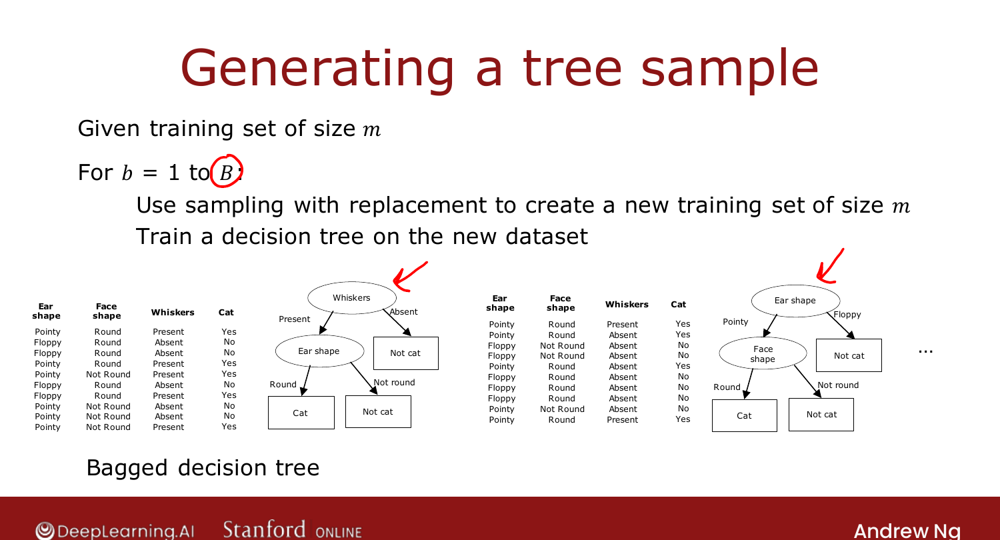
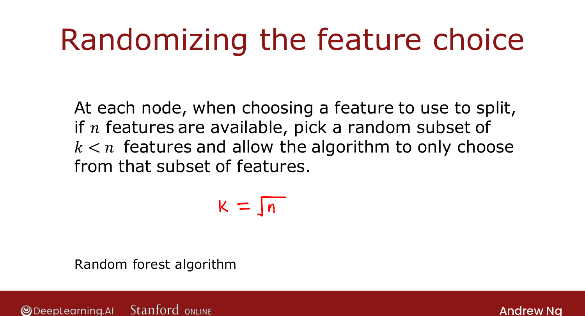

# Random Forest Algorithm

> **Course 2 · Week 4** · _AI-generated study aid — not authoritative; trust the lecture & cited sources._

[← Sampling with Replacement](../../course-2/week-4/sampling-with-replacement.md){ .md-button }

[XGBoost →](../../course-2/week-4/xgboost.md){ .md-button }

<video controls preload="none" playsinline src="https://dyckms5inbsqq.cloudfront.net/dlai/advanced-learning-algorithms/W4/L11-C2W4L3S03-Random-forest-algorith/lc-advanced-learning-algorithms-W4-L11-C2W4L3S03-Random-forest-algorith-master_360p.mp4?v=1752484671">Your browser can't play this video — <a href="https://dyckms5inbsqq.cloudfront.net/dlai/advanced-learning-algorithms/W4/L11-C2W4L3S03-Random-forest-algorith/lc-advanced-learning-algorithms-W4-L11-C2W4L3S03-Random-forest-algorith-master_360p.mp4?v=1752484671">download the lecture</a>.</video>

> 📄 **[Read the full lecture transcript](random-forest-algorithm-transcript.md)**

Combine sampling with replacement and ensemble voting to get the **random forest** — far
better than a single tree. `[00:02]`

## Bagged decision trees

For $b = 1$ to $B$: use sampling with replacement to create a new training set of size $m$,
then train a decision tree on it. To predict, have all $B$ trees **vote**. `[00:29]`

A typical $B$ is around **100** (recommended 64–128). Larger $B$ never *hurts* accuracy but
gives **diminishing returns** — using 1,000 trees just slows things down without meaningful
gain. This version is called a **bagged decision tree** ("bag" → the lowercase/uppercase
$b$/$B$). `[02:36]`

{ .slide }
_Official C2 slide — generating a tree sample by bagging (DeepLearning.AI / Stanford)._
{ .slide-cap }

## One tweak → random forest

Even with bagging, the trees often pick the **same root split** (and similar splits near the
root), so they're too alike. The fix: at **each node**, instead of choosing from all $n$
features, pick a **random subset of $k < n$** features and split on the best of those. For
large $n$, a typical choice is $k = \sqrt{n}$. `[04:27]`

{ .slide }
_Official C2 slide — randomizing the feature choice (DeepLearning.AI / Stanford)._
{ .slide-cap }

This forces the trees to differ, so voting is more accurate. Intuitively, the
sampling-with-replacement procedure already **explores many small data changes** and
averages over them — so any further change to the training set has little effect on the
forest's output, making it **robust**. Next: an even better algorithm — **boosting** /
XGBoost. `[05:50]`

[← Sampling with Replacement](../../course-2/week-4/sampling-with-replacement.md){ .md-button }

[XGBoost →](../../course-2/week-4/xgboost.md){ .md-button }

