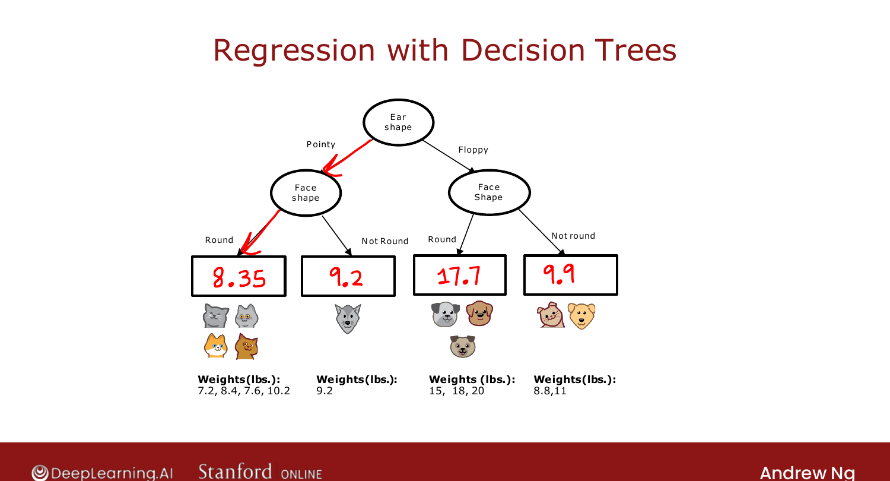
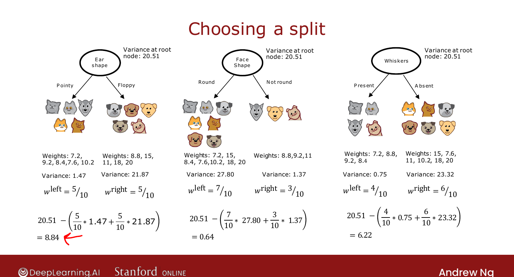

# Regression Trees (Optional)

> **Course 2 · Week 4** · _AI-generated study aid — not authoritative; trust the lecture & cited sources._

[← Continuous-Valued Features](../../course-2/week-4/continuous-valued-features.md){ .md-button }

[Using Multiple Decision Trees →](../../course-2/week-4/using-multiple-decision-trees.md){ .md-button }

<video controls preload="none" playsinline src="https://dyckms5inbsqq.cloudfront.net/dlai/advanced-learning-algorithms/W4/L8-C2W4L2S06-Regression-Trees-optio/lc-advanced-learning-algorithms-W4-L8-C2W4L2S06-Regression-Trees-optio-master_360p.mp4?v=1752484671">Your browser can't play this video — <a href="https://dyckms5inbsqq.cloudfront.net/dlai/advanced-learning-algorithms/W4/L8-C2W4L2S06-Regression-Trees-optio/lc-advanced-learning-algorithms-W4-L8-C2W4L2S06-Regression-Trees-optio-master_360p.mp4?v=1752484671">download the lecture</a>.</video>

> 📄 **[Read the full lecture transcript](regression-trees-transcript.md)**

Generalize decision trees from classification to **regression** — predicting a **number**. `[00:07]`

## Predicting a number

Now the **weight** $y$ is the **target** to predict (not an input feature), from the discrete
features. The tree splits as usual; at each **leaf**, the prediction is the **average** of
the weights of the training examples that reached it. E.g. a leaf holding animals of weight
7.2, 8.4, 7.6, 10.2 predicts $\frac{7.2+8.4+7.6+10.2}{4} = 8.35$. To predict, follow an
example to its leaf and output that average. `[02:56]`

{ .slide }
_Official C2 slide — a regression tree predicting weight (DeepLearning.AI / Stanford)._
{ .slide-cap }

## Choosing splits: reduce variance

For classification we reduced **entropy**; for regression we reduce **variance** (how widely
a set of numbers spreads). For each candidate split, compute the **weighted-average
variance** of the branches ($w^{\text{left}}\cdot\text{Var}_{\text{left}} +
w^{\text{right}}\cdot\text{Var}_{\text{right}}$), then the **reduction in variance**: `[04:01]`

$$\text{variance reduction} = \text{Var}(\text{root}) - \Big(w^{\text{left}}\text{Var}_{\text{left}} + w^{\text{right}}\text{Var}_{\text{right}}\Big).$$

For the cat data (root variance 20.51): splitting on ear shape reduces variance by **8.84**,
face shape by 0.64, whiskers by 6.22. **Pick the largest reduction** → split on ear shape. `[08:29]`

{ .slide }
_Official C2 slide — splitting a regression tree by variance reduction (DeepLearning.AI / Stanford)._
{ .slide-cap }

So a regression tree is the same algorithm with **variance reduction** playing the role of
**information gain**. Next: making trees more powerful with **ensembles**. `[08:46]`

[← Continuous-Valued Features](../../course-2/week-4/continuous-valued-features.md){ .md-button }

[Using Multiple Decision Trees →](../../course-2/week-4/using-multiple-decision-trees.md){ .md-button }

