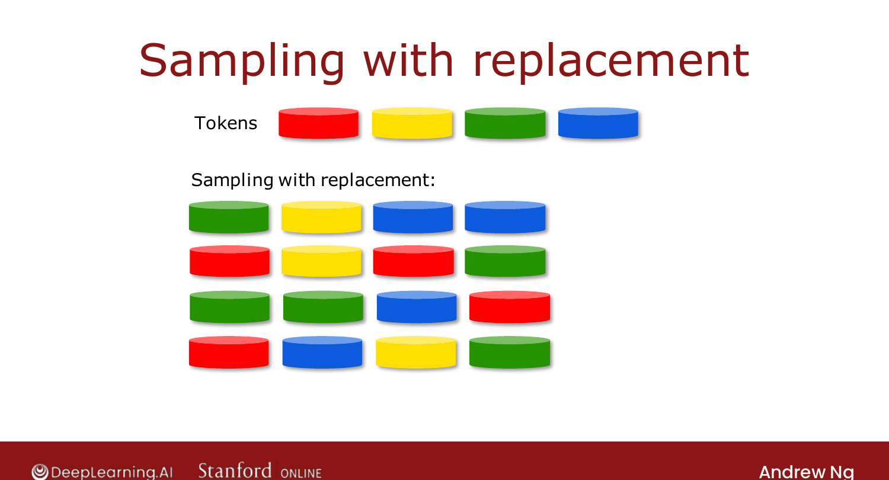

# Sampling with Replacement

> **Course 2 · Week 4** · _AI-generated study aid — not authoritative; trust the lecture & cited sources._

[← Using Multiple Decision Trees](../../course-2/week-4/using-multiple-decision-trees.md){ .md-button }

[Random Forest Algorithm →](../../course-2/week-4/random-forest-algorithm.md){ .md-button }

<video controls preload="none" playsinline src="https://dyckms5inbsqq.cloudfront.net/dlai/advanced-learning-algorithms/W4/L10-C2W4L3S02-Sampling-with-replacem/lc-advanced-learning-algorithms-W4-L10-C2W4L3S02-Sampling-with-replacem-master_360p.mp4?v=1752484671">Your browser can't play this video — <a href="https://dyckms5inbsqq.cloudfront.net/dlai/advanced-learning-algorithms/W4/L10-C2W4L3S02-Sampling-with-replacem/lc-advanced-learning-algorithms-W4-L10-C2W4L3S02-Sampling-with-replacem-master_360p.mp4?v=1752484671">download the lecture</a>.</video>

> 📄 **[Read the full lecture transcript](sampling-with-replacement-transcript.md)**

The technique that lets you build many different training sets — and hence many different
trees. `[00:02]`

## What it means

Put four colored tokens (red, yellow, green, blue) in a bag. Draw one, **note it, and put it
back** before the next draw — that's the "with replacement" part. Four draws might give
**green, yellow, blue, blue** (blue twice, red never). Without replacement you'd just get all
four tokens back every time — replacement is what produces **varied** samples. `[02:07]`

{ .slide }
_Official C2 slide — sampling with replacement (DeepLearning.AI / Stanford)._
{ .slide-cap }

## Applied to building trees

Put the 10 training examples in a virtual bag. Draw **with replacement** 10 times to make a
**new** training set of the same size. Some examples appear **twice**, some are **missing** —
that's expected. Each such bag gives a training set that's **similar to but different from**
the original — exactly the variety you need to grow a diverse ensemble. `[03:41]`

Next: turn this into the **random forest** algorithm. `[03:56]`

[← Using Multiple Decision Trees](../../course-2/week-4/using-multiple-decision-trees.md){ .md-button }

[Random Forest Algorithm →](../../course-2/week-4/random-forest-algorithm.md){ .md-button }

