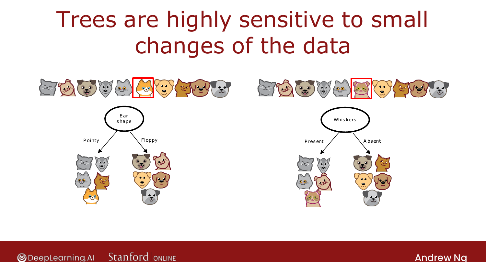
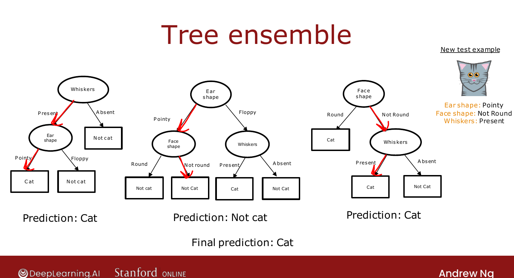

# Using Multiple Decision Trees

> **Course 2 · Week 4** · _AI-generated study aid — not authoritative; trust the lecture & cited sources._

[← Regression Trees (Optional)](../../course-2/week-4/regression-trees.md){ .md-button }

[Sampling with Replacement →](../../course-2/week-4/sampling-with-replacement.md){ .md-button }

<video controls preload="none" playsinline src="https://dyckms5inbsqq.cloudfront.net/dlai/advanced-learning-algorithms/W4/L9-C2W4L3S01-Using-multiple-decisio/lc-advanced-learning-algorithms-W4-L9-C2W4L3S01-Using-multiple-decisio-master_360p.mp4?v=1752484671">Your browser can't play this video — <a href="https://dyckms5inbsqq.cloudfront.net/dlai/advanced-learning-algorithms/W4/L9-C2W4L3S01-Using-multiple-decisio/lc-advanced-learning-algorithms-W4-L9-C2W4L3S01-Using-multiple-decisio-master_360p.mp4?v=1752484671">download the lecture</a>.</video>

> 📄 **[Read the full lecture transcript](using-multiple-decision-trees-transcript.md)**

A single decision tree has a weakness: it's **highly sensitive to small changes** in the
data. The fix is a **tree ensemble** — many trees that vote. `[00:01]`

## The sensitivity problem

Change just **one** of the 10 training examples and the highest-information-gain feature at
the **root** can flip (e.g. from ear shape to whiskers). Because the root split changes,
*every* sub-tree below it changes too — a totally different tree from a one-example change.
That fragility makes a single tree unreliable. `[01:21]`

{ .slide }
_Official C2 slide — trees are sensitive to small data changes (DeepLearning.AI / Stanford)._
{ .slide-cap }

## Ensembles vote

Train **many** trees (a **tree ensemble**). To classify a new example, run it through **all**
the trees and take the **majority vote**. If three trees predict cat / not-cat / cat, the
ensemble predicts **cat**. `[02:51]`

{ .slide }
_Official C2 slide — an ensemble of trees voting (DeepLearning.AI / Stanford)._
{ .slide-cap }

Voting makes the algorithm **robust**: any single tree gets only one vote, so a quirk in one
tree can't dominate. But how do you generate many *different* plausible trees? That needs a
statistics technique — **sampling with replacement** — next. `[03:51]`

[← Regression Trees (Optional)](../../course-2/week-4/regression-trees.md){ .md-button }

[Sampling with Replacement →](../../course-2/week-4/sampling-with-replacement.md){ .md-button }

