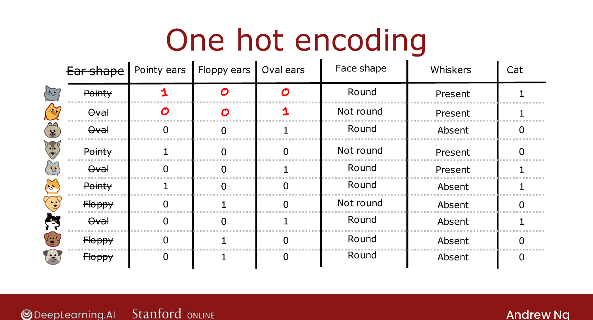
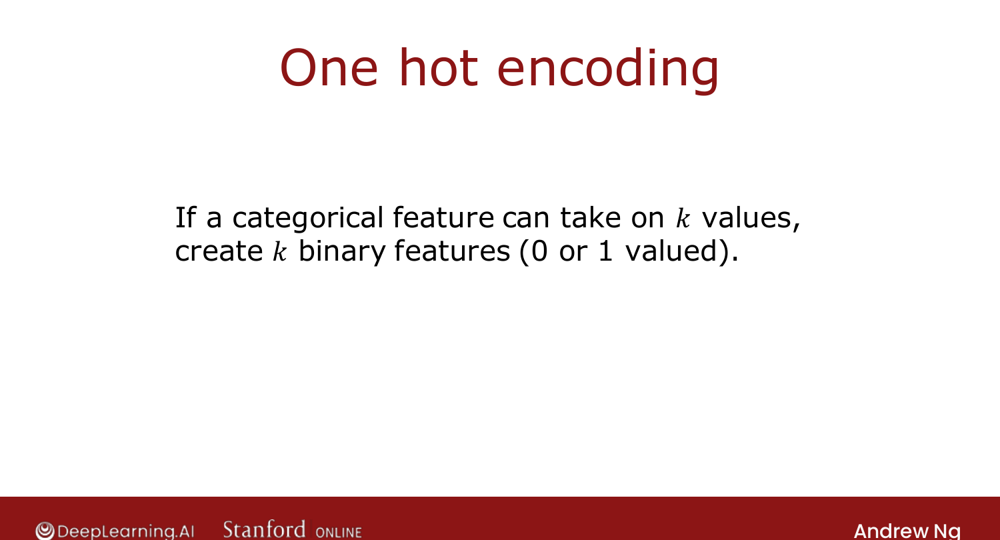

# One-Hot Encoding of Categorical Features

> **Course 2 · Week 4** · _AI-generated study aid — not authoritative; trust the lecture & cited sources._

[← Putting It Together](../../course-2/week-4/putting-it-together.md){ .md-button }

[Continuous-Valued Features →](../../course-2/week-4/continuous-valued-features.md){ .md-button }

<video controls preload="none" playsinline src="https://dyckms5inbsqq.cloudfront.net/dlai/advanced-learning-algorithms/W4/L6-C2W4L2S04-Using-one-hot-encoding/lc-advanced-learning-algorithms-W4-L6-C2W4L2S04-Using-one-hot-encoding-master_360p.mp4?v=1752484670">Your browser can't play this video — <a href="https://dyckms5inbsqq.cloudfront.net/dlai/advanced-learning-algorithms/W4/L6-C2W4L2S04-Using-one-hot-encoding/lc-advanced-learning-algorithms-W4-L6-C2W4L2S04-Using-one-hot-encoding-master_360p.mp4?v=1752484670">download the lecture</a>.</video>

> 📄 **[Read the full lecture transcript](using-one-hot-encoding-of-categorical-features-transcript.md)**

So far every feature had **two** values. What about a categorical feature with **more than
two**? Use **one-hot encoding**. `[00:08]`

## The problem

Suppose ear shape can be **pointy, floppy, or oval** — three values. Splitting on it directly
would create **three** sub-branches. Instead, convert it. `[00:46]`

## One-hot encoding

Replace the one 3-valued feature with **three binary features**: "has pointy ears?", "has
floppy ears?", "has oval ears?", each $0$ or $1$. A pointy-eared animal becomes
$[1, 0, 0]$; an oval-eared one $[0, 0, 1]$. In every row **exactly one** of the new features
is $1$ — the "hot" one, hence *one-hot*. `[02:21]`

{ .slide }
_Official C2 slide — one-hot encoding a categorical feature (DeepLearning.AI / Stanford)._
{ .slide-cap }

## The rule

If a categorical feature can take $k$ values, replace it with $k$ binary ($0$/$1$) features.
Now every feature is binary again, so the decision-tree algorithm applies **unchanged**. `[02:35]`

{ .slide }
_Official C2 slide — k values become k binary features (DeepLearning.AI / Stanford)._
{ .slide-cap }

## Bonus: it feeds neural networks too

One-hot encoding isn't just for trees. Encode **all** the categorical features as $0$/$1$
(round→1, not-round→0; whiskers present→1, absent→0) and you get a list of numbers — exactly
what a **neural network** (or logistic/linear regression) needs as input. `[04:37]`

Next: features that are arbitrary **numbers**, not a few discrete values. `[05:10]`

[← Putting It Together](../../course-2/week-4/putting-it-together.md){ .md-button }

[Continuous-Valued Features →](../../course-2/week-4/continuous-valued-features.md){ .md-button }

