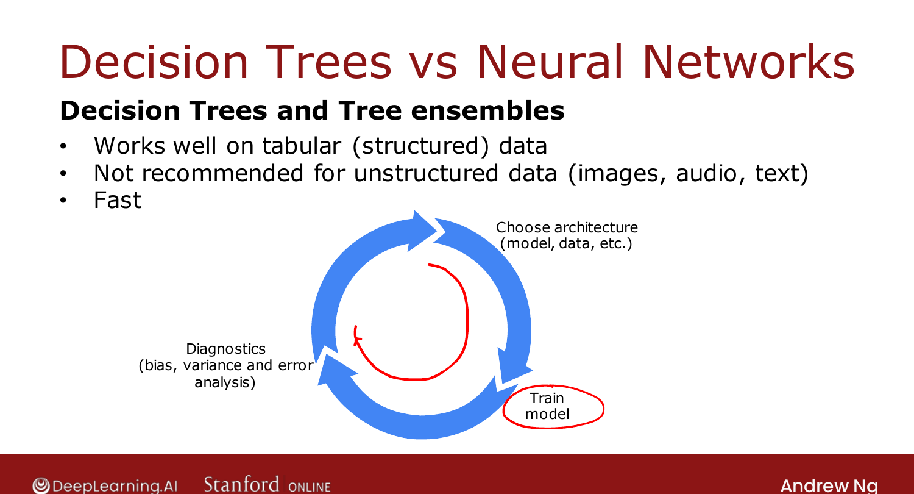

# When to Use Decision Trees

> **Course 2 · Week 4** · _AI-generated study aid — not authoritative; trust the lecture & cited sources._

[← XGBoost](../../course-2/week-4/xgboost.md){ .md-button }

[What is Clustering? →](../../course-3/week-1/what-is-clustering.md){ .md-button }

<video controls preload="none" playsinline src="https://dyckms5inbsqq.cloudfront.net/dlai/advanced-learning-algorithms/W4/L13-C2W4L4S01-When-to-use-decision-t/lc-advanced-learning-algorithms-W4-L13-C2W4L4S01-When-to-use-decision-t-master_360p.mp4?v=1752484672">Your browser can't play this video — <a href="https://dyckms5inbsqq.cloudfront.net/dlai/advanced-learning-algorithms/W4/L13-C2W4L4S01-When-to-use-decision-t/lc-advanced-learning-algorithms-W4-L13-C2W4L4S01-When-to-use-decision-t-master_360p.mp4?v=1752484672">download the lecture</a>.</video>

> 📄 **[Read the full lecture transcript](when-to-use-decision-trees-transcript.md)**

Both decision trees (and ensembles) and neural networks are powerful — here's how to choose. `[00:02]`

## Decision trees & tree ensembles

- **Great on tabular / structured data** — datasets that look like a spreadsheet (e.g.
  housing: size, bedrooms, floors, age), for classification or regression. `[00:15]`
- **Not recommended for unstructured data** — images, video, audio, text. `[01:03]`
- **Fast to train** — which lets you go around the iterative development loop quickly. `[01:23]`
- **Small trees are interpretable** — you can read a few-dozen-node tree and see how it
  decides. (Interpretability is *overstated* for big ensembles of hundreds of trees.) `[02:05]`
- If you use trees, **use XGBoost** for most applications (a single tree only under a very
  tight compute budget). `[02:49]`

{ .slide }
_Official C2 slide — decision trees vs. neural networks (DeepLearning.AI / Stanford)._
{ .slide-cap }

## Neural networks

- **Work on all data types** — structured, unstructured, and mixed; **preferred** for
  unstructured (images/audio/text). `[03:21]`
- May be **slower** to train (large networks take a long time). `[03:54]`
- Work with **transfer learning** — critical when you have a small dataset. `[04:00]`
- Easier to **chain multiple models** and train them together with gradient descent (you can
  only train one decision tree at a time). `[04:26]`

That's the end of Course 2. You now know neural networks **and** decision trees, plus the
practical advice to make them work. Next up: Course 3, **unsupervised learning** — where the
data has no labels $y$ at all. *May the forest be with you.* `[05:57]`

!!! abstract "You might want to try it out in code"
    You now know everything this week's Coding Lab needs — what a tree is, how it measures
    purity, how it picks a split, and the ensembles built on top. The **[C2W4 Coding Lab →](../../coding-labs/C2W4.md)**
    builds decision trees in code and then random forests and boosting. Entirely optional, and
    you can do it in any order you like — but this is the moment it'll click.

[← XGBoost](../../course-2/week-4/xgboost.md){ .md-button }

[What is Clustering? →](../../course-3/week-1/what-is-clustering.md){ .md-button }

