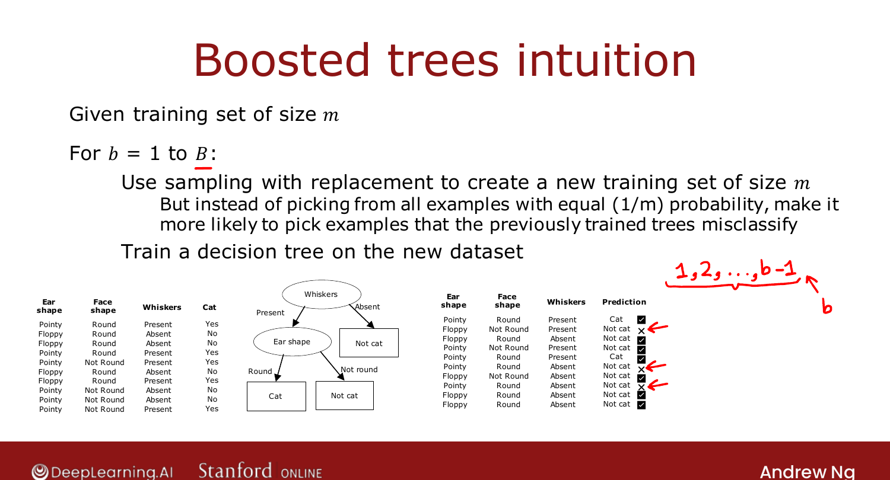
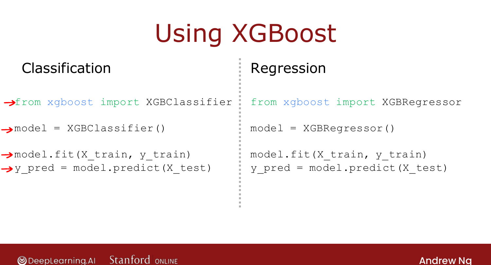

# XGBoost

> **Course 2 · Week 4** · _AI-generated study aid — not authoritative; trust the lecture & cited sources._

<div class="ep-nav" markdown>

[← Random Forest Algorithm](../../course-2/week-4/random-forest-algorithm.md){ .md-button }

[When to Use Decision Trees →](../../course-2/week-4/when-to-use-decision-trees.md){ .md-button }

</div>

<div class="video-wrap"><video controls preload="none" playsinline src="https://dyckms5inbsqq.cloudfront.net/dlai/advanced-learning-algorithms/W4/L12-C2W4L3S04-XGBoost-L12/lc-advanced-learning-algorithms-W4-L12-C2W4L3S04-XGBoost-L12-master_360p.mp4?v=1752484672">Your browser can't play this video — <a href="https://dyckms5inbsqq.cloudfront.net/dlai/advanced-learning-algorithms/W4/L12-C2W4L3S04-XGBoost-L12/lc-advanced-learning-algorithms-W4-L12-C2W4L3S04-XGBoost-L12-master_360p.mp4?v=1752484672">download the lecture</a>.</video></div>

> 📄 **[Read the full lecture transcript](xgboost-transcript.md)**

By far the most common decision-tree-ensemble implementation today — fast, easy to use, and
a frequent winner of ML competitions. `[00:09]`

## Boosting: deliberate practice

Modify the bagging loop: on every iteration **after the first**, instead of sampling all $m$
examples equally, make it **more likely to pick examples the previous trees got wrong**. `[01:11]`

It's like learning piano with **deliberate practice** — rather than replaying the whole
piece, you focus on the bars you play badly. Each new tree focuses on the examples the
existing ensemble still misclassifies, so the ensemble improves quickly. `[02:32]`

{ .slide }
_Official C2 slide — the boosting intuition (DeepLearning.AI / Stanford)._
{ .slide-cap }

## XGBoost

**XGBoost** (Extreme Gradient Boosting) is the dominant open-source boosted-trees library.
Its strengths: `[04:28]`

- fast and efficient;
- good **default** choices for the splitting criterion and stopping;
- built-in **regularization** to prevent overfitting;
- highly competitive on **Kaggle** (XGBoost and deep learning win most competitions).

(Technical note: XGBoost actually assigns **weights** to examples rather than literally
sampling with replacement — a bit more efficient, but the focus-on-mistakes intuition holds.)

```python
from xgboost import XGBClassifier          # XGBRegressor for regression
model = XGBClassifier()
model.fit(X_train, y_train)
y_pred = model.predict(X_test)
```

{ .slide }
_Official C2 slide — using XGBoost (DeepLearning.AI / Stanford)._
{ .slide-cap }

The internals are complex, so practitioners use the library. Next: when to reach for trees
vs. neural networks. `[06:32]`


<div class="ep-nav" markdown>

[← Random Forest Algorithm](../../course-2/week-4/random-forest-algorithm.md){ .md-button }

[When to Use Decision Trees →](../../course-2/week-4/when-to-use-decision-trees.md){ .md-button }

</div>
