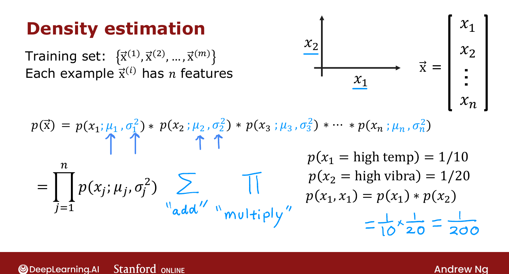
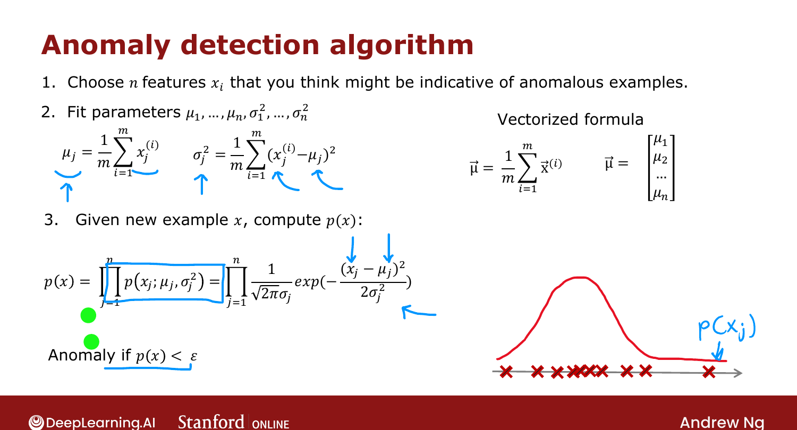

# Anomaly Detection Algorithm

> **Course 3 · Week 1** · _AI-generated study aid — not authoritative; trust the lecture & cited sources._

[← Gaussian (Normal) Distribution](../../course-3/week-1/gaussian-normal-distribution.md){ .md-button }

[Developing and Evaluating an Anomaly Detection System →](../../course-3/week-1/developing-and-evaluating-an-anomaly-detection-system.md){ .md-button }

<video controls preload="none" playsinline src="https://dyckms5inbsqq.cloudfront.net/dlai/unsupervised-learning-recommenders-reinforcement-learning/W1/L10-MLS-C3W1L2S03-Anomaly-detection-/lc-unsupervised-learning-recommenders-reinforcement-learning-W1-L10-MLS-C3W1L2S03-Anomaly-detection--master_360p.mp4?v=1752487436">Your browser can't play this video — <a href="https://dyckms5inbsqq.cloudfront.net/dlai/unsupervised-learning-recommenders-reinforcement-learning/W1/L10-MLS-C3W1L2S03-Anomaly-detection-/lc-unsupervised-learning-recommenders-reinforcement-learning-W1-L10-MLS-C3W1L2S03-Anomaly-detection--master_360p.mp4?v=1752487436">download the lecture</a>.</video>

> 📄 **[Read the full lecture transcript](anomaly-detection-algorithm-transcript.md)**

Extend the single-feature Gaussian to a full anomaly detector over $n$ features. `[00:01]`

## Modeling $p(\vec{x})$ as a product

Each example $\vec{x}$ has $n$ features. Model the probability of the whole vector as the
**product** of per-feature Gaussians: `[00:52]`

$$p(\vec{x}) = p(x_1;\mu_1,\sigma_1^2)\cdot p(x_2;\mu_2,\sigma_2^2)\cdots p(x_n;\mu_n,\sigma_n^2)
= \prod_{j=1}^{n} p(x_j;\mu_j,\sigma_j^2).$$

(Formally this assumes the features are **statistically independent**, but the algorithm
works fine even when they aren't — you don't need that concept to use it.) `[02:00]`

**Why multiply?** If an engine has a $\tfrac{1}{10}$ chance of running unusually hot and a
$\tfrac{1}{20}$ chance of vibrating unusually, the chance of **both** is $\tfrac{1}{10}\times
\tfrac{1}{20} = \tfrac{1}{200}$ — very unlikely. The product makes a point anomalous if it's
unusual on **any** feature. `[04:26]`

{ .slide }
_Official C3 slide — density estimation as a product of Gaussians (DeepLearning.AI / Stanford)._
{ .slide-cap }

## The algorithm

1. **Choose features** $x_j$ you think might indicate anomalies. `[05:13]`
2. **Fit parameters** $\mu_1,\dots,\mu_n$ and $\sigma_1^2,\dots,\sigma_n^2$:
   $\mu_j = \frac{1}{m}\sum_i x_j^{(i)}$, $\sigma_j^2 = \frac{1}{m}\sum_i (x_j^{(i)}-\mu_j)^2$.
3. **For a new $\vec{x}$**, compute $p(\vec{x}) = \prod_j p(x_j;\mu_j,\sigma_j^2)$ and flag an
   **anomaly if $p(\vec{x}) < \epsilon$**.

{ .slide }
_Official C3 slide — the full anomaly-detection algorithm (DeepLearning.AI / Stanford)._
{ .slide-cap }

A point is flagged when it's unlikely on the combined model — typically because one or more
features sit far out in their Gaussian's tail. Next: how to **develop and evaluate** such a
system. `[--]`

[← Gaussian (Normal) Distribution](../../course-3/week-1/gaussian-normal-distribution.md){ .md-button }

[Developing and Evaluating an Anomaly Detection System →](../../course-3/week-1/developing-and-evaluating-an-anomaly-detection-system.md){ .md-button }

