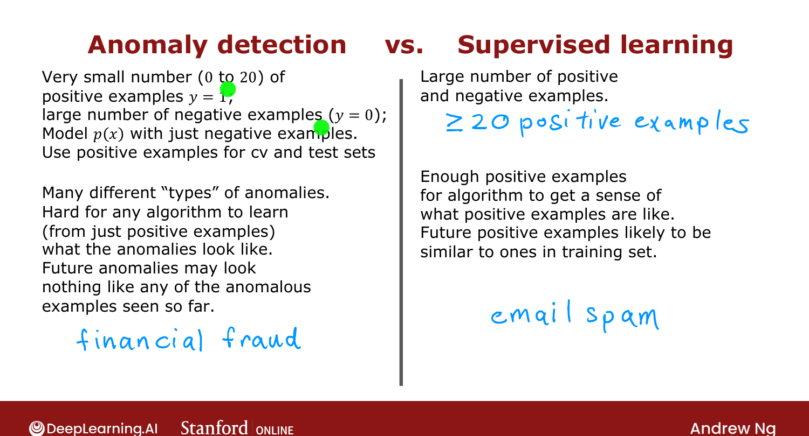
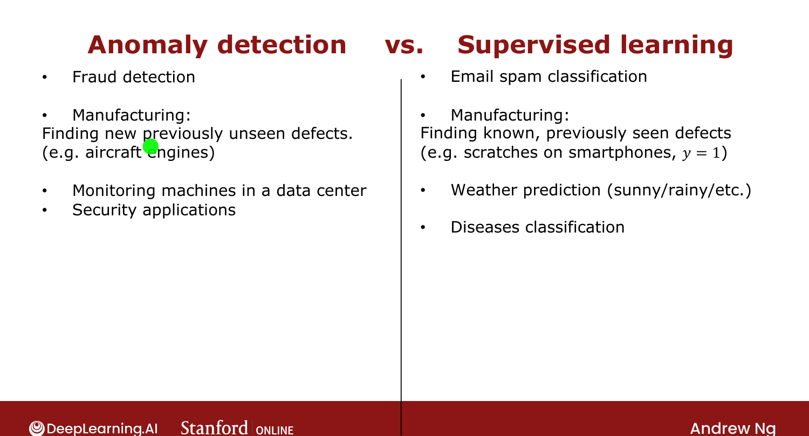

# Anomaly Detection vs. Supervised Learning

> **Course 3 · Week 1** · _AI-generated study aid — not authoritative; trust the lecture & cited sources._

[← Developing and Evaluating an Anomaly Detection System](../../course-3/week-1/developing-and-evaluating-an-anomaly-detection-system.md){ .md-button }

[Choosing What Features to Use →](../../course-3/week-1/choosing-what-features-to-use.md){ .md-button }

<video controls preload="none" playsinline src="https://dyckms5inbsqq.cloudfront.net/dlai/unsupervised-learning-recommenders-reinforcement-learning/W1/L12-MLS-C3W1L2S05-Anomaly-detection-/lc-unsupervised-learning-recommenders-reinforcement-learning-W1-L12-MLS-C3W1L2S05-Anomaly-detection--master_360p.mp4?v=1752487436">Your browser can't play this video — <a href="https://dyckms5inbsqq.cloudfront.net/dlai/unsupervised-learning-recommenders-reinforcement-learning/W1/L12-MLS-C3W1L2S05-Anomaly-detection-/lc-unsupervised-learning-recommenders-reinforcement-learning-W1-L12-MLS-C3W1L2S05-Anomaly-detection--master_360p.mp4?v=1752487436">download the lecture</a>.</video>

> 📄 **[Read the full lecture transcript](anomaly-detection-vs-supervised-learning-transcript.md)**

With a few positives ($y=1$) and many negatives ($y=0$), when do you use anomaly detection
vs. supervised learning? The choice is subtle. `[00:02]`

## The deciding factor: many types of anomalies?

- **Anomaly detection** fits when you have a **very small** number of positives (0–20 is
  common) and many negatives — and especially when there are **many different types** of
  anomalies, including **brand-new** ones you've never seen. It models what **normal** looks
  like and flags *anything* that deviates, so it catches novel failures. `[01:32]`
- **Supervised learning** fits when you have **enough positives** to learn what they look
  like, and future positives are likely to **resemble** past ones. `[02:55]`

{ .slide }
_Official C3 slide — when to use each (DeepLearning.AI / Stanford)._
{ .slide-cap }

## Examples

- **Financial fraud** → anomaly detection: new fraud types appear constantly, so look for
  *anything different* from past transactions. `[03:17]`
- **Email spam** → supervised learning: spam keeps selling similar things, so future spam
  resembles past spam. `[03:58]`
- Anomaly: **manufacturing** (novel defects), **monitoring** machines/security. Supervised:
  spam, **weather prediction**, **disease classification**. `[--]`

{ .slide }
_Official C3 slide — application examples for each (DeepLearning.AI / Stanford)._
{ .slide-cap }

Rule of thumb: if **future anomalies may look nothing like past ones**, prefer anomaly
detection; if they'll **resemble** what you've seen, prefer supervised learning. Next:
choosing features for anomaly detection. `[04:39]`

[← Developing and Evaluating an Anomaly Detection System](../../course-3/week-1/developing-and-evaluating-an-anomaly-detection-system.md){ .md-button }

[Choosing What Features to Use →](../../course-3/week-1/choosing-what-features-to-use.md){ .md-button }

