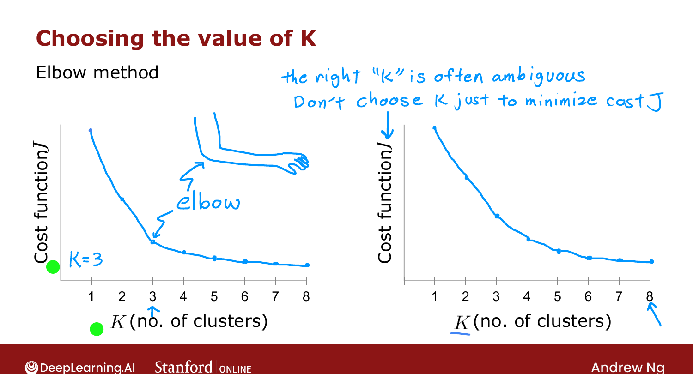
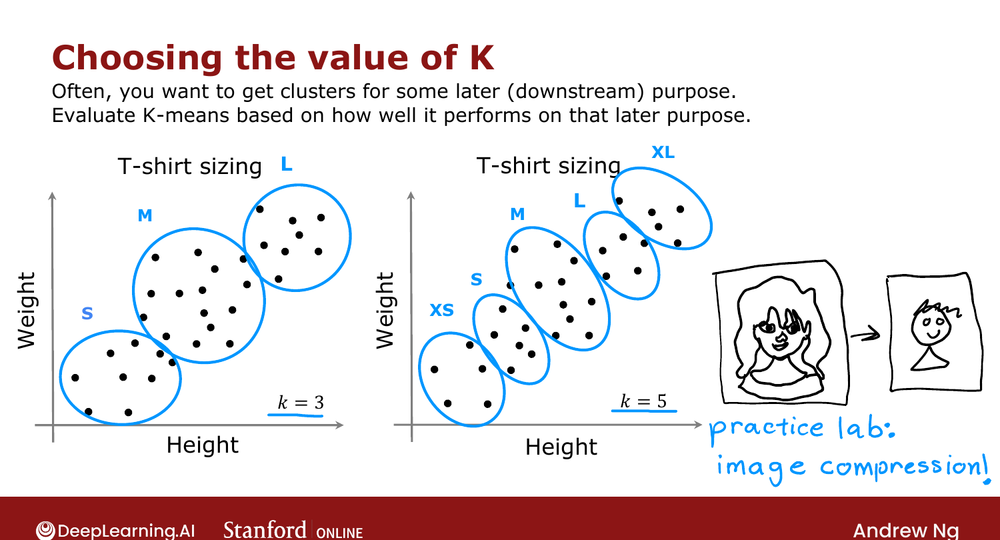

# Choosing the Number of Clusters

> **Course 3 · Week 1** · _AI-generated study aid — not authoritative; trust the lecture & cited sources._

[← Initializing K-means](../../course-3/week-1/initializing-k-means.md){ .md-button }

[Finding Unusual Events (Anomaly Detection) →](../../course-3/week-1/finding-unusual-events.md){ .md-button }

<video controls preload="none" playsinline src="https://dyckms5inbsqq.cloudfront.net/dlai/unsupervised-learning-recommenders-reinforcement-learning/W1/L7-MLS-C3W1L1S07-Choosing-the-numbe/lc-unsupervised-learning-recommenders-reinforcement-learning-W1-L7-MLS-C3W1L1S07-Choosing-the-numbe-master_360p.mp4?v=1752487435">Your browser can't play this video — <a href="https://dyckms5inbsqq.cloudfront.net/dlai/unsupervised-learning-recommenders-reinforcement-learning/W1/L7-MLS-C3W1L1S07-Choosing-the-numbe/lc-unsupervised-learning-recommenders-reinforcement-learning-W1-L7-MLS-C3W1L1S07-Choosing-the-numbe-master_360p.mp4?v=1752487435">download the lecture</a>.</video>

> 📄 **[Read the full lecture transcript](choosing-the-number-of-clusters-transcript.md)**

K-means needs $K$ as an input — but how many clusters should you use? `[00:02]`

## $K$ is often genuinely ambiguous

Show the same dataset to different people and some see **2** clusters, others **4** — both
can be right. Because clustering is **unsupervised**, there's no "right answer" label, and
many datasets give no clear indication of how many clusters they contain. `[01:18]`

## The elbow method (Ng doesn't use it)

Run K-means for a range of $K$ and plot the distortion $J$ vs. $K$. $J$ falls fast at first,
then more slowly — pick the "**elbow**" where the rate of decrease changes. Ng **rarely uses
this**: many cost curves decrease smoothly with no clear elbow. `[02:53]`

{ .slide }
_Official C3 slide — the elbow method (DeepLearning.AI / Stanford)._
{ .slide-cap }

**What does *not* work:** choosing $K$ to **minimize $J$** — more clusters almost always lower
$J$, so this just picks the largest possible $K$. `[03:19]`

## Choose $K$ for the downstream purpose

Usually you cluster for some **later use**, so evaluate $K$ by **how well it serves that
purpose**. T-shirt sizing: `[03:43]`

- $K=3$ → small / medium / large;
- $K=5$ → XS / S / M / L / XL.

Both are valid. Decide based on the **trade-off**: more sizes fit better but cost more to
manufacture and ship. (The programming exercise does the same with **image compression** —
trading image quality against compressed size.) `[05:53]`

{ .slide }
_Official C3 slide — choose K by its downstream use (DeepLearning.AI / Stanford)._
{ .slide-cap }

That completes K-means. Next: the second unsupervised algorithm — **anomaly detection**. `[06:55]`

[← Initializing K-means](../../course-3/week-1/initializing-k-means.md){ .md-button }

[Finding Unusual Events (Anomaly Detection) →](../../course-3/week-1/finding-unusual-events.md){ .md-button }

