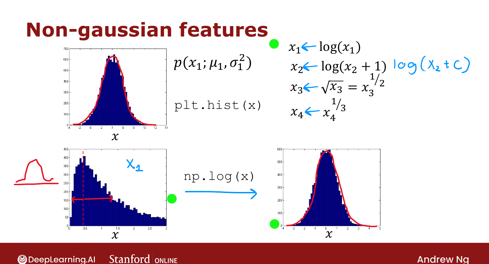
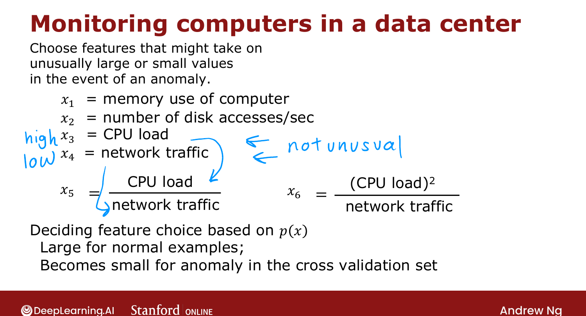

# Choosing What Features to Use

> **Course 3 · Week 1** · _AI-generated study aid — not authoritative; trust the lecture & cited sources._

[← Anomaly Detection vs. Supervised Learning](../../course-3/week-1/anomaly-detection-vs-supervised-learning.md){ .md-button }

[Making Recommendations →](../../course-3/week-2/making-recommendations.md){ .md-button }

<video controls preload="none" playsinline src="https://dyckms5inbsqq.cloudfront.net/dlai/unsupervised-learning-recommenders-reinforcement-learning/W1/L13-MLS-C3W1L2S06-Choosing-what-feat/lc-unsupervised-learning-recommenders-reinforcement-learning-W1-L13-MLS-C3W1L2S06-Choosing-what-feat-master_360p.mp4?v=1752487436">Your browser can't play this video — <a href="https://dyckms5inbsqq.cloudfront.net/dlai/unsupervised-learning-recommenders-reinforcement-learning/W1/L13-MLS-C3W1L2S06-Choosing-what-feat/lc-unsupervised-learning-recommenders-reinforcement-learning-W1-L13-MLS-C3W1L2S06-Choosing-what-feat-master_360p.mp4?v=1752487436">download the lecture</a>.</video>

> 📄 **[Read the full lecture transcript](choosing-what-features-to-use-transcript.md)**

Feature choice matters **even more** for anomaly detection than for supervised learning. With
labels, a supervised algorithm can learn to ignore irrelevant features; anomaly detection
learns from **unlabeled** data, so it can't — you have to choose features carefully. `[00:11]`

## Make features more Gaussian

Anomaly detection models each feature with a Gaussian, so it helps if the feature **looks
Gaussian**. Plot a histogram (`plt.hist(x)`); if it's skewed rather than bell-shaped,
**transform** it: `[01:01]`

- $x \to \log(x)$ (or $\log(x + c)$ to handle zeros / tune the shape);
- $x \to \sqrt{x}$, $x \to x^{1/3}$, or more generally $x \to x^{p}$ for some power $p$.

Try a few transforms/values and keep whichever histogram looks **most Gaussian** — and apply
the **same** transform to training, CV, and test data. `[04:22]`

{ .slide }
_Official C3 slide — transforming features to be more Gaussian (DeepLearning.AI / Stanford)._
{ .slide-cap }

## Error analysis → new features

The most common problem: an anomaly has $p(\vec{x})$ **comparable** to normal examples (not
small enough to flag). Look at that missed anomaly and ask what feature would **distinguish**
it — then add it. `[--]`

For data-center monitoring, beyond raw features ($x_1$ memory, $x_2$ disk accesses, $x_3$ CPU
load, $x_4$ network traffic) you can engineer **combinations** — e.g. $x_5 = \frac{\text{CPU
load}}{\text{network traffic}}$ — that spike for a specific failure mode (high CPU with low
traffic) that no single raw feature catches. `[--]`

{ .slide }
_Official C3 slide — engineering features for anomaly detection (DeepLearning.AI / Stanford)._
{ .slide-cap }

That completes Week 1 of Course 3 — clustering and anomaly detection. Next week:
**recommender systems**. `[--]`

[← Anomaly Detection vs. Supervised Learning](../../course-3/week-1/anomaly-detection-vs-supervised-learning.md){ .md-button }

[Making Recommendations →](../../course-3/week-2/making-recommendations.md){ .md-button }

