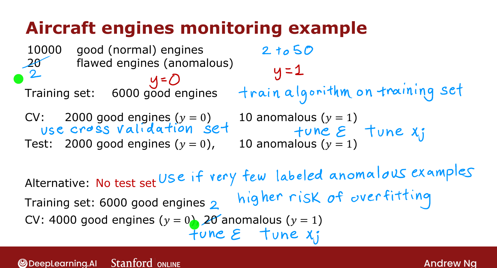
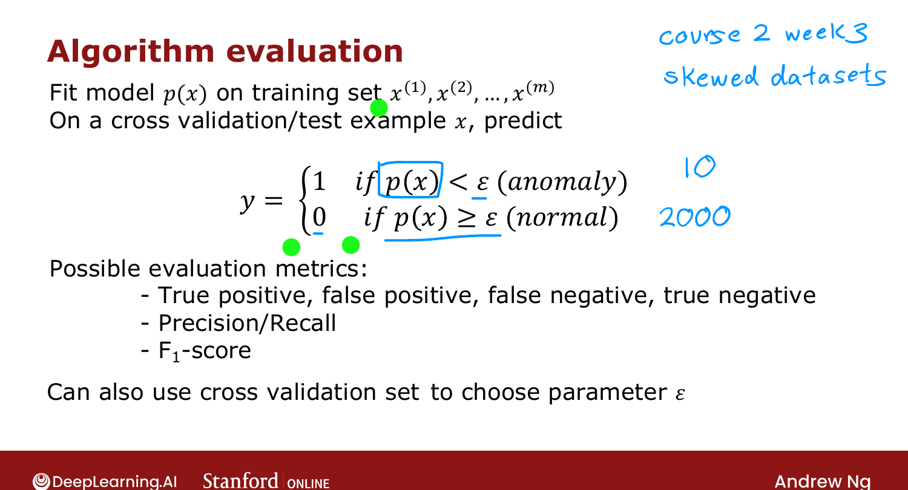

# Developing and Evaluating an Anomaly Detection System

> **Course 3 · Week 1** · _AI-generated study aid — not authoritative; trust the lecture & cited sources._

[← Anomaly Detection Algorithm](../../course-3/week-1/anomaly-detection-algorithm.md){ .md-button }

[Anomaly Detection vs. Supervised Learning →](../../course-3/week-1/anomaly-detection-vs-supervised-learning.md){ .md-button }

<video controls preload="none" playsinline src="https://dyckms5inbsqq.cloudfront.net/dlai/unsupervised-learning-recommenders-reinforcement-learning/W1/L11-MLS-C3W1L2S04-Developing-and-eva/lc-unsupervised-learning-recommenders-reinforcement-learning-W1-L11-MLS-C3W1L2S04-Developing-and-eva-master_360p.mp4?v=1752487436">Your browser can't play this video — <a href="https://dyckms5inbsqq.cloudfront.net/dlai/unsupervised-learning-recommenders-reinforcement-learning/W1/L11-MLS-C3W1L2S04-Developing-and-eva/lc-unsupervised-learning-recommenders-reinforcement-learning-W1-L11-MLS-C3W1L2S04-Developing-and-eva-master_360p.mp4?v=1752487436">download the lecture</a>.</video>

> 📄 **[Read the full lecture transcript](developing-and-evaluating-an-anomaly-detection-system-transcript.md)**

Practical tip: having a **real-number evaluation** makes it far faster to decide whether a
change (a feature, or $\epsilon$) helped. `[00:21]`

## Use a few labeled anomalies

Even though training is unsupervised, it helps to have a **small number of labeled
anomalies** ($y=1$) and normal examples ($y=0$). Train $p(\vec{x})$ on the **unlabeled
(assumed-normal)** training set, then put a few known anomalies into the **cross-validation**
and **test** sets to tune and evaluate. `[01:15]`

## Aircraft-engine split

Say you have 10,000 good engines and 20 anomalies (anywhere from ~2 to 50 known anomalies is
typical): `[03:38]`

- **Training set:** 6,000 good engines (a stray anomaly slipping in is fine).
- **CV set:** 2,000 good + 10 anomalies.
- **Test set:** 2,000 good + 10 anomalies.

Fit the Gaussians on the training set; use the **CV set to tune $\epsilon$** (and the
features) so it catches the anomalies without flagging too many good engines; then report on
the **test set**. `[05:33]`

{ .slide }
_Official C3 slide — splitting data for anomaly detection (DeepLearning.AI / Stanford)._
{ .slide-cap }

If you have **very few** anomalies (say 2), drop the test set and use only train + CV —
accept the higher risk of overfitting your choices to the CV set. `[07:32]`

## Evaluating

Fit $p(\vec{x})$ on the training set; on each CV/test example predict $y=1$ if
$p(\vec{x})<\epsilon$, else $y=0$, and compare to the labels. Since anomalies are rare
(**highly skewed** data), use **precision/recall** and **F1** (from C2W3) rather than plain
accuracy, and tune $\epsilon$ on the CV set. `[09:15]`

{ .slide }
_Official C3 slide — evaluating an anomaly detector (DeepLearning.AI / Stanford)._
{ .slide-cap }

This raises a question: with a few labels, why not just use **supervised learning**? Next. `[11:21]`

[← Anomaly Detection Algorithm](../../course-3/week-1/anomaly-detection-algorithm.md){ .md-button }

[Anomaly Detection vs. Supervised Learning →](../../course-3/week-1/anomaly-detection-vs-supervised-learning.md){ .md-button }

